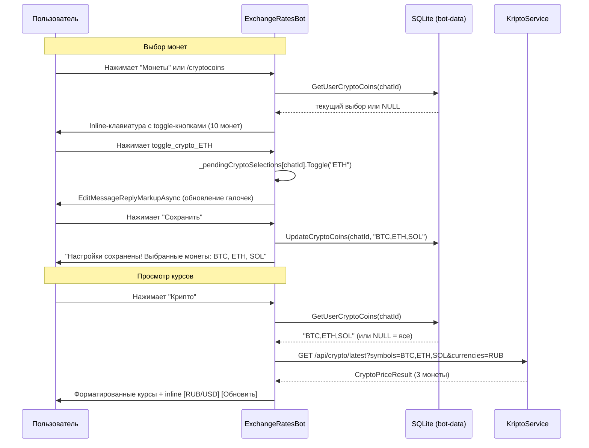
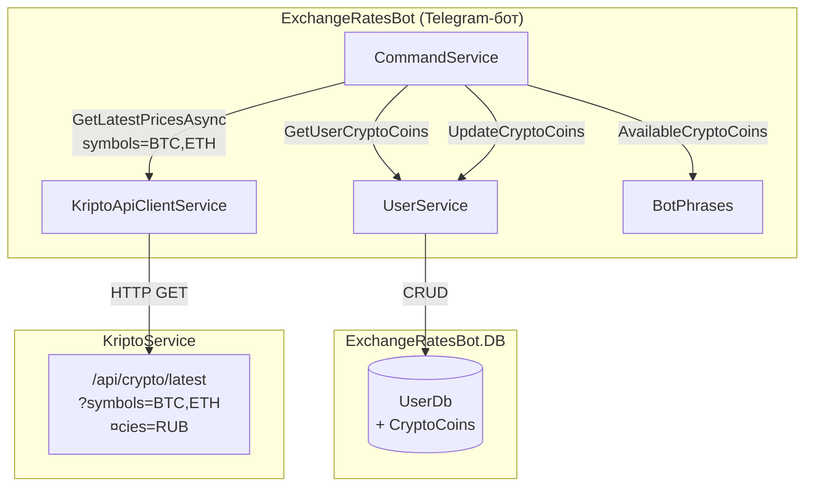
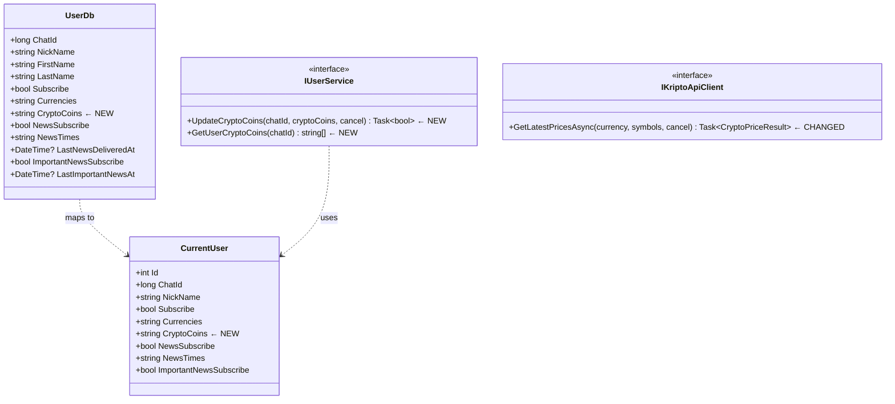

# BOT-0024: Персонализация криптовалют в Telegram-боте

## Обзор

Дать пользователю возможность выбрать, какие криптовалюты показывать при нажатии кнопки "Крипто". Реализация по аналогии с существующей персонализацией фиат-валют (`/currencies`).

**ADR**: [adr-bot-0024-crypto-personalization.md](adr-bot-0024-crypto-personalization.md)

## Затрагиваемые сервисы и компоненты

| Проект | Что меняется | Тип изменения |
|--------|-------------|---------------|
| `ExchangeRatesBot.DB` | `UserDb` -- новое поле `CryptoCoins` | Модель |
| `ExchangeRatesBot.Domain` | `CurrentUser` -- новое поле `CryptoCoins` | Модель |
| `ExchangeRatesBot.Domain` | `IUserService` -- новые методы | Интерфейс |
| `ExchangeRatesBot.Domain` | `IKriptoApiClient` -- новая перегрузка | Интерфейс |
| `ExchangeRatesBot.App` | `UserService` -- реализация новых методов | Сервис |
| `ExchangeRatesBot.App` | `KriptoApiClientService` -- передача `symbols` | Сервис |
| `ExchangeRatesBot.App` | `CommandService` -- UI выбора монет | Сервис |
| `ExchangeRatesBot.App` | `BotPhrases` -- новые константы | Константы |
| `ExchangeRatesBot.Migrations` | Новая миграция | Миграция |

**Не затрагиваются**: ExchangeRates.Api, NewsService, KriptoService (API уже поддерживает `symbols`).

## Модель данных

### UserDb -- изменение

```csharp
public class UserDb : Entity
{
    // ... существующие поля ...
    public string CryptoCoins { get; set; }  // NEW: CSV, nullable. NULL = все 10 монет
}
```

### CurrentUser -- изменение

```csharp
public class CurrentUser
{
    // ... существующие поля ...
    public string CryptoCoins { get; set; }  // NEW
}
```

### EF-миграция

```csharp
migrationBuilder.AddColumn<string>(
    name: "CryptoCoins",
    table: "Users",  // имя таблицы UserDb
    type: "TEXT",
    nullable: true);
```

**Безопасность миграции**: nullable колонка, существующие записи получат `NULL` = дефолтное поведение (все 10 монет).

## Изменения в интерфейсах

### IUserService -- новые методы

```csharp
/// <summary>
/// Обновить выбранные криптовалюты пользователя
/// </summary>
Task<bool> UpdateCryptoCoins(long chatId, string cryptoCoins, CancellationToken cancel);

/// <summary>
/// Получить выбранные криптовалюты пользователя.
/// Возвращает null если пользователь не настраивал (= показывать все).
/// </summary>
string[] GetUserCryptoCoins(long chatId);
```

### IKriptoApiClient -- изменение сигнатуры

```csharp
/// <summary>
/// Получить последние курсы криптовалют от KriptoService.
/// symbols -- CSV-список символов для фильтрации (null = все).
/// </summary>
Task<CryptoPriceResult> GetLatestPricesAsync(
    string currency = "RUB",
    string symbols = null,  // NEW: фильтр по символам
    CancellationToken cancel = default);
```

## UX Flow

### Точка входа

Кнопка **"Монеты"** добавляется в третий ряд Reply-клавиатуры рядом с "Крипто":

```
[ Курс сегодня ] [ За 7 дней ] [ Статистика ]
[   Валюты     ] [ Подписка  ] [  Помощь    ]
[   Новости    ] [  Крипто   ] [  Монеты    ]
```

Альтернативный доступ: команда `/cryptocoins`.

### Диаграмма UX-потока



### Inline-клавиатура выбора монет

```
[ ✅ BTC ] [ ⬜ ETH ] [ ⬜ SOL ]
[ ⬜ XRP ] [ ⬜ BNB ] [ ⬜ USDT ]
[ ⬜ DOGE] [ ⬜ ADA ] [ ⬜ TON ]
[ ⬜ AVAX]
[ ✅ Сохранить ]
```

- По 3 кнопки в ряд (аналогично `CurrenciesKeyboard`)
- При первом открытии: все 10 отмечены (если `CryptoCoins == null`) или текущий выбор
- Toggle -- мгновенное обновление клавиатуры без нового сообщения

## Детали реализации

### 1. Callback-префиксы

| Callback | Описание |
|----------|----------|
| `toggle_crypto_{SYMBOL}` | Toggle монеты в pending-выборе |
| `save_crypto_coins` | Сохранить выбор монет в БД |

Префикс `toggle_crypto_` выбран для избежания коллизии с `toggle_{CURRENCY}` (фиат).

### 2. CommandService -- новые элементы

```csharp
// Временное состояние выбора крипто для каждого пользователя
private static readonly ConcurrentDictionary<long, HashSet<string>> _pendingCryptoSelections = new();
```

**Обработка в `CallbackMessageCommand`:**

```csharp
// Toggle криптомонеты -- ВАЖНО: проверять ПЕРЕД toggle_ (фиат), т.к. prefix match
if (callbackData.StartsWith("toggle_crypto_"))
{
    var symbol = callbackData.Substring(14); // "toggle_crypto_BTC" -> "BTC"
    await HandleToggleCryptoSymbol(update, chatId, symbol);
    return;
}
```

**Порядок проверки в `CallbackMessageCommand` критичен**: `toggle_crypto_` должен проверяться **до** `toggle_` (строка 128), иначе `toggle_crypto_BTC` будет перехвачен как `toggle_` с кодом `crypto_BTC`.

**Обработка в `MessageCommand`:**

```csharp
case "/cryptocoins":
case var txt when txt == BotPhrases.BtnCryptoCoins:
    // аналогично /currencies
    break;
```

### 3. KriptoApiClientService -- изменение запроса

```csharp
public async Task<CryptoPriceResult> GetLatestPricesAsync(
    string currency = "RUB",
    string symbols = null,
    CancellationToken cancel = default)
{
    var url = $"api/crypto/latest?currencies={currency}";
    if (!string.IsNullOrEmpty(symbols))
    {
        url += $"&symbols={symbols}";
    }
    var response = await _httpClient.GetAsync(url, cancel);
    // ...
}
```

### 4. HandleCryptoCommand -- изменение

```csharp
private async Task HandleCryptoCommand(Update update, string currency)
{
    var chatId = update.Message.From.Id;
    var coins = _userControl.GetUserCryptoCoins(chatId);
    var symbols = coins != null ? string.Join(",", coins) : null;

    var result = await _kriptoClient.GetLatestPricesAsync(currency, symbols, CancellationToken.None);
    // ... остальной код без изменений ...
}
```

Аналогично `HandleCryptoCallback` -- получить chatId из `update.CallbackQuery.From.Id`.

### 5. UserService -- реализация

```csharp
public async Task<bool> UpdateCryptoCoins(long chatId, string cryptoCoins, CancellationToken cancel)
{
    // по аналогии с UpdateCurrencies
    var usersDb = await _userDb.GetCollection(cancel);
    var userDb = usersDb.FirstOrDefault(u => u.ChatId == chatId);
    if (userDb == null) return false;
    userDb.CryptoCoins = cryptoCoins;
    await _userDb.Update(userDb, cancel);
    return true;
}

public string[] GetUserCryptoCoins(long chatId)
{
    if (CurrentUser != null && CurrentUser.ChatId == chatId && CurrentUser.CryptoCoins != null)
    {
        return CurrentUser.CryptoCoins.Split(',');
    }
    return null; // NULL = все монеты (дефолт)
}
```

### 6. SetUser -- маппинг нового поля

В `UserService.SetUser()` добавить:

```csharp
CurrentUser.CryptoCoins = userGetCollection.CryptoCoins;
```

### 7. BotPhrases -- новые константы

```csharp
// --- Персонализация криптовалют ---
public static string BtnCryptoCoins { get; } = "Монеты";
public static string CryptoCoinsHeader { get; } = "Выберите криптовалюты для отслеживания:";
public static string CryptoCoinsSaved { get; } = "*Настройки сохранены!* Выбранные монеты: ";
public static string CryptoCoinsEmpty { get; } = "Выберите хотя бы одну криптовалюту.";

public static string[] AvailableCryptoCoins { get; } = new string[]
    { "BTC", "ETH", "SOL", "XRP", "BNB", "USDT", "DOGE", "ADA", "TON", "AVAX" };

public static string DefaultCryptoCoins { get; } = "BTC,ETH,SOL,XRP,BNB,USDT,DOGE,ADA,TON,AVAX";
```

## Компонентная диаграмма



## Диаграмма классов (изменения)



## Порядок реализации

### Этап 1: Модель и миграция
1. Добавить `CryptoCoins` в `UserDb`
2. Добавить `CryptoCoins` в `CurrentUser`
3. Обновить маппинг в `UserService.SetUser()`
4. Создать EF-миграцию

### Этап 2: Интерфейсы и сервисы
5. Добавить `UpdateCryptoCoins` и `GetUserCryptoCoins` в `IUserService`
6. Реализовать в `UserService`
7. Изменить сигнатуру `IKriptoApiClient.GetLatestPricesAsync` (добавить `symbols`)
8. Обновить `KriptoApiClientService` -- передавать `symbols` в URL

### Этап 3: UI и команды
9. Добавить константы в `BotPhrases`
10. Добавить `_pendingCryptoSelections` в `CommandService`
11. Реализовать `HandleToggleCryptoSymbol`, `HandleSaveCryptoCoins`, `CryptoCoinsKeyboard`
12. Добавить обработку `toggle_crypto_` и `save_crypto_coins` в `CallbackMessageCommand`
13. Добавить обработку `/cryptocoins` и кнопки "Монеты" в `MessageCommand`
14. Обновить `GetMainKeyboard` -- добавить кнопку "Монеты"

### Этап 4: Интеграция с показом курсов
15. Обновить `HandleCryptoCommand` -- получать и передавать `symbols`
16. Обновить `HandleCryptoCallback` -- аналогично
17. Обновить `HelpMessage` в `BotPhrases`

## Миграция БД

**Команда:**
```bash
dotnet ef migrations add AddCryptoCoins --project src/bot/ExchangeRatesBot.Migrations --startup-project src/bot/ExchangeRatesBot
```

**Тип**: ALTER TABLE ADD COLUMN (nullable TEXT).
**Риск**: минимальный. SQLite поддерживает ADD COLUMN без пересоздания таблицы.
**Откат**: DROP COLUMN (SQLite 3.35.0+) или пересоздание таблицы.

## Конфигурация

Новые параметры конфигурации **не требуются**. Все необходимые настройки (URL KriptoService, список монет) уже существуют.

## Риски и ограничения

| Риск | Вероятность | Влияние | Митигация |
|------|-------------|---------|-----------|
| Коллизия callback-префиксов | Средняя | Высокое | Проверять `toggle_crypto_` до `toggle_` |
| Разрастание CommandService | Низкая | Среднее | Вне scope; в будущем вынести в CryptoCommandHandler |
| Потеря pending-выбора при рестарте | Низкая | Низкое | Допустимо; инициализация из БД при повторном toggle |
| Несовпадение монет бота и KriptoService | Низкая | Среднее | `AvailableCryptoCoins` синхронизировать с `trackedSymbols` KriptoService |

## Тестирование

- Новый пользователь: "Крипто" показывает все 10 монет
- Настройка: "Монеты" -> toggle 3 монеты -> "Сохранить" -> "Крипто" показывает только 3
- Inline-кнопки RUB/USD и "Обновить" работают с фильтрацией
- Сохранение и загрузка из БД после рестарта бота
- Пустой выбор: предупреждение "Выберите хотя бы одну криптовалюту"
- Перезапуск бота во время выбора: повторный toggle инициализирует из БД
