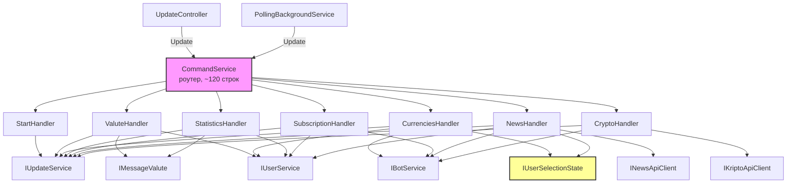
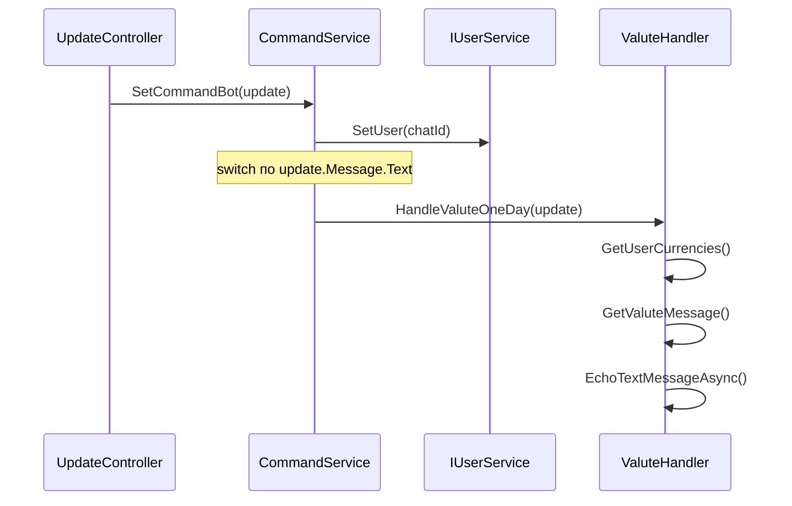

- [ ] Не реализовано

# BOT-0025: Декомпозиция CommandService на доменные handler'ы

## Обзор

Рефакторинг `CommandService` (810+ строк, 7 зависимостей, 10+ команд, 30+ callback'ов) в тонкий роутер + 7 доменных handler'ов. Цель -- соблюдение SRP, уменьшение конфликтов при мерже, улучшение навигации и тестируемости.

**ADR**: [adr-bot-0025-command-service-decomposition.md](adr-bot-0025-command-service-decomposition.md)

## Затрагиваемые проекты

| Проект | Изменения |
|--------|-----------|
| `ExchangeRatesBot.App` | Новые handler'ы, рефакторинг CommandService, новый UserSelectionState |
| `ExchangeRatesBot` (Startup) | Регистрация handler'ов и UserSelectionState в DI |
| `ExchangeRatesBot.Domain` | Новый интерфейс `IUserSelectionState` |

**НЕ затрагиваются**: ExchangeRatesBot.DB, ExchangeRatesBot.Configuration, ExchangeRatesBot.Maintenance, ExchangeRatesBot.Migrations, все проекты ExchangeRates.Api и NewsService.

## Архитектура

### Component Diagram



### Sequence Diagram: обработка Message update



### Sequence Diagram: обработка Callback update


## Детальный дизайн

### 1. IUserSelectionState (новый интерфейс)

**Файл**: `src/bot/ExchangeRatesBot.Domain/Interfaces/IUserSelectionState.cs`

```csharp
public interface IUserSelectionState
{
    ConcurrentDictionary<long, HashSet<string>> PendingCurrencies { get; }
    ConcurrentDictionary<long, HashSet<string>> PendingNewsSchedule { get; }
    // ConcurrentDictionary<long, HashSet<string>> PendingCryptoCoins { get; }  // BOT-0024
}
```

**Реализация**: `src/bot/ExchangeRatesBot.App/Services/UserSelectionState.cs`
**Lifetime**: Singleton (заменяет static поля)

### 2. Handler'ы

Каждый handler -- обычный класс (не реализует интерфейс). Публичные методы -- точки входа, которые вызывает роутер.

#### StartHandler

**Файл**: `src/bot/ExchangeRatesBot.App/Handlers/StartHandler.cs`

```csharp
public class StartHandler
{
    private readonly IUpdateService _updateService;

    // Конструктор: IUpdateService

    public async Task HandleStart(Update update)      // /start
    public async Task HandleHelp(Update update)        // /help, "Помощь"
    public static ReplyKeyboardMarkup GetMainKeyboard()  // reply-клавиатура
}
```

`GetMainKeyboard()` размещается здесь, потому что клавиатура отправляется только с `/start`. Метод static, зависит только от `BotPhrases`.

#### ValuteHandler

**Файл**: `src/bot/ExchangeRatesBot.App/Handlers/ValuteHandler.cs`

```csharp
public class ValuteHandler
{
    private readonly IUpdateService _updateService;
    private readonly IMessageValute _valuteService;
    private readonly IUserService _userService;

    public async Task HandleOneDay(Update update)       // /valuteoneday, "Курс сегодня"
    public async Task HandleSevenDays(Update update)    // /valutesevendays, "За 7 дней"
}
```

#### CurrenciesHandler

**Файл**: `src/bot/ExchangeRatesBot.App/Handlers/CurrenciesHandler.cs`

```csharp
public class CurrenciesHandler
{
    private readonly IUpdateService _updateService;
    private readonly IBotService _botService;
    private readonly IUserService _userService;
    private readonly IUserSelectionState _state;

    public async Task HandleCurrenciesCommand(Update update)                   // /currencies, "Валюты"
    public async Task HandleToggleCurrency(Update update, string currencyCode) // toggle_{CODE}
    public async Task HandleSaveCurrencies(Update update)                      // save_currencies

    private List<List<InlineKeyboardButton>> CurrenciesKeyboard(long chatId)
}
```

#### StatisticsHandler

**Файл**: `src/bot/ExchangeRatesBot.App/Handlers/StatisticsHandler.cs`

```csharp
public class StatisticsHandler
{
    private readonly IUpdateService _updateService;
    private readonly IMessageValute _valuteService;
    private readonly IUserService _userService;
    private readonly IBotService _botService;

    public async Task HandleStatisticsCommand(Update update)       // /statistics, "Статистика"
    public async Task HandlePeriodCallback(Update update, int days) // period_{N}

    private static List<List<InlineKeyboardButton>> PeriodSelectionKeyboard()
}
```

#### SubscriptionHandler

**Файл**: `src/bot/ExchangeRatesBot.App/Handlers/SubscriptionHandler.cs`

```csharp
public class SubscriptionHandler
{
    private readonly IUpdateService _updateService;
    private readonly IBotService _botService;
    private readonly IUserService _userService;

    public async Task HandleSubscribeCommand(Update update)          // /subscribe, "Подписка"
    public async Task HandleToggleRates(Update update)               // sub_toggle_rates
    public async Task HandleToggleImportant(Update update)           // sub_toggle_important
    public async Task HandleNewsMenu(Update update)                  // sub_news_menu
    public async Task HandleNewsToggle(Update update)                // sub_news_toggle
    public async Task HandleBack(Update update)                      // sub_back
    public async Task HandleLegacyCallbacks(Update update)           // old callbacks

    private List<List<InlineKeyboardButton>> SubscriptionMenu()
    private List<List<InlineKeyboardButton>> NewsSubscriptionMenu()
}
```

#### NewsHandler

**Файл**: `src/bot/ExchangeRatesBot.App/Handlers/NewsHandler.cs`

```csharp
public class NewsHandler
{
    private readonly IUpdateService _updateService;
    private readonly IBotService _botService;
    private readonly IUserService _userService;
    private readonly INewsApiClient _newsClient;
    private readonly IUserSelectionState _state;

    public async Task HandleNewsCommand(Update update)                        // /news, "Новости"
    public async Task HandleNewsLatest(Update update)                         // news_latest
    public async Task HandleNewsPage(Update update, int beforeId)             // news_p_{id}
    public async Task HandleScheduleCommand(Update update)                    // news_schedule
    public async Task HandleToggleNewsSlot(Update update, string timeSlotKey) // toggle_news_{HH}
    public async Task HandleSaveNewsSchedule(Update update)                   // save_news_schedule

    private List<List<InlineKeyboardButton>> NewsScheduleKeyboard(long chatId)
}
```

#### CryptoHandler

**Файл**: `src/bot/ExchangeRatesBot.App/Handlers/CryptoHandler.cs`

```csharp
public class CryptoHandler
{
    private readonly IUpdateService _updateService;
    private readonly IBotService _botService;
    private readonly IKriptoApiClient _kriptoClient;

    public async Task HandleCryptoCommand(Update update)              // /crypto, "Крипто"
    public async Task HandleCryptoCallback(Update update, string currency) // crypto_*

    private static string FormatCryptoPrices(CryptoPriceResult result, string currency)
    private static string FormatCryptoPrice(decimal price)
    private static string EscapeMarkdown(string text)
    private static InlineKeyboardMarkup CryptoInlineKeyboard(string activeCurrency)
}
```

### 3. CommandService (после рефакторинга)

**Файл**: `src/bot/ExchangeRatesBot.App/Services/CommandService.cs` (~120 строк)

```csharp
public class CommandService : ICommandBot
{
    private readonly IUserService _userControl;
    private readonly IUpdateService _updateService;

    // Handler'ы
    private readonly StartHandler _startHandler;
    private readonly ValuteHandler _valuteHandler;
    private readonly CurrenciesHandler _currenciesHandler;
    private readonly StatisticsHandler _statisticsHandler;
    private readonly SubscriptionHandler _subscriptionHandler;
    private readonly NewsHandler _newsHandler;
    private readonly CryptoHandler _cryptoHandler;

    public async Task SetCommandBot(Update update)
    {
        switch (update.Type)
        {
            case UpdateType.Message:
                await EnsureUser(update.Message.From);
                await RouteMessage(update);
                break;
            case UpdateType.CallbackQuery:
                await _userControl.SetUser(update.CallbackQuery.From.Id);
                await RouteCallback(update);
                break;
            default:
                await _updateService.EchoTextMessageAsync(update, BotPhrases.Error, default);
                break;
        }
    }

    private async Task RouteMessage(Update update) { /* switch по тексту */ }
    private async Task RouteCallback(Update update) { /* if/switch по callbackData */ }
    private async Task EnsureUser(User from) { /* создание/загрузка пользователя */ }
}
```

Роутер содержит **только** маршрутизацию -- никакой бизнес-логики, никаких клавиатур, никакого форматирования.

### 4. DI-регистрация (Startup.cs)

```csharp
// Состояние
services.AddSingleton<IUserSelectionState, UserSelectionState>();

// Handler'ы
services.AddScoped<StartHandler>();
services.AddScoped<ValuteHandler>();
services.AddScoped<CurrenciesHandler>();
services.AddScoped<StatisticsHandler>();
services.AddScoped<SubscriptionHandler>();
services.AddScoped<NewsHandler>();
services.AddScoped<CryptoHandler>();

// Роутер (без изменений интерфейса)
services.AddScoped<ICommandBot, CommandService>();
```

## Маппинг: текущий код -> handler'ы

### Message commands

| Текст / Команда | Текущий метод | Целевой handler | Метод handler'а |
|-----------------|---------------|-----------------|-----------------|
| `/start` | `MessageCommand` inline | `StartHandler` | `HandleStart` |
| `/help`, "Помощь" | `MessageCommand` inline | `StartHandler` | `HandleHelp` |
| `/valuteoneday`, "Курс сегодня" | `MessageCommand` inline | `ValuteHandler` | `HandleOneDay` |
| `/valutesevendays`, "За 7 дней" | `MessageCommand` inline | `ValuteHandler` | `HandleSevenDays` |
| `/statistics`, "Статистика" | `MessageCommand` inline | `StatisticsHandler` | `HandleStatisticsCommand` |
| `/currencies`, "Валюты" | `MessageCommand` inline | `CurrenciesHandler` | `HandleCurrenciesCommand` |
| `/subscribe`, "Подписка" | `MessageCommand` inline | `SubscriptionHandler` | `HandleSubscribeCommand` |
| `/news`, "Новости" | `MessageCommand` inline | `NewsHandler` | `HandleNewsCommand` |
| `/crypto`, "Крипто" | `MessageCommand` inline | `CryptoHandler` | `HandleCryptoCommand` |

### Callback queries

| Callback pattern | Текущий метод | Целевой handler | Метод handler'а |
|-----------------|---------------|-----------------|-----------------|
| `crypto_*` | `HandleCryptoCallback` | `CryptoHandler` | `HandleCryptoCallback` |
| `news_p_{id}` | `HandleNewsPage` | `NewsHandler` | `HandleNewsPage` |
| `toggle_news_{HH}` | `HandleToggleNewsSlot` | `NewsHandler` | `HandleToggleNewsSlot` |
| `toggle_{CODE}` | `HandleToggleCurrency` | `CurrenciesHandler` | `HandleToggleCurrency` |
| `period_{N}` | inline в `CallbackMessageCommand` | `StatisticsHandler` | `HandlePeriodCallback` |
| `save_currencies` | `HandleSaveCurrencies` | `CurrenciesHandler` | `HandleSaveCurrencies` |
| `sub_toggle_rates` | inline | `SubscriptionHandler` | `HandleToggleRates` |
| `sub_toggle_important` | inline | `SubscriptionHandler` | `HandleToggleImportant` |
| `sub_news_menu` | inline | `SubscriptionHandler` | `HandleNewsMenu` |
| `sub_news_toggle` | inline | `SubscriptionHandler` | `HandleNewsToggle` |
| `sub_back` | inline | `SubscriptionHandler` | `HandleBack` |
| `news_schedule` | inline | `NewsHandler` | `HandleScheduleCommand` |
| `save_news_schedule` | `HandleSaveNewsSchedule` | `NewsHandler` | `HandleSaveNewsSchedule` |
| `news_latest` | inline | `NewsHandler` | `HandleNewsLatest` |
| legacy callbacks | inline | `SubscriptionHandler` | `HandleLegacyCallbacks` |

## Структура файлов (итого)

```
src/bot/ExchangeRatesBot.App/
  Handlers/                              # НОВАЯ папка
    StartHandler.cs                      # ~40 строк
    ValuteHandler.cs                     # ~40 строк
    CurrenciesHandler.cs                 # ~100 строк (keyboard + state)
    StatisticsHandler.cs                 # ~60 строк (keyboard + callback)
    SubscriptionHandler.cs               # ~120 строк (2 меню, 6 callbacks)
    NewsHandler.cs                       # ~130 строк (лента, расписание, keyboard)
    CryptoHandler.cs                     # ~120 строк (форматирование, keyboard)
  Services/
    CommandService.cs                    # ~120 строк (роутер)
    UserSelectionState.cs                # ~20 строк (singleton)
    ...остальные без изменений

src/bot/ExchangeRatesBot.Domain/
  Interfaces/
    IUserSelectionState.cs               # ~10 строк
    ...остальные без изменений
```

**Итого**: 810 строк в 1 файле -> ~630 строк в 9 файлах (среднее 70 строк/файл).

## Порядок callback-matching (критично!)

В `RouteCallback` порядок проверок **важен** из-за пересечения префиксов:

1. `crypto_*` -- проверять **до** общего switch
2. `news_p_*` -- проверять **до** `news_*`
3. `toggle_news_*` -- проверять **до** `toggle_*`
4. `toggle_*` -- только после `toggle_news_*`
5. `period_*` -- проверять **до** общего switch
6. Все остальные -- точное совпадение в switch

Этот порядок **идентичен текущему** в `CallbackMessageCommand`. Не менять порядок при рефакторинге!

## План реализации (этапы)

### Этап 1: Подготовка инфраструктуры
1. Создать папку `Handlers/`
2. Создать `IUserSelectionState` и `UserSelectionState`
3. Зарегистрировать в DI

### Этап 2: Вынос handler'ов (по одному, каждый -- отдельный коммит)
1. `CryptoHandler` -- наиболее изолированный, не зависит от IUserService
2. `StartHandler` -- самый простой
3. `ValuteHandler` -- простой, без state
4. `StatisticsHandler` -- простой, без state
5. `CurrenciesHandler` -- требует IUserSelectionState
6. `NewsHandler` -- требует IUserSelectionState + INewsApiClient
7. `SubscriptionHandler` -- самый сложный (6 callbacks, 2 меню)

### Этап 3: Финализация
1. Удалить неиспользуемые зависимости из конструктора CommandService
2. Удалить static ConcurrentDictionary из CommandService
3. Проверить что `IProcessingService` больше не нужен в CommandService (он не используется уже сейчас, но принимается в конструкторе)
4. Ручное тестирование всех 10 команд и всех callback'ов

## Миграции БД

Не требуются. Рефакторинг затрагивает только C# код в слое App.

## Конфигурация

Новых параметров нет. Изменений в appsettings нет.

## Риски и ограничения

| Риск | Вероятность | Влияние | Митигация |
|------|------------|---------|-----------|
| Потеря маршрута при переносе | Средняя | Высокое (пользователь не получит ответ) | Маппинг-таблица выше + ручное тестирование каждого callback |
| Race condition в UserSelectionState | Низкая | Низкое | Точное воспроизведение текущей семантики ConcurrentDictionary |
| Конфликт с BOT-0019 / BOT-0024 | Средняя | Среднее | Выполнять после мержа BOT-0019 и BOT-0024 в develop |
| Регрессия в legacy callbacks | Низкая | Низкое | Перенос без изменений в SubscriptionHandler |

## Обратная совместимость

- **ICommandBot** -- интерфейс не меняется
- **UpdateController** -- не меняется
- **PollingBackgroundService** -- не меняется
- **Все callback-data** -- не меняются (пользователи с inline-клавиатурами в чате продолжат работать)
- **Reply-клавиатура** -- не меняется
- **BotPhrases** -- не меняется
