# Архитектурная документация ExchangeRates.Api

**Версия**: 2.0
**Дата**: 2026-03-18
**Автор**: Software Architect Agent

---

## Содержание

1. [Обзор системы](#1-обзор-системы)
2. [Архитектура высокого уровня](#2-архитектура-высокого-уровня)
3. [ExchangeRates.Api -- компонентная архитектура](#3-exchangeratesapi----компонентная-архитектура)
4. [ExchangeRatesBot -- компонентная архитектура](#4-exchangeratesbot----компонентная-архитектура)
5. [NewsService -- компонентная архитектура](#5-newsservice----компонентная-архитектура)
6. [Взаимодействие между сервисами](#6-взаимодействие-между-сервисами)
7. [Потоки данных](#7-потоки-данных)
8. [Режимы работы Telegram-бота (Webhook vs Polling)](#8-режимы-работы-telegram-бота-webhook-vs-polling)
9. [Архитектурные паттерны](#9-архитектурные-паттерны)
10. [Технологический стек](#10-технологический-стек)
11. [Развертывание (Docker Compose)](#11-развертывание-docker-compose)
12. [Архитектурные решения и их обоснование](#12-архитектурные-решения-и-их-обоснование)

---

## 1. Обзор системы

**ExchangeRates.Api** -- система для сбора, хранения и предоставления данных о курсах валют Центрального Банка Российской Федерации. Система состоит из трех микросервисов:

- **ExchangeRates.Api** -- REST API для периодического сбора курсов валют из внешнего источника (ЦБ РФ) и предоставления исторических данных через HTTP-эндпоинт.
- **ExchangeRatesBot** -- Telegram-бот, выступающий клиентом API и предоставляющий пользователям удобный интерфейс для получения курсов валют, подписки на рассылки и новостного дайджеста.
- **NewsService** -- микросервис новостного дайджеста: RSS-парсинг новостей ЦБ РФ, дедупликация, LLM-суммаризация и предоставление дайджеста через HTTP API.

Все сервисы работают как ASP.NET Core Web-приложения на .NET 10.0, развертываются в Docker-контейнерах и взаимодействуют через внутреннюю Docker-сеть.

### Ключевые характеристики

| Характеристика | Значение |
|---|---|
| Платформа | .NET 10.0 (ASP.NET Core) |
| ORM | Entity Framework Core 8.0.0 |
| СУБД | SQLite (отдельные БД для каждого сервиса) |
| Внешний источник курсов | cbr-xml-daily.ru (JSON API ЦБ РФ) |
| Внешний источник новостей | cbr.ru/rss (RSS 2.0 ЦБ РФ) |
| Протокол взаимодействия сервисов | HTTP (REST) |
| Развертывание | Docker Compose (3 контейнера) |
| Логирование | Serilog (Console + SQLite) |
| Поддержка валют | 34 валюты |
| LLM-интеграция | Polza AI, Ollama (опционально) |

---

## 2. Архитектура высокого уровня

### 2.1 Диаграмма системного контекста (C4 Level 1)

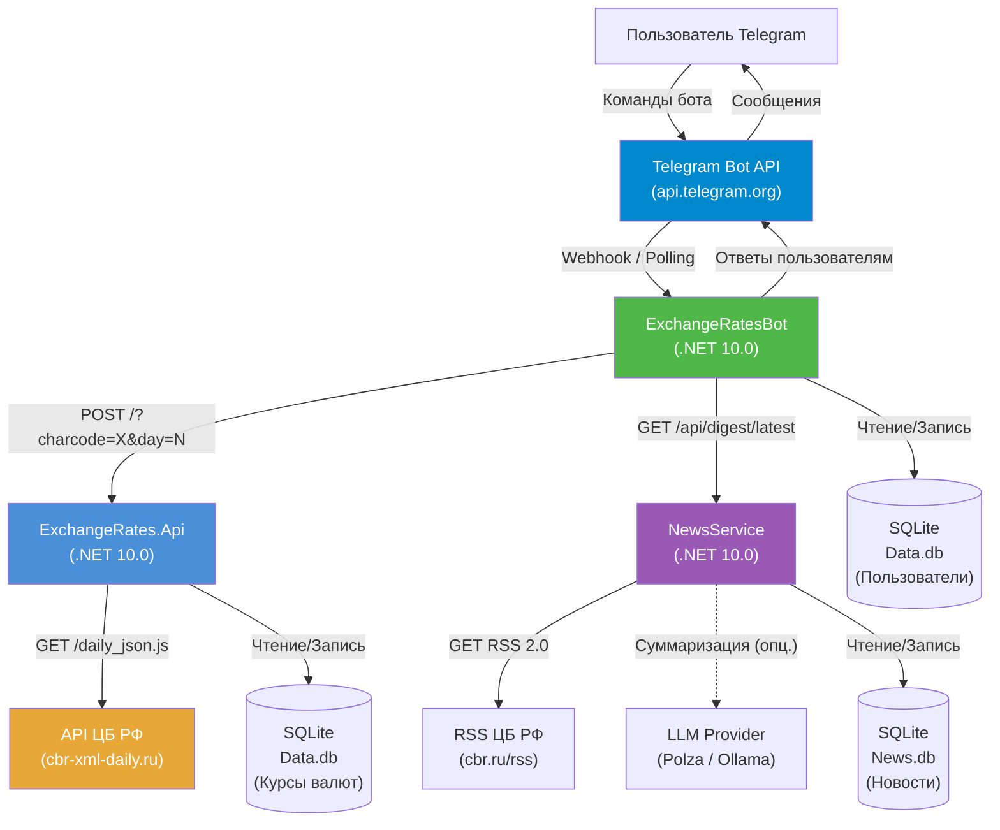

### 2.2 Диаграмма контейнеров (C4 Level 2)

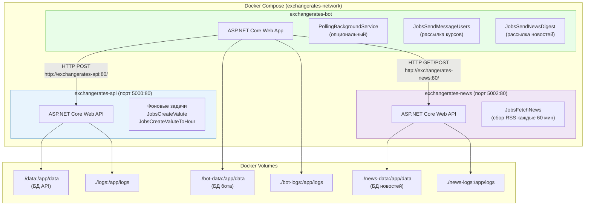

---

## 3. ExchangeRates.Api -- компонентная архитектура

API-сервис реализован по принципам **Clean Architecture** с разделением на слои.

### 3.1 Структура проектов

```
src/
  ExchangeRates.Api/                    # Presentation Layer (точка входа)
  ExchangeRates.Core.Domain/            # Domain Layer (модели, интерфейсы)
  ExchangeRates.Core.App/               # Application Layer (бизнес-логика)
  ExchangeRates.Infrastructure.DB/      # Infrastructure Layer (EF Core DbContext)
  ExchangeRates.Infrastructure.SQLite/  # Infrastructure Layer (репозиторий SQLite)
  ExchangeRates.Configuration/          # Cross-Cutting (конфигурация)
  ExchangeRates.Maintenance/            # Cross-Cutting (фоновые задачи)
  ExchangeRates.Migrations/             # Infrastructure (EF Core миграции)
```

### 3.2 Компонентная диаграмма ExchangeRates.Api

```mermaid
graph TB
    subgraph Presentation["Presentation Layer"]
        Controller["ValuteController<br/>[ApiController]<br/>POST /?charCode=X&day=N"]
        Startup["Startup<br/>(DI, Middleware)"]
        Program["Program<br/>(Serilog, Host)"]
    end

    subgraph Application["Application Layer (Core.App)"]
        ProcessingService["ProcessingService<br/>: IProcessingService<br/>(Запрос к API ЦБ)"]
        SaveService["SaveService<br/>: ISaveService<br/>(Маппинг и сохранение)"]
        GetValuteService["GetValuteService<br/>: IGetValute<br/>(Чтение истории)"]
        ApiClientService["ApiClientService<br/>: IApiClient<br/>(HTTP-клиент)"]
    end

    subgraph Domain["Domain Layer (Core.Domain)"]
        IProcessingService["IProcessingService"]
        ISaveService["ISaveService"]
        IGetValute["IGetValute"]
        IApiClient["IApiClient"]
        IRepositoryBase["IRepositoryBase T"]
        Root["Root"]
        Valute["Valute<br/>(34 свойства-валюты)"]
        ParseModel["ParseModel<br/>(базовый класс валюты)"]
    end

    subgraph Infrastructure["Infrastructure Layer"]
        DataDb["DataDb<br/>: DbContext<br/>(EF Core)"]
        ValuteModelDb["ValuteModelDb<br/>(DB-модель)"]
        RepositoryDbSQLite["RepositoryDbSQLite T<br/>: IRepositoryBase T"]
    end

    subgraph Maintenance["Maintenance (Фоновые задачи)"]
        BackgroundAbstract["BackgroundTaskAbstract T<br/>: BackgroundService"]
        JobsCreateValute["JobsCreateValute<br/>(ежедневная, по расписанию)"]
        JobsCreateValuteToHour["JobsCreateValuteToHour<br/>(каждые N минут, без дубликатов)"]
    end

    Controller --> IGetValute
    GetValuteService -.->|реализует| IGetValute
    ProcessingService -.->|реализует| IProcessingService
    SaveService -.->|реализует| ISaveService
    ApiClientService -.->|реализует| IApiClient

    ProcessingService --> IApiClient
    SaveService --> IRepositoryBase
    GetValuteService --> IRepositoryBase

    RepositoryDbSQLite -.->|реализует| IRepositoryBase
    RepositoryDbSQLite --> DataDb

    JobsCreateValute --> BackgroundAbstract
    JobsCreateValuteToHour --> BackgroundAbstract
    JobsCreateValute --> IProcessingService
    JobsCreateValute --> ISaveService

    style Presentation fill:#dce8f5,stroke:#4a90d9
    style Application fill:#d5e8d4,stroke:#82b366
    style Domain fill:#fff2cc,stroke:#d6b656
    style Infrastructure fill:#f8cecc,stroke:#b85450
    style Maintenance fill:#e1d5e7,stroke:#9673a6
```

### 3.3 Зависимости между проектами

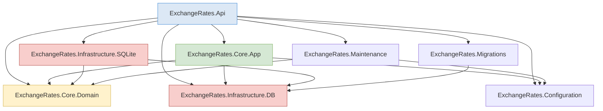

> **Примечание**: Зависимость `Core.App --> Infrastructure.DB` (конкретно на `ValuteModelDb`) нарушает строгий принцип Clean Architecture. Это осознанный компромисс ради простоты маппинга в `SaveService`.

---

## 4. ExchangeRatesBot -- компонентная архитектура

Telegram-бот построен по слоистой архитектуре с собственным набором проектов.

### 4.1 Структура проектов

```
src/bot/
  ExchangeRatesBot/                    # Presentation Layer (точка входа, контроллеры)
  ExchangeRatesBot.App/               # Application Layer (сервисы, фразы)
  ExchangeRatesBot.Domain/            # Domain Layer (модели, интерфейсы)
  ExchangeRatesBot.DB/                # Infrastructure Layer (EF Core DbContext, репозиторий)
  ExchangeRatesBot.Configuration/     # Cross-Cutting (конфигурация BotConfig)
  ExchangeRatesBot.Maintenance/       # Cross-Cutting (фоновые задачи, polling)
  ExchangeRatesBot.Migrations/        # Infrastructure (EF Core миграции)
```

### 4.2 Компонентная диаграмма ExchangeRatesBot

```mermaid
graph TB
    subgraph Presentation["Presentation Layer"]
        UpdateController["UpdateController<br/>[ApiController]<br/>POST / (webhook)"]
        BotStartup["Startup<br/>(DI, Middleware)"]
    end

    subgraph Application["Application Layer (Bot.App)"]
        BotService["BotService<br/>: IBotService<br/>(TelegramBotClient, Singleton)"]
        CommandService["CommandService<br/>: ICommandBot<br/>(Маршрутизация команд)"]
        UpdateService["UpdateService<br/>: IUpdateService<br/>(Отправка сообщений)"]
        MessageValute["MessageValuteService<br/>: IMessageValute<br/>(Форматирование курсов)"]
        UserServiceBot["UserService<br/>: IUserService<br/>(Пользователи, подписки)"]
        NewsApiClient["NewsApiClientService<br/>: INewsApiClient<br/>(HTTP-клиент к NewsService)"]
        BotPhrases["BotPhrases<br/>(Статические тексты)"]
    end

    subgraph Domain["Domain Layer (Bot.Domain)"]
        IBotService["IBotService"]
        ICommandBot["ICommandBot"]
        IUserServiceI["IUserService"]
        INewsApiClientI["INewsApiClient"]
        UserModel["User / CurrentUser"]
        Entity["Entity (базовый класс)"]
    end

    subgraph InfrastructureBot["Infrastructure Layer (Bot.DB)"]
        BotDataDb["DataDb<br/>: DbContext"]
        UserDb["UserDb : Entity<br/>(ChatId, Subscribe,<br/>NewsSubscribe, Currencies)"]
        RepositoryDb["RepositoryDb T<br/>: IBaseRepositoryDb T"]
    end

    subgraph MaintenanceBot["Maintenance (Фоновые задачи)"]
        JobsSendMessage["JobsSendMessageUsers<br/>(рассылка курсов по расписанию)"]
        JobsSendNews["JobsSendNewsDigest<br/>(рассылка новостей подписчикам)"]
        PollingService["PollingBackgroundService<br/>(polling режим)"]
    end

    UpdateController --> ICommandBot
    CommandService -.->|реализует| ICommandBot
    BotService -.->|реализует| IBotService
    NewsApiClient -.->|реализует| INewsApiClientI

    CommandService --> IUserServiceI
    CommandService --> INewsApiClientI
    JobsSendNews --> INewsApiClientI

    RepositoryDb --> BotDataDb
    BotDataDb --> UserDb

    style Presentation fill:#dce8f5,stroke:#4a90d9
    style Application fill:#d5e8d4,stroke:#82b366
    style Domain fill:#fff2cc,stroke:#d6b656
    style InfrastructureBot fill:#f8cecc,stroke:#b85450
    style MaintenanceBot fill:#e1d5e7,stroke:#9673a6
```

### 4.3 Команды бота

| Команда | Описание | Обработчик |
|---------|----------|------------|
| `/start` | Запуск бота, отображение Reply-клавиатуры | `CommandService.MessageCommand()` |
| `/help` | Справка по командам | `CommandService.MessageCommand()` |
| `/valuteoneday` | Курсы за сегодня (персональный набор) | `CommandService.MessageCommand()` |
| `/valutesevendays` | Курсы за 7 дней со статистикой | `CommandService.MessageCommand()` |
| `/currencies` | Выбор валют (inline-клавиатура, 10 валют) | `CommandService.MessageCommand()` |
| `/subscribe` | Подписка на рассылку курсов | `CommandService.MessageCommand()` |
| `/unsubscribe` | Отписка от рассылки | `CommandService.MessageCommand()` |
| `/news` | Новостной дайджест (inline-клавиатура) | `CommandService.MessageCommand()` |

**Reply-клавиатура** (3 ряда):
1. `Курс сегодня` | `За 7 дней`
2. `Подписка` | `Помощь`
3. `Новости`

**Inline Callback-запросы**:
- `toggle_{CURRENCY}` -- переключение валюты в /currencies
- `save_currencies` -- сохранение выбора валют
- `news_subscribe` / `news_unsubscribe` -- подписка/отписка на новости
- `news_latest` -- получение последнего дайджеста

---

## 5. NewsService -- компонентная архитектура

Микросервис новостного дайджеста, выделенный из бота для разделения ответственности и независимого масштабирования.

### 5.1 Структура проектов

```
src/newsservice/
  NewsService/                         # Web Host (DigestController, Startup)
  NewsService.App/                     # Сервисы (RSS, LLM, дедупликация, дайджест)
  NewsService.Domain/                  # Модели, DTO, интерфейсы
  NewsService.DB/                      # EF Core контекст NewsDataDb, репозиторий
  NewsService.Configuration/           # NewsConfig, LlmConfig
  NewsService.Maintenance/             # Фоновая задача JobsFetchNews
  NewsService.Migrations/              # EF Core миграции
```

### 5.2 Компонентная диаграмма NewsService

```mermaid
graph TB
    subgraph Presentation["Presentation Layer"]
        DigestController["DigestController<br/>[ApiController]<br/>GET /api/digest/latest<br/>POST /api/digest/mark-sent<br/>GET /api/digest/status"]
        NewsStartup["Startup<br/>(DI, Middleware)"]
    end

    subgraph Application["Application Layer (App)"]
        RssFetcher["RssFetcherService<br/>: IRssFetcherService<br/>(RSS-парсинг ЦБ РФ)"]
        Dedup["NewsDeduplicationService<br/>: INewsDeduplicationService<br/>(SHA256 хеш, LLM)"]
        DigestService["NewsDigestService<br/>: INewsDigestService<br/>(Формирование Markdown)"]
        LlmPolza["PolzaLlmService<br/>: ILlmService"]
        LlmOllama["OllamaLlmService<br/>: ILlmService"]
        LlmNoop["NoopLlmService<br/>: ILlmService<br/>(Fallback)"]
        NormHelper["NewsNormalizationHelper<br/>(Нормализация, хеширование)"]
    end

    subgraph Domain["Domain Layer"]
        IDigest["INewsDigestService"]
        IRss["IRssFetcherService"]
        IDedup["INewsDeduplicationService"]
        ILlm["ILlmService"]
        IRepo["INewsRepository"]
        TopicDb["NewsTopicDb<br/>(Title, Summary, Url,<br/>ContentHash, IsSent)"]
        ItemDb["NewsItemDb<br/>(RawTitle, RawDescription)"]
        DigestDto["DigestResponse<br/>{Message, TopicIds}"]
        StatusDto["ServiceStatusResponse<br/>{TotalTopics, UnsentTopics}"]
    end

    subgraph Infrastructure["Infrastructure Layer (DB)"]
        NewsDataDb["NewsDataDb<br/>: DbContext"]
        NewsRepo["NewsRepository<br/>: INewsRepository"]
    end

    subgraph Maintenance["Maintenance"]
        JobsFetch["JobsFetchNews<br/>(каждые 60 мин)"]
    end

    subgraph Config["Configuration"]
        NewsConfig["NewsConfig<br/>(FetchInterval, MaxNews,<br/>RssFeeds)"]
        LlmConfig["LlmConfig<br/>(Provider, ApiKey,<br/>OllamaUrl)"]
    end

    DigestController --> IDigest
    DigestService -.->|реализует| IDigest
    RssFetcher -.->|реализует| IRss
    Dedup -.->|реализует| IDedup
    LlmPolza -.->|реализует| ILlm
    LlmOllama -.->|реализует| ILlm
    LlmNoop -.->|реализует| ILlm

    DigestService --> IRepo
    Dedup --> IRepo
    Dedup --> ILlm
    Dedup --> NormHelper
    JobsFetch --> IRss
    JobsFetch --> IDedup
    NewsRepo -.->|реализует| IRepo
    NewsRepo --> NewsDataDb

    style Presentation fill:#dce8f5,stroke:#4a90d9
    style Application fill:#d5e8d4,stroke:#82b366
    style Domain fill:#fff2cc,stroke:#d6b656
    style Infrastructure fill:#f8cecc,stroke:#b85450
    style Maintenance fill:#e1d5e7,stroke:#9673a6
    style Config fill:#d5e8d4,stroke:#82b366
```

### 5.3 Зависимости между проектами

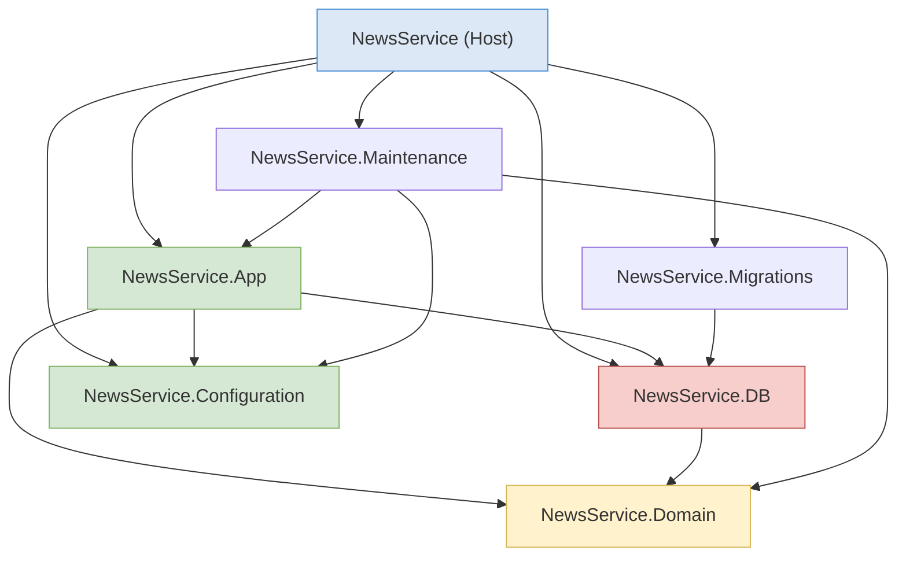

### 5.4 API эндпоинты NewsService

| Метод | Route | Описание | Тело ответа |
|-------|-------|----------|-------------|
| `GET` | `/api/digest/latest?maxNews=10` | Последний неотправленный дайджест | `DigestResponse { Message, TopicIds }` |
| `POST` | `/api/digest/mark-sent` | Пометить темы как отправленные | `{ MarkedCount }` или `404` |
| `GET` | `/api/digest/status` | Статус сервиса | `ServiceStatusResponse` |

### 5.5 LLM-интеграция (Strategy Pattern)

NewsService поддерживает три LLM-провайдера, выбираемых через конфигурацию `LlmConfig.Provider`:

| Провайдер | Класс | Назначение |
|-----------|-------|------------|
| `polza` | `PolzaLlmService` | Polza AI API (облачный) |
| `ollama` | `OllamaLlmService` | Ollama (локальный) |
| *(пусто)* | `NoopLlmService` | Graceful degradation (без суммаризации) |

LLM используется для:
- Суммаризации новостей (`SummarizeAsync`)
- Определения похожих новостей (`AreSimilarAsync`)

При недоступности LLM система продолжает работать без суммаризации.

### 5.6 RSS-парсинг и дедупликация

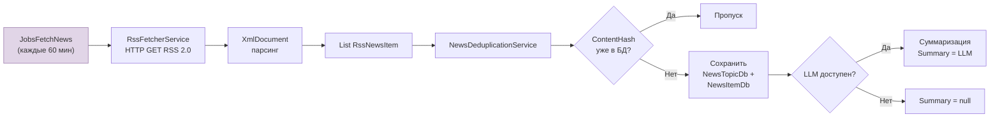

---

## 6. Взаимодействие между сервисами

### 6.1 Сетевая топология в Docker Compose

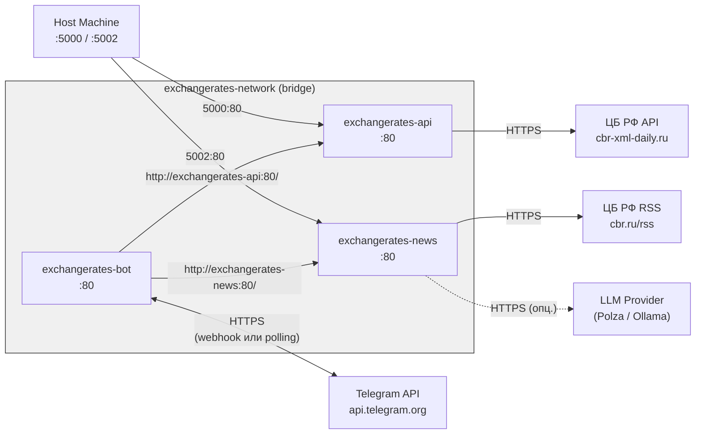

### 6.2 Диаграмма последовательности: пользователь запрашивает курс валюты

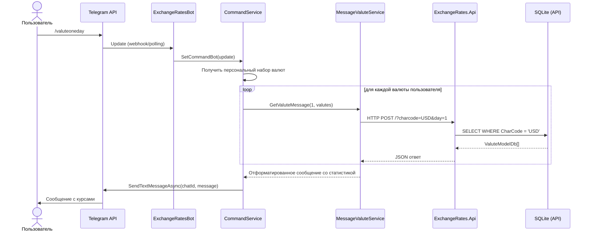

### 6.3 Диаграмма последовательности: рассылка новостного дайджеста

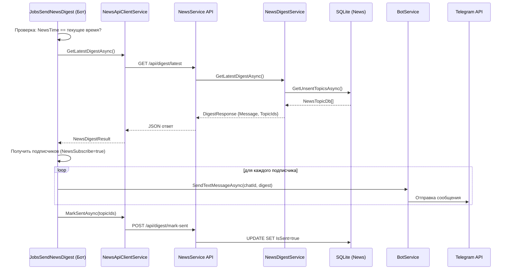

### 6.4 Контракты HTTP-взаимодействия

**Запрос курсов (Бот --> API):**
```
POST http://exchangerates-api:80/?charcode=USD&day=7
```

**Ответ (API --> Бот):**
```json
{
  "dateGet": "2026-03-18T12:00:00",
  "getValuteModels": [
    {
      "name": "Доллар США",
      "charCode": "USD",
      "value": 92.5,
      "dateSave": "2026-03-18T08:40:00",
      "dateValute": "2026-03-18T00:00:00"
    }
  ]
}
```

**Запрос дайджеста (Бот --> NewsService):**
```
GET http://exchangerates-news:80/api/digest/latest?maxNews=10
```

**Ответ (NewsService --> Бот):**
```json
{
  "message": "Markdown-текст дайджеста...",
  "topicIds": [1, 2, 3]
}
```

---

## 7. Потоки данных

### 7.1 Поток сбора курсов валют

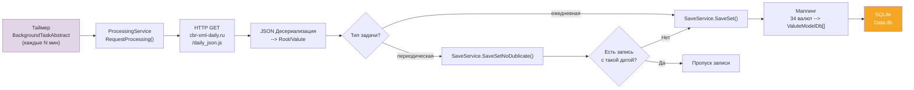

### 7.2 Поток рассылки курсов подписчикам

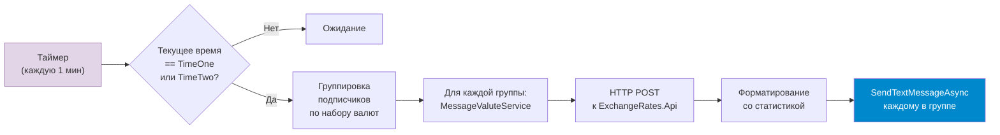

### 7.3 Модель данных

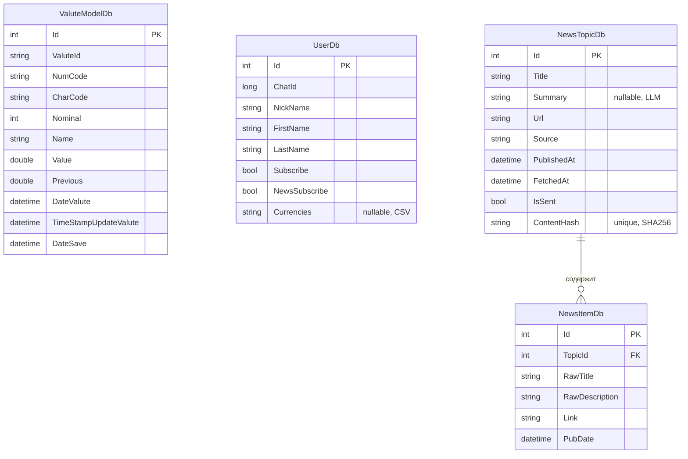

**Индексы:**
- `ValuteModelDb`: DateSave, ValuteId, CharCode
- `NewsTopicDb`: ContentHash (unique), IsSent, PublishedAt
- `NewsItemDb`: TopicId (FK)

---

## 8. Режимы работы Telegram-бота (Webhook vs Polling)

### 8.1 Диаграмма сравнения режимов

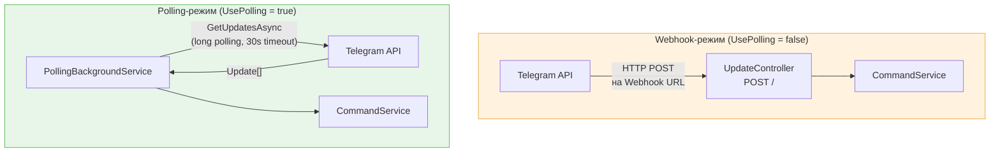

### 8.2 Сравнительная таблица режимов

| Параметр | Webhook | Polling |
|---|---|---|
| Направление соединения | Входящее (Telegram --> бот) | Исходящее (бот --> Telegram) |
| Необходимость публичного IP | Да | Нет |
| HTTPS-сертификат | Обязателен | Не требуется |
| Задержка получения обновлений | Мгновенная | До 30 сек |
| Подходит для Docker | Требует reverse proxy | Да, из коробки |
| Конфигурация | `UsePolling=false`, `Webhook=URL` | `UsePolling=true` |

---

## 9. Архитектурные паттерны

### 9.1 Clean Architecture

Все три сервиса следуют принципам Clean Architecture:

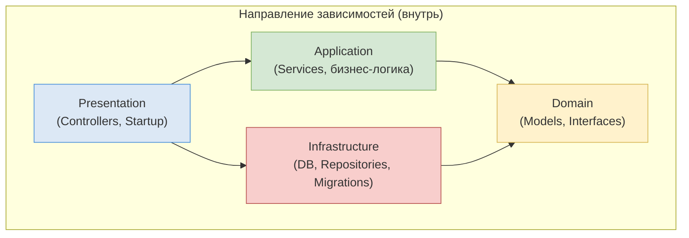

### 9.2 Repository Pattern

Каждый сервис реализует Generic Repository:
- **API**: `IRepositoryBase<T>` --> `RepositoryDbSQLite<T>`
- **Bot**: `IBaseRepositoryDb<T>` --> `RepositoryDb<T>`
- **News**: `INewsRepository` --> `NewsRepository`

### 9.3 Dependency Injection

Вся регистрация зависимостей в `Startup.ConfigureServices()`:

| API | Lifetime |
|---|---|
| `IApiClient` --> `ApiClientService` | Scoped |
| `IProcessingService` --> `ProcessingService` | Scoped |
| `ISaveService` --> `SaveService` | Scoped |
| `IGetValute` --> `GetValuteService` | Transient |
| `IRepositoryBase<>` --> `RepositoryDbSQLite<>` | Scoped |

| Bot | Lifetime |
|---|---|
| `IBotService` --> `BotService` | **Singleton** |
| `IUpdateService` --> `UpdateService` | Scoped |
| `ICommandBot` --> `CommandService` | Scoped |
| `IMessageValute` --> `MessageValuteService` | Scoped |
| `IUserService` --> `UserService` | Scoped |
| `INewsApiClient` --> `NewsApiClientService` | Scoped |

| NewsService | Lifetime |
|---|---|
| `IRssFetcherService` --> `RssFetcherService` | Scoped |
| `INewsDeduplicationService` --> `NewsDeduplicationService` | Scoped |
| `INewsDigestService` --> `NewsDigestService` | Scoped |
| `INewsRepository` --> `NewsRepository` | Scoped |
| `ILlmService` --> `PolzaLlmService` / `OllamaLlmService` / `NoopLlmService` | Scoped |

### 9.4 Background Service (Hosted Service)

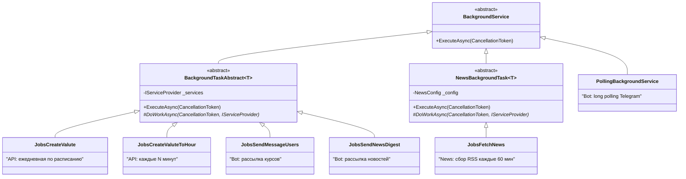

### 9.5 Strategy Pattern (LLM)

NewsService использует Strategy Pattern для выбора LLM-провайдера:

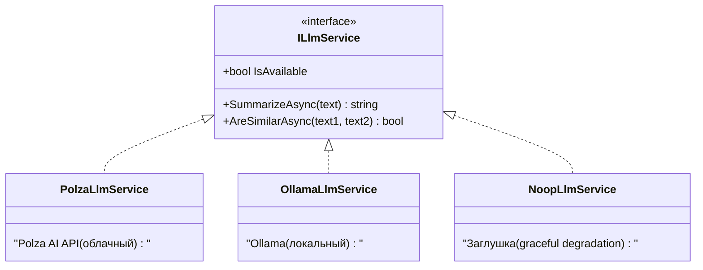

### 9.6 Условная регистрация сервисов

Все три проекта используют условную регистрацию `HostedService` на основе конфигурации:
- **API**: `JobsCreateValute` при `JobsValute=True`
- **Bot**: `PollingBackgroundService` при `UsePolling=true`, `JobsSendNewsDigest` при `NewsEnabled=true`
- **News**: `JobsFetchNews` при `NewsConfig.Enabled=true`

---

## 10. Технологический стек

| Компонент | Технология | Версия |
|---|---|---|
| Runtime | .NET | 10.0 |
| Web Framework | ASP.NET Core | 10.0 |
| ORM | Entity Framework Core | 8.0.0 |
| СУБД | SQLite | - |
| Логирование | Serilog | - |
| Serilog Sink (Console) | Serilog.Sinks.Console | - |
| Serilog Sink (SQLite) | Serilog.Sinks.SQLite | - |
| JSON (API) | System.Text.Json | Built-in |
| JSON (Bot) | Newtonsoft.Json | (AddNewtonsoftJson) |
| Telegram SDK | Telegram.Bot | 16.0.2 |
| Контейнеризация | Docker | Multi-stage build |
| Оркестрация | Docker Compose | 3.3 |

---

## 11. Развертывание (Docker Compose)

### 11.1 Диаграмма развертывания

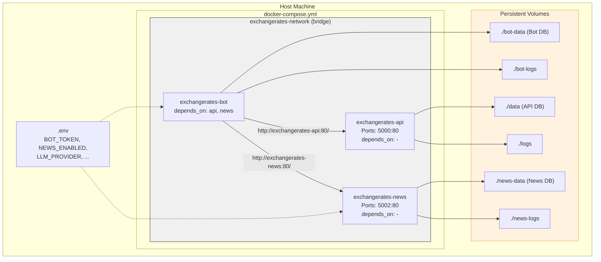

### 11.2 Переменные окружения

См. [README.md](../README.md#переменные-окружения) для полного списка переменных.

### 11.3 Порядок запуска

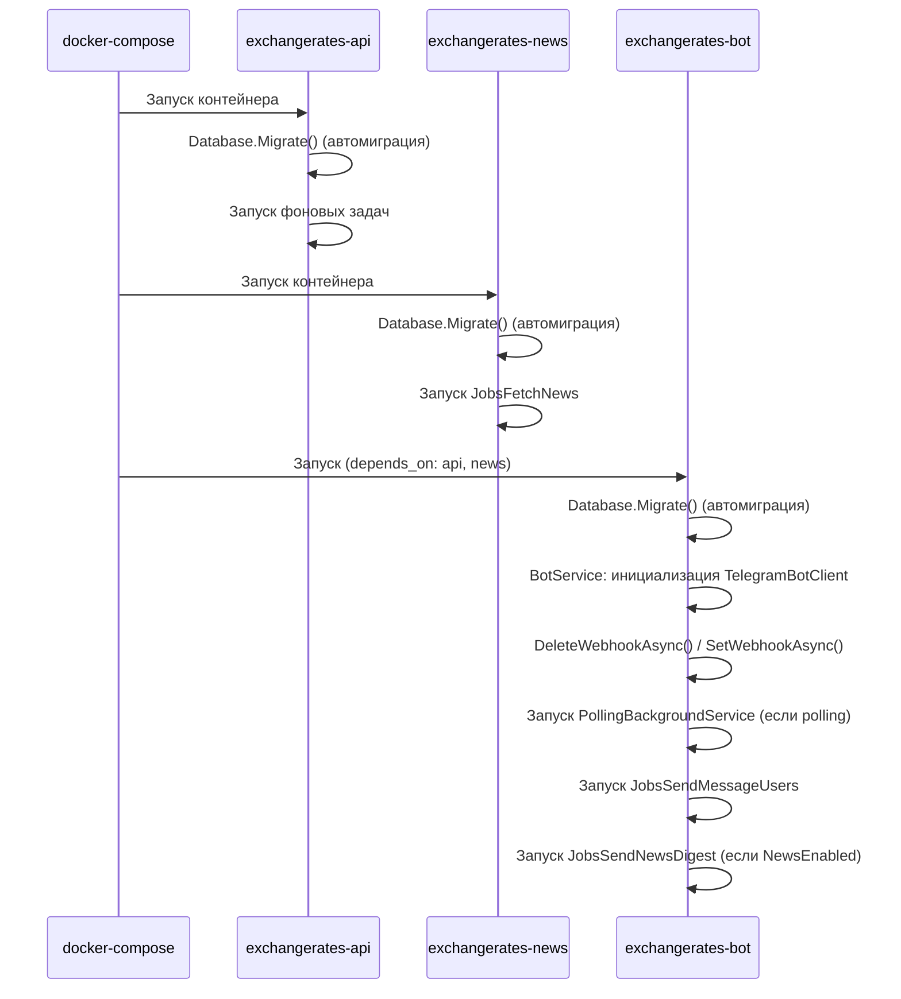

### 11.4 Multi-stage Docker Build

Все три Dockerfile используют двухэтапную сборку:

1. **Build stage** (`mcr.microsoft.com/dotnet/sdk:10.0`): Restore, сборка, публикация
2. **Runtime stage** (`mcr.microsoft.com/dotnet/aspnet:10.0`): Минимальный образ для запуска

---

## 12. Архитектурные решения и их обоснование

### ADR-001: SQLite как СУБД

**Решение**: SQLite для всех трех сервисов.
**Обоснование**: Минимальные требования к инфраструктуре. Данные курсов -- append-only с низким объемом. Каждый сервис использует отдельную БД в отдельном Docker volume.
**Риски**: При росте нагрузки миграция на PostgreSQL через замену `UseSqlite()` на `UseNpgsql()`.

### ADR-002: Раздельные базы данных для каждого сервиса

**Решение**: Три отдельные SQLite базы (Data.db, Data.db, News.db) в раздельных Docker volumes.
**Обоснование**: Разделение ответственности. Устраняет конкурентный доступ к SQLite.

### ADR-003: Telegram.Bot v16.0.2

**Решение**: Фиксированная версия, не обновлять до v17+.
**Обоснование**: v17+ содержит критические breaking changes (переименование методов, изменение сигнатур). Обновление потребует рефакторинга всех мест отправки сообщений.

### ADR-004: Polling как режим по умолчанию

**Решение**: `UsePolling=true` по умолчанию в docker-compose.
**Обоснование**: Docker-окружения часто за NAT. Polling не требует публичного домена.

### ADR-005: Явный маппинг 34 валют

**Решение**: Ручное создание `ValuteModelDb` для каждой валюты в `SaveService.SaveSet()`.
**Обоснование**: Типобезопасность. API ЦБ использует именованные свойства (не коллекцию).

### ADR-006: Scoped сервисы через CreateScope()

**Решение**: Фоновые задачи создают DI-scope через `IServiceProvider.CreateScope()`.
**Обоснование**: BackgroundService -- Singleton, а EF Core DbContext требует Scoped lifetime.

### ADR-007: NewsService как отдельный микросервис

**Решение**: Выделить новостную функциональность в отдельный сервис вместо встраивания в бота.
**Обоснование**: Разделение ответственности (SRP). Независимое масштабирование. Изоляция LLM-нагрузки. Бот обращается к NewsService через HTTP, как к API.

### ADR-008: LLM с graceful degradation

**Решение**: Три реализации ILlmService (Polza, Ollama, Noop) с автоматическим fallback на NoopLlmService.
**Обоснование**: LLM -- опциональная функция. Система должна работать без LLM, просто без суммаризации новостей.

### ADR-009: SHA256 для дедупликации новостей

**Решение**: ContentHash (SHA256 от нормализованного заголовка) с уникальным индексом в БД.
**Обоснование**: Быстрая проверка дубликатов без полнотекстового сравнения. Нормализация (lowercase, trim, strip HTML) уменьшает ложные различия.

### ADR-010: Персонализация набора валют

**Решение**: Поле `Currencies` (CSV-строка, nullable) в UserDb. Inline-клавиатура с 10 валютами.
**Обоснование**: Не все 34 валюты нужны каждому пользователю. NULL = дефолтный набор (USD, EUR, GBP, JPY, CNY) для обратной совместимости.

### ADR-011: Миграция на .NET 10.0 с EF Core 8.0

**Решение**: Обновить все 22 проекта до .NET 10.0, EF Core до 8.0.0. Telegram.Bot остается на v16.0.2.
**Обоснование**: Актуальная платформа, LTS-поддержка. EF Core 8.0.0 -- стабильная версия, совместимая с .NET 10.0.
