# Архитектурная документация ExchangeRates.Api

**Версия**: 1.0
**Дата**: 2026-03-10
**Автор**: Software Architect Agent

---

## Содержание

1. [Обзор системы](#1-обзор-системы)
2. [Архитектура высокого уровня](#2-архитектура-высокого-уровня)
3. [ExchangeRates.Api -- компонентная архитектура](#3-exchangeratesapi----компонентная-архитектура)
4. [ExchangeRatesBot -- компонентная архитектура](#4-exchangeratesbot----компонентная-архитектура)
5. [Взаимодействие между сервисами](#5-взаимодействие-между-сервисами)
6. [Потоки данных](#6-потоки-данных)
7. [Режимы работы Telegram-бота (Webhook vs Polling)](#7-режимы-работы-telegram-бота-webhook-vs-polling)
8. [Архитектурные паттерны](#8-архитектурные-паттерны)
9. [Технологический стек](#9-технологический-стек)
10. [Развертывание (Docker Compose)](#10-развертывание-docker-compose)
11. [Архитектурные решения и их обоснование](#11-архитектурные-решения-и-их-обоснование)

---

## 1. Обзор системы

**ExchangeRates.Api** -- система для сбора, хранения и предоставления данных о курсах валют Центрального Банка Российской Федерации. Система состоит из двух основных сервисов:

- **ExchangeRates.Api** -- REST API для периодического сбора курсов валют из внешнего источника (ЦБ РФ) и предоставления исторических данных через HTTP-эндпоинт.
- **ExchangeRatesBot** -- Telegram-бот, выступающий клиентом API и предоставляющий пользователям удобный интерфейс для получения курсов валют, подписки на рассылки.

Оба сервиса работают как ASP.NET Core 5.0 Web-приложения, развертываются в Docker-контейнерах и взаимодействуют через внутреннюю Docker-сеть.

### Ключевые характеристики

| Характеристика | Значение |
|---|---|
| Платформа | .NET 5.0 (ASP.NET Core) |
| СУБД | SQLite (отдельные БД для API и бота) |
| Внешний источник данных | cbr-xml-daily.ru (JSON API ЦБ РФ) |
| Протокол взаимодействия сервисов | HTTP (REST) |
| Развертывание | Docker Compose (2 контейнера) |
| Логирование | Serilog (Console + SQLite) |
| Поддержка валют | 34 валюты (AMD, AUD, AZN, BGN, BRL, BYN, CAD, CHF, CNY, CZK, DKK, EUR, GBP, HKD, HUF, INR, JPY, KGS, KRW, KZT, MDL, NOK, PLN, RON, SEK, SGD, TJS, TMT, TRY, UAH, USD, UZS, XDR, ZAR) |

---

## 2. Архитектура высокого уровня

### 2.1 Диаграмма системного контекста (C4 Level 1)

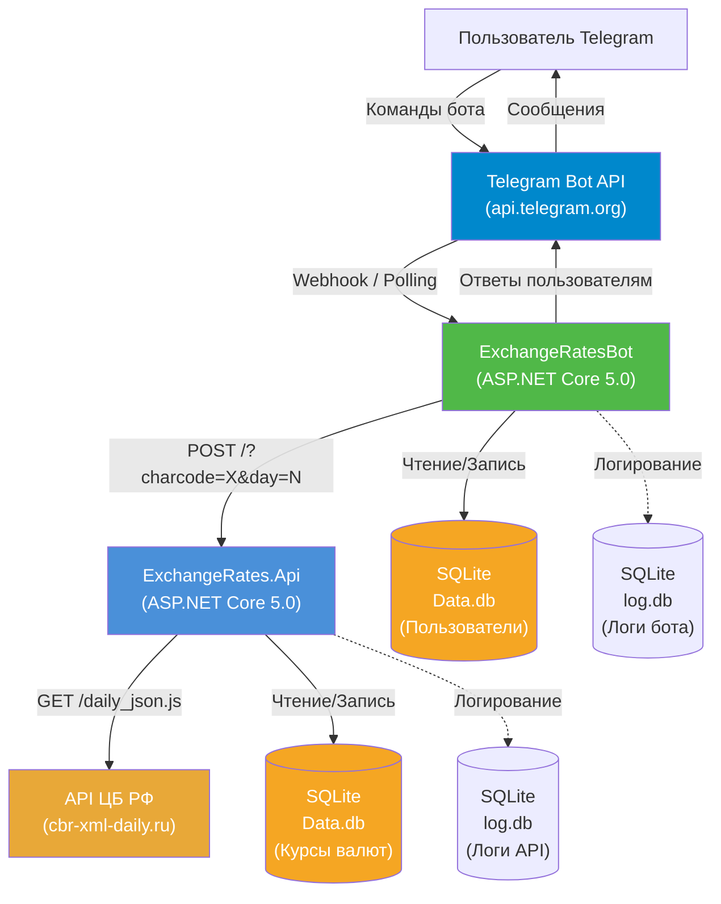

### 2.2 Диаграмма контейнеров (C4 Level 2)

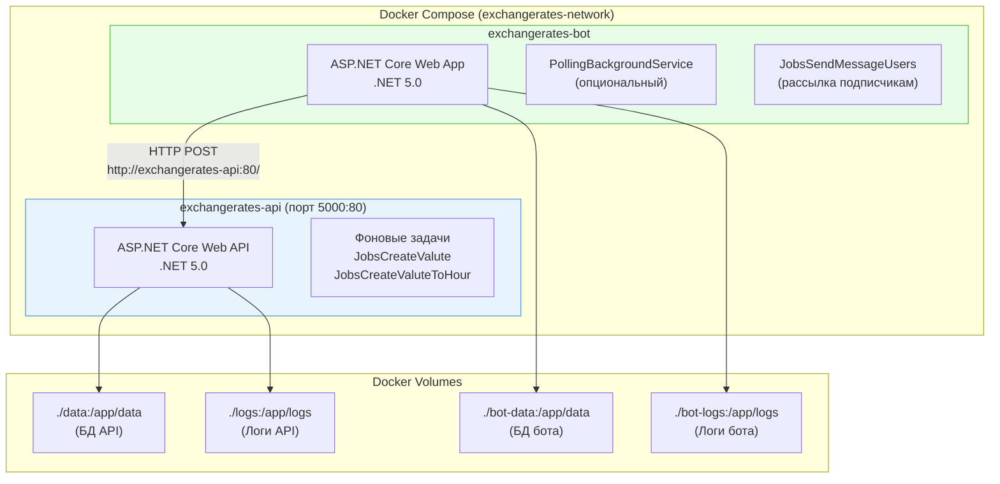

---

## 3. ExchangeRates.Api -- компонентная архитектура

API-сервис реализован по принципам **Clean Architecture (Чистая архитектура)** с четким разделением на слои.

### 3.1 Структура проектов

```
src/
  ExchangeRates.Api/                    # Presentation Layer (точка входа)
  ExchangeRates.Core.Domain/            # Domain Layer (модели, интерфейсы)
  ExchangeRates.Core.App/               # Application Layer (бизнес-логика)
  ExchangeRates.Infrastructure.DB/      # Infrastructure Layer (EF Core DbContext)
  ExchangeRates.Infrastructure.SQLite/  # Infrastructure Layer (репозиторий SQLite)
  ExchangeRates.Configuration/          # Cross-Cutting (конфигурация)
  ExchangeRates.Maintenance/            # Cross-Cutting (фоновые задачи)
  ExchangeRates.Migrations/             # Infrastructure (EF Core миграции)
```

### 3.2 Компонентная диаграмма ExchangeRates.Api

```mermaid
graph TB
    subgraph Presentation["Presentation Layer"]
        Controller["ValuteController<br/>[ApiController]<br/>POST /?charCode=X&day=N"]
        Startup["Startup<br/>(DI, Middleware)"]
        Program["Program<br/>(Serilog, Host)"]
    end

    subgraph Application["Application Layer (Core.App)"]
        ProcessingService["ProcessingService<br/>: IProcessingService<br/>(Запрос к API ЦБ)"]
        SaveService["SaveService<br/>: ISaveService<br/>(Маппинг и сохранение)"]
        GetValuteService["GetValuteService<br/>: IGetValute<br/>(Чтение истории)"]
        ApiClientService["ApiClientService<br/>: IApiClient<br/>(HTTP-клиент)"]
    end

    subgraph Domain["Domain Layer (Core.Domain)"]
        IProcessingService["IProcessingService"]
        ISaveService["ISaveService"]
        IGetValute["IGetValute"]
        IApiClient["IApiClient"]
        IRepositoryBase["IRepositoryBase T"]
        Root["Root"]
        Valute["Valute<br/>(34 свойства-валюты)"]
        ParseModel["ParseModel<br/>(базовый класс валюты)"]
        GetValuteM["GetValute<br/>GetValuteModel"]
    end

    subgraph Infrastructure["Infrastructure Layer"]
        DataDb["DataDb<br/>: DbContext<br/>(EF Core)"]
        ValuteModelDb["ValuteModelDb<br/>(DB-модель)"]
        RepositoryDbSQLite["RepositoryDbSQLite T<br/>: IRepositoryBase T"]
    end

    subgraph Maintenance["Maintenance (Фоновые задачи)"]
        BackgroundAbstract["BackgroundTaskAbstract T<br/>: BackgroundService"]
        JobsCreateValute["JobsCreateValute<br/>(ежедневная, по расписанию)"]
        JobsCreateValuteToHour["JobsCreateValuteToHour<br/>(каждые N минут, без дубликатов)"]
    end

    subgraph Config["Configuration"]
        ClientConfig["ClientConfig<br/>(SiteApi, PeriodMinute,<br/>TimeUpdateJobs, ...)"]
    end

    Controller --> IGetValute
    GetValuteService -.->|реализует| IGetValute
    ProcessingService -.->|реализует| IProcessingService
    SaveService -.->|реализует| ISaveService
    ApiClientService -.->|реализует| IApiClient

    ProcessingService --> IApiClient
    ProcessingService --> Root
    SaveService --> IRepositoryBase
    SaveService --> Root
    SaveService --> ValuteModelDb
    GetValuteService --> IRepositoryBase
    GetValuteService --> GetValuteM

    RepositoryDbSQLite -.->|реализует| IRepositoryBase
    RepositoryDbSQLite --> DataDb
    DataDb --> ValuteModelDb

    JobsCreateValute --> BackgroundAbstract
    JobsCreateValuteToHour --> BackgroundAbstract
    JobsCreateValute --> IProcessingService
    JobsCreateValute --> ISaveService
    JobsCreateValuteToHour --> IProcessingService
    JobsCreateValuteToHour --> ISaveService

    Root --> Valute
    Valute --> ParseModel

    style Presentation fill:#dce8f5,stroke:#4a90d9
    style Application fill:#d5e8d4,stroke:#82b366
    style Domain fill:#fff2cc,stroke:#d6b656
    style Infrastructure fill:#f8cecc,stroke:#b85450
    style Maintenance fill:#e1d5e7,stroke:#9673a6
    style Config fill:#d5e8d4,stroke:#82b366
```

### 3.3 Зависимости между проектами (направление ссылок)

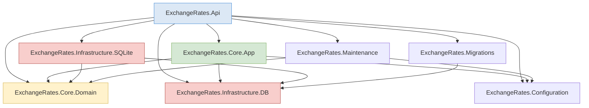

> **Примечание**: Зависимость `Core.App --> Infrastructure.DB` (конкретно на `ValuteModelDb`) нарушает строгий принцип Clean Architecture, где Application Layer не должен знать об инфраструктурных деталях. Это осознанный компромисс ради простоты маппинга в `SaveService`.

---

## 4. ExchangeRatesBot -- компонентная архитектура

Telegram-бот также построен по слоистой архитектуре, аналогичной API, но с собственным набором проектов.

### 4.1 Структура проектов

```
src/bot/
  ExchangeRatesBot/                    # Presentation Layer (точка входа, контроллеры)
  ExchangeRatesBot.App/               # Application Layer (сервисы, фразы)
  ExchangeRatesBot.Domain/            # Domain Layer (модели, интерфейсы)
  ExchangeRatesBot.DB/                # Infrastructure Layer (EF Core DbContext, репозиторий)
  ExchangeRatesBot.Configuration/     # Cross-Cutting (конфигурация BotConfig)
  ExchangeRatesBot.Maintenance/       # Cross-Cutting (фоновые задачи, polling)
  ExchangeRatesBot.Migrations/        # Infrastructure (EF Core миграции)
```

### 4.2 Компонентная диаграмма ExchangeRatesBot

```mermaid
graph TB
    subgraph Presentation["Presentation Layer"]
        UpdateController["UpdateController<br/>[ApiController]<br/>POST / (webhook)"]
        BotStartup["Startup<br/>(DI, Middleware)"]
        BotProgram["Program<br/>(Serilog, Host)"]
    end

    subgraph Application["Application Layer (Bot.App)"]
        BotService["BotService<br/>: IBotService<br/>(TelegramBotClient, Singleton)"]
        CommandService["CommandService<br/>: ICommandBot<br/>(Маршрутизация команд)"]
        UpdateService["UpdateService<br/>: IUpdateService<br/>(Отправка сообщений)"]
        BotProcessing["ProcessingService<br/>: IProcessingService<br/>(HTTP-клиент к API)"]
        MessageValute["MessageValuteService<br/>: IMessageValute<br/>(Форматирование курсов)"]
        UserServiceBot["UserService<br/>: IUserService<br/>(Управление пользователями)"]
        BotApiClient["ApiClientService<br/>: IApiClient<br/>(HTTP-клиент)"]
        BotPhrases["BotPhrases<br/>(Статические тексты)"]
    end

    subgraph Domain["Domain Layer (Bot.Domain)"]
        IBotService["IBotService"]
        ICommandBot["ICommandBot"]
        IUpdateServiceI["IUpdateService"]
        IProcessingBot["IProcessingService"]
        IMessageValuteI["IMessageValute"]
        IUserServiceI["IUserService"]
        IApiClientBot["IApiClient"]
        IBaseRepo["IBaseRepositoryDb T"]
        UserModel["User"]
        BotRoot["Root<br/>GetValuteModel"]
        Entity["Entity (базовый класс)"]
        ValuteBot["Valute<br/>(отображение курса)"]
        CurrentUserM["CurrentUser"]
    end

    subgraph InfrastructureBot["Infrastructure Layer (Bot.DB)"]
        BotDataDb["DataDb<br/>: DbContext"]
        UserDb["UserDb : Entity<br/>(модель БД)"]
        RepositoryDb["RepositoryDb T<br/>: IBaseRepositoryDb T"]
    end

    subgraph MaintenanceBot["Maintenance (Фоновые задачи)"]
        BotBackgroundAbstract["BackgroundTaskAbstract T<br/>: BackgroundService"]
        JobsSendMessage["JobsSendMessageUsers<br/>(рассылка по расписанию)"]
        PollingService["PollingBackgroundService<br/>: BackgroundService<br/>(polling режим)"]
    end

    subgraph ConfigBot["Configuration"]
        BotConfig["BotConfig<br/>(BotToken, Webhook,<br/>UsePolling, UrlRequest, ...)"]
    end

    UpdateController --> ICommandBot
    CommandService -.->|реализует| ICommandBot
    BotService -.->|реализует| IBotService
    UpdateService -.->|реализует| IUpdateServiceI
    BotProcessing -.->|реализует| IProcessingBot
    MessageValute -.->|реализует| IMessageValuteI
    UserServiceBot -.->|реализует| IUserServiceI
    BotApiClient -.->|реализует| IApiClientBot

    CommandService --> IUpdateServiceI
    CommandService --> IMessageValuteI
    CommandService --> IUserServiceI
    UpdateService --> IBotService
    BotProcessing --> IApiClientBot
    MessageValute --> IProcessingBot
    UserServiceBot --> IBaseRepo

    RepositoryDb -.->|реализует| IBaseRepo
    RepositoryDb --> BotDataDb
    BotDataDb --> UserDb
    UserDb --> Entity

    JobsSendMessage --> BotBackgroundAbstract
    JobsSendMessage --> IBotService
    JobsSendMessage --> IMessageValuteI
    JobsSendMessage --> IBaseRepo

    PollingService --> IBotService
    PollingService --> ICommandBot

    style Presentation fill:#dce8f5,stroke:#4a90d9
    style Application fill:#d5e8d4,stroke:#82b366
    style Domain fill:#fff2cc,stroke:#d6b656
    style InfrastructureBot fill:#f8cecc,stroke:#b85450
    style MaintenanceBot fill:#e1d5e7,stroke:#9673a6
    style ConfigBot fill:#d5e8d4,stroke:#82b366
```

---

## 5. Взаимодействие между сервисами

### 5.1 Сетевая топология в Docker Compose

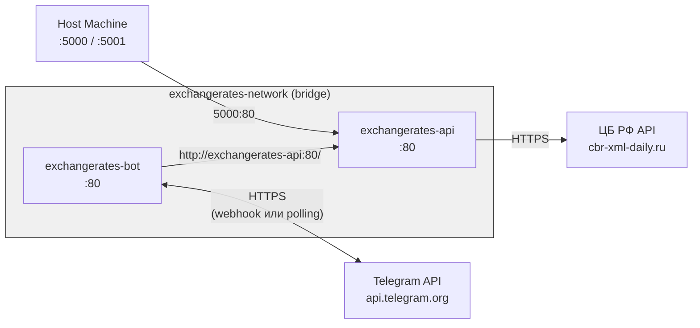

### 5.2 Диаграмма последовательности: пользователь запрашивает курс валюты

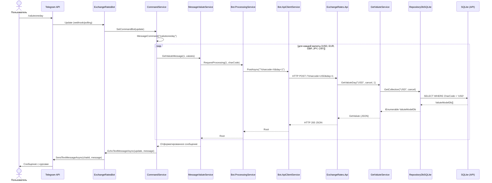

### 5.3 Контракт HTTP-взаимодействия между сервисами

**Запрос (Бот --> API):**
```
POST http://exchangerates-api:80/?charcode=USD&day=7
Content-Type: (пустое тело)
```

**Ответ (API --> Бот):**
```json
{
  "dateGet": "2026-03-10T12:00:00",
  "getValuteModels": [
    {
      "name": "Доллар США",
      "charCode": "USD",
      "value": 92.5,
      "dateSave": "2026-03-10T08:40:00",
      "dateValute": "2026-03-10T00:00:00"
    }
  ]
}
```

---

## 6. Потоки данных

### 6.1 Поток сбора данных (Фоновая задача API)

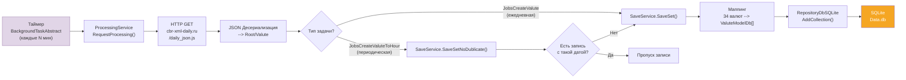

### 6.2 Поток рассылки курсов подписчикам (Фоновая задача бота)

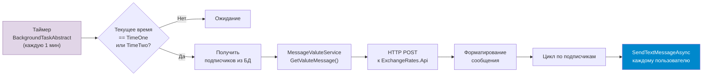

### 6.3 Модель данных

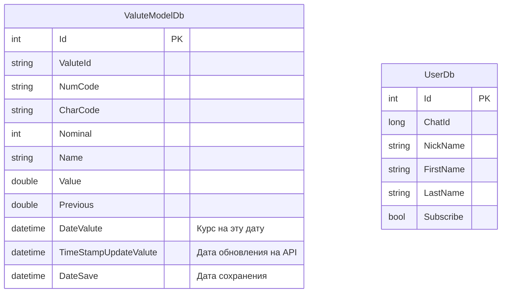

**Индексы таблицы ValuteModelDb:**
- `DateSave` -- для быстрой сортировки по дате сохранения
- `ValuteId` -- для фильтрации по идентификатору валюты ЦБ
- `CharCode` -- для фильтрации по буквенному коду валюты (основной фильтр API)

---

## 7. Режимы работы Telegram-бота (Webhook vs Polling)

Бот поддерживает два режима получения обновлений от Telegram API, переключаемых через конфигурацию `BotConfig.UsePolling`.

### 7.1 Диаграмма сравнения режимов

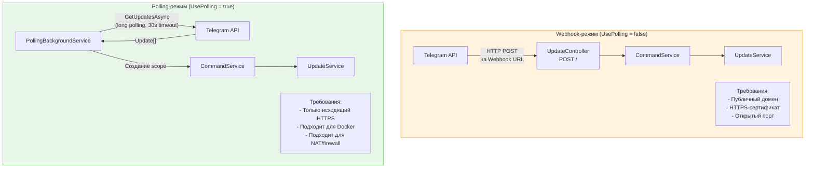

### 7.2 Последовательность инициализации режимов

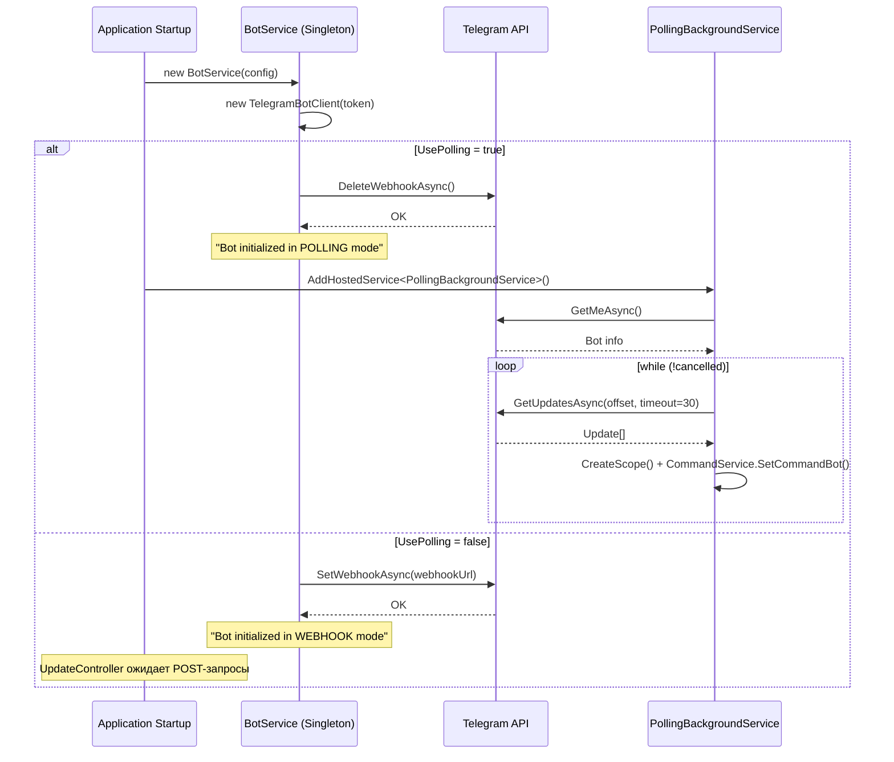

### 7.3 Сравнительная таблица режимов

| Параметр | Webhook | Polling |
|---|---|---|
| Направление соединения | Входящее (Telegram --> бот) | Исходящее (бот --> Telegram) |
| Необходимость публичного IP | Да | Нет |
| HTTPS-сертификат | Обязателен | Не требуется |
| Задержка получения обновлений | Мгновенная | До 30 сек (long polling) |
| Нагрузка на сервер | Пассивная (по событию) | Активная (постоянный цикл) |
| Подходит для Docker | Требует reverse proxy | Да, из коробки |
| Конфигурация | `UsePolling=false`, `Webhook=URL` | `UsePolling=true` |
| Рекомендация для production | С публичным доменом | За NAT / без домена |

---

## 8. Архитектурные паттерны

### 8.1 Clean Architecture (Чистая архитектура)

Оба сервиса следуют принципам Clean Architecture с разделением на слои:

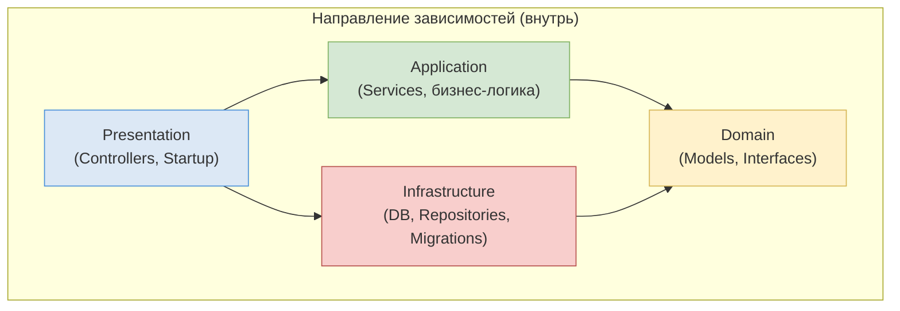

**Правило зависимостей**: Внутренние слои (Domain) не зависят от внешних. Интерфейсы определены в Domain, реализации -- в Application и Infrastructure.

### 8.2 Паттерн Repository

Оба сервиса реализуют **Generic Repository**:

- **API**: `IRepositoryBase<T>` (Domain) --> `RepositoryDbSQLite<T>` (Infrastructure.SQLite)
- **Bot**: `IBaseRepositoryDb<T>` (Domain) --> `RepositoryDb<T>` (DB)

Репозитории инкапсулируют доступ к `DbContext` и предоставляют типобезопасные операции CRUD.

### 8.3 Dependency Injection (Инверсия зависимостей)

Вся регистрация зависимостей сосредоточена в `Startup.ConfigureServices()`:

| API: Интерфейс --> Реализация | Lifetime |
|---|---|
| `IApiClient` --> `ApiClientService` | Scoped |
| `IProcessingService` --> `ProcessingService` | Scoped |
| `ISaveService` --> `SaveService` | Scoped |
| `IGetValute` --> `GetValuteService` | Transient |
| `IRepositoryBase<>` --> `RepositoryDbSQLite<>` | Scoped |

| Bot: Интерфейс --> Реализация | Lifetime |
|---|---|
| `IBotService` --> `BotService` | **Singleton** |
| `IUpdateService` --> `UpdateService` | Scoped |
| `IProcessingService` --> `ProcessingService` | Scoped |
| `ICommandBot` --> `CommandService` | Scoped |
| `IApiClient` --> `ApiClientService` | Scoped |
| `IMessageValute` --> `MessageValuteService` | Scoped |
| `IUserService` --> `UserService` | Scoped |
| `IBaseRepositoryDb<>` --> `RepositoryDb<>` | Scoped |

> **Важно**: `BotService` зарегистрирован как Singleton, поскольку содержит единственный экземпляр `TelegramBotClient`, который разделяется между всеми запросами и фоновыми сервисами.

### 8.4 Background Service (Hosted Service)

Фоновые задачи реализованы через наследование от `BackgroundService`:

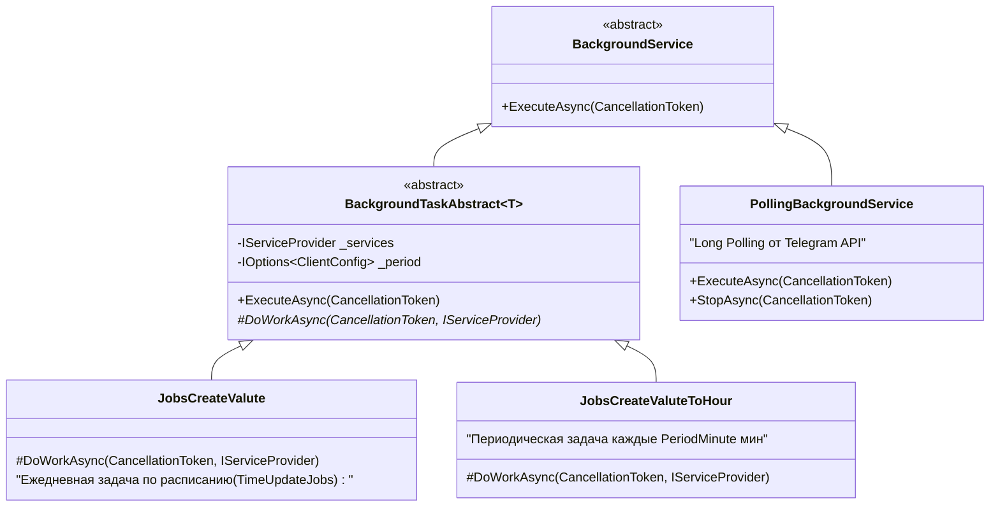

Паттерн **Scoped Service in Background Task**: фоновые задачи используют `IServiceProvider.CreateScope()` для создания scoped-зависимостей внутри long-running hosted service.

### 8.5 Условная регистрация сервисов

Оба проекта используют паттерн условной регистрации `HostedService` на основе конфигурации:

- **API**: `JobsCreateValute` и `JobsCreateValuteToHour` регистрируются только при `JobsValute=True` / `JobsValuteToHour=True`
- **Bot**: `PollingBackgroundService` регистрируется только при `UsePolling=true`

---

## 9. Технологический стек

### 9.1 Общие технологии

| Компонент | Технология | Версия |
|---|---|---|
| Runtime | .NET | 5.0 |
| Web Framework | ASP.NET Core | 5.0 |
| ORM | Entity Framework Core | 5.x |
| СУБД | SQLite | - |
| Логирование | Serilog | - |
| Serilog Sink (Console) | Serilog.Sinks.Console | - |
| Serilog Sink (SQLite) | Serilog.Sinks.SQLite | - |
| JSON Serialization (API) | System.Text.Json | Built-in |
| JSON Serialization (Bot) | Newtonsoft.Json | (AddNewtonsoftJson) |
| Telegram SDK | Telegram.Bot | 16.0.2 |
| Контейнеризация | Docker | Multi-stage build |
| Оркестрация | Docker Compose | 3.8 |

### 9.2 Диаграмма зависимостей NuGet

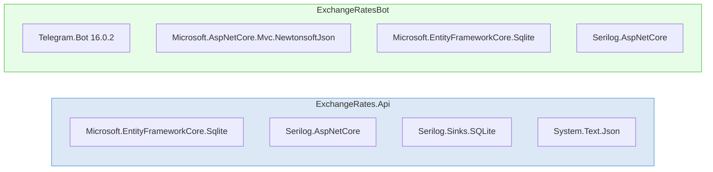

---

## 10. Развертывание (Docker Compose)

### 10.1 Диаграмма развертывания

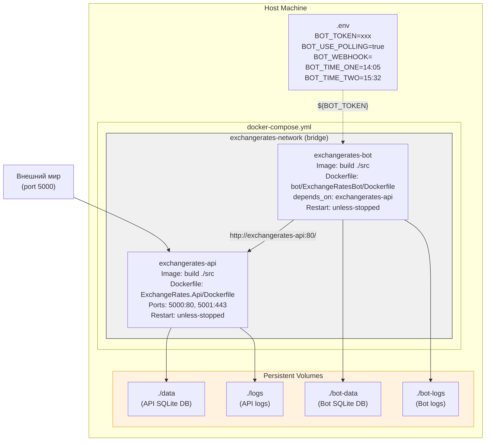

### 10.2 Конфигурация через переменные окружения

**API (exchangerates-api):**

| Переменная | Описание | Значение по умолчанию |
|---|---|---|
| `ASPNETCORE_ENVIRONMENT` | Окружение | Production |
| `ConnectionStrings__DbData` | Строка подключения SQLite | Data Source=/app/data/Data.db |
| `ClientConfig__SiteApi` | URL API ЦБ РФ | https://www.cbr-xml-daily.ru/ |
| `ClientConfig__SiteGet` | Эндпоинт API ЦБ | daily_json.js |
| `ClientConfig__PeriodMinute` | Интервал фоновой задачи (мин) | 30 |
| `ClientConfig__TimeUpdateJobs` | Время ежедневной задачи | 08:40 |
| `ClientConfig__JobsValute` | Включить ежедневную задачу | false |
| `ClientConfig__JobsValuteToHour` | Включить периодическую задачу | True |

**Bot (exchangerates-bot):**

| Переменная | Описание | Значение по умолчанию |
|---|---|---|
| `BotConfig__BotToken` | Telegram Bot Token | из .env |
| `BotConfig__UsePolling` | Режим polling | true |
| `BotConfig__Webhook` | URL для webhook | (пустой) |
| `BotConfig__UrlRequest` | URL ExchangeRates.Api | http://exchangerates-api:80/ |
| `BotConfig__TimeOne` | Время рассылки 1 | 14:05 |
| `BotConfig__TimeTwo` | Время рассылки 2 | 15:32 |
| `ConnectionStrings__SqliteConnection` | Строка подключения SQLite | Data Source=/app/data/Data.db |

### 10.3 Порядок запуска

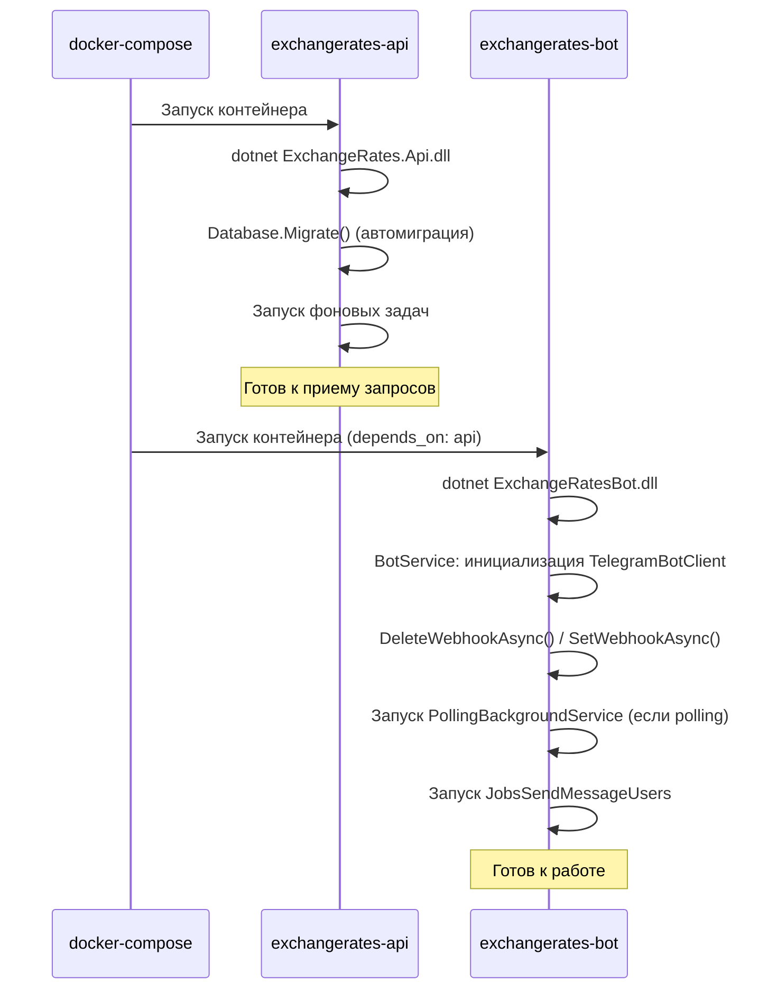

### 10.4 Multi-stage Docker Build

Оба Dockerfile используют двухэтапную сборку:

1. **Build stage** (`mcr.microsoft.com/dotnet/sdk:5.0`): Restore зависимостей, сборка и публикация
2. **Runtime stage** (`mcr.microsoft.com/dotnet/aspnet:5.0`): Минимальный образ для запуска

Это значительно уменьшает размер финального образа (SDK ~700MB --> Runtime ~200MB).

---

## 11. Архитектурные решения и их обоснование

### ADR-001: SQLite как СУБД

**Решение**: Использовать SQLite для обоих сервисов.

**Обоснование**: Минимальные требования к инфраструктуре. Нет необходимости в отдельном сервере СУБД. Данные курсов валют -- append-only с низким объемом записей (34 записи в день).

**Риски**: При значительном росте нагрузки потребуется миграция на PostgreSQL или другую СУБД. Путь миграции: заменить `UseSqlite()` на `UseNpgsql()` и обновить миграции.

### ADR-002: Раздельные базы данных для API и бота

**Решение**: Каждый сервис имеет собственную SQLite базу данных в отдельном Docker volume.

**Обоснование**: Разделение ответственности. API хранит курсы валют, бот -- пользователей и подписки. Устраняет проблему конкурентного доступа к SQLite (WAL mode ограничен одним писателем).

### ADR-003: Telegram.Bot v16.0.2 (фиксированная версия)

**Решение**: Оставаться на Telegram.Bot v16.0.2 вместо обновления до v17+.

**Обоснование**: v17 содержит breaking changes в API (`SendTextMessageAsync` стал extension method с другой сигнатурой, удалены параметры). Обновление потребовало бы значительного рефакторинга всех мест отправки сообщений.

### ADR-004: Polling как режим по умолчанию для Docker

**Решение**: По умолчанию бот работает в polling-режиме (`UsePolling=true` в docker-compose).

**Обоснование**: Docker-окружения часто находятся за NAT без публичного домена. Polling не требует входящих соединений и HTTPS-сертификата. Webhook остается доступным для production-развертываний с публичным доменом.

### ADR-005: Явный маппинг 34 валют в SaveService

**Решение**: Ручное создание `ValuteModelDb` для каждой из 34 валют в `SaveService.SaveSet()`.

**Обоснование**: Типобезопасность и явность маппинга. Модель API ЦБ использует именованные свойства (не коллекцию), что делает рефлексию избыточной. Компромисс: ~500 строк кода маппинга в обмен на полный контроль и отсутствие "магии".

### ADR-006: Scoped сервисы через CreateScope() в фоновых задачах

**Решение**: Фоновые задачи (`BackgroundService`) создают собственные DI-scope через `IServiceProvider.CreateScope()`.

**Обоснование**: `BackgroundService` работает как Singleton, но бизнес-сервисы зарегистрированы как Scoped (EF Core DbContext требует Scoped lifetime). `CreateScope()` создает изолированный контекст для каждого цикла выполнения задачи.
