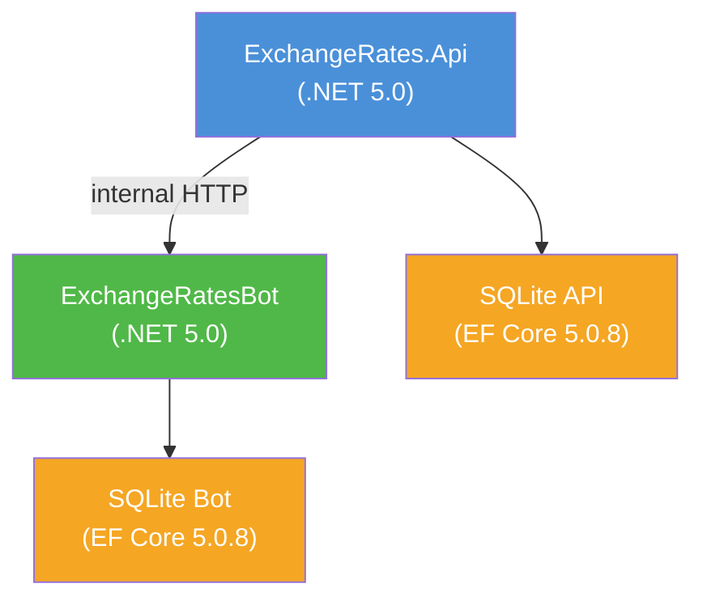
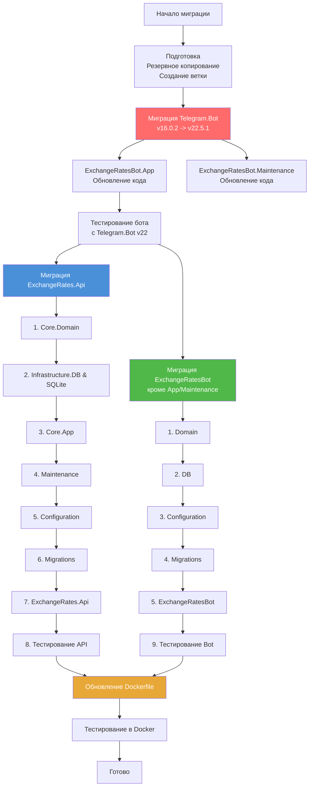
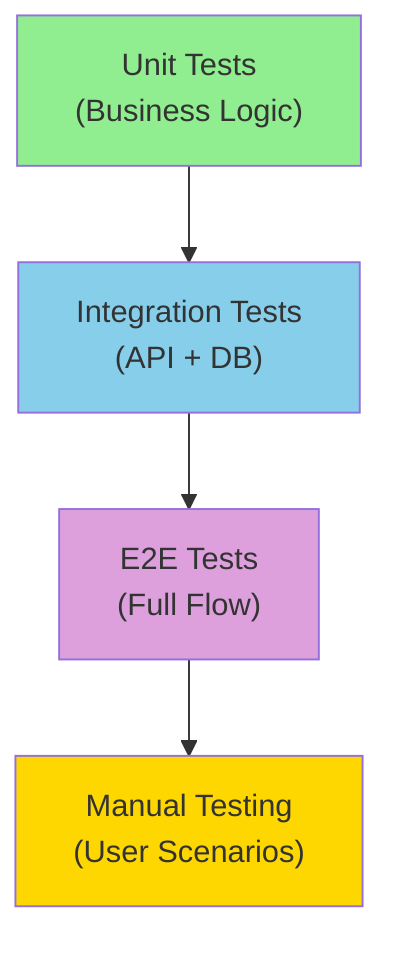
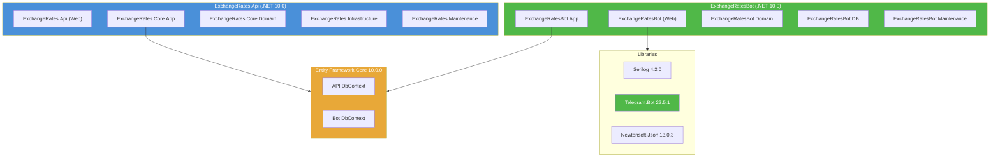

# План миграции ExchangeRates.Api на .NET 10

- [x] Реализовано

**Дата создания**: 2026-03-11
**Автор**: Software Architect Agent
**Версия плана**: 2.0
**Статус**: Проектирование

---

## Содержание

1. [Введение и цели](#1-введение-и-цели)
2. [Анализ текущего состояния](#2-анализ-текущего-состояния)
3. [Матрица совместимости пакетов](#3-матрица-совместимости-пакетов)
4. [Потенциальные Breaking Changes](#4-потенциальные-breaking-changes)
5. [Изменения в коде для Telegram.Bot v22.x](#5-изменения-в-коде-для-telegrambot-v22x)
6. [План миграции](#6-план-миграции)
7. [Архитектурные решения для миграции](#7-архитектурные-решения-для-миграции)
8. [Чеклист проверки](#8-чеклист-проверки)
9. [Стратегия тестирования](#9-стратегия-тестирования)
10. [Оценка рисков](#10-оценка-рисков)
11. [Rollback план](#11-rollback-план)

---

## 1. Введение и цели

### 1.1 Цели миграции

| Цель | Описание |
|---|---|
| Обновление runtime | Переход с .NET 5.0 (LTS) на .NET 10 (LTS) |
| Обновление Telegram.Bot | Миграция с v16.0.2 на v22.5.1 для получения новых возможностей Bot API |
| Получение новых возможностей | Использование улучшений производительности, новых API |
| Безопасность | Устранение устаревших зависимостей и потенциальных уязвимостей |
| Долгосрочная поддержка | .NET 10 будет поддерживаться до 2030+ года |

### 1.2 Объем работ

Миграция затрагивает **2 сервиса, 14 проектов, 2 Dockerfile**:

**ExchangeRates.Api (8 проектов):**
- ExchangeRates.Api (Web API)
- ExchangeRates.Core.Domain
- ExchangeRates.Core.App
- ExchangeRates.Infrastructure.DB
- ExchangeRates.Infrastructure.SQLite
- ExchangeRates.Configuration
- ExchangeRates.Maintenance
- ExchangeRates.Migrations

**ExchangeRatesBot (6 проектов):**
- ExchangeRatesBot (Web App)
- ExchangeRatesBot.App
- ExchangeRatesBot.Domain
- ExchangeRatesBot.DB
- ExchangeRatesBot.Configuration
- ExchangeRatesBot.Maintenance
- ExchangeRatesBot.Migrations

### 1.3 Ограничения и не изменяемые компоненты

| Компонент | Ограничение | Обоснование |
|---|---|---|
| Архитектура приложения | Не менять | Clean Architecture остается в силе |
| Конфигурация | Обратная совместимость | appsettings.json и переменные окружения остаются |

---

## 2. Анализ текущего состояния

### 2.1 Текущие версии пакетов

#### ExchangeRates.Api

| Проект | TargetFramework | NuGet пакеты (версии) |
|---|---|---|
| ExchangeRates.Api | net5.0 | Microsoft.EntityFrameworkCore.Design 5.0.8<br/>Serilog 2.10.0<br/>Serilog.AspNetCore 4.1.0<br/>Serilog.Settings.AppSettings 2.2.2<br/>Serilog.Sinks.SQLite 5.0.0 |
| ExchangeRates.Core.Domain | net5.0 | Serilog 2.10.0<br/>Microsoft.Extensions.Options 5.0.0 |
| ExchangeRates.Core.App | net5.0 | Microsoft.EntityFrameworkCore 5.0.8<br/>Microsoft.EntityFrameworkCore.Design 5.0.8<br/>Microsoft.EntityFrameworkCore.Sqlite 5.0.8<br/>Microsoft.EntityFrameworkCore.Sqlite.Design 1.1.6<br/>Microsoft.EntityFrameworkCore.Tools 5.0.8<br/>Serilog 2.10.0<br/>SQLite 3.13.0 |
| ExchangeRates.Infrastructure.DB | net5.0 | Microsoft.EntityFrameworkCore 5.0.8<br/>Microsoft.EntityFrameworkCore.Sqlite 5.0.8<br/>Serilog 2.10.0 |
| ExchangeRates.Infrastructure.SQLite | net5.0 | Serilog 2.10.0 |
| ExchangeRates.Configuration | net5.0 | Serilog 2.10.0 |
| ExchangeRates.Maintenance | net5.0 | Microsoft.Extensions.Hosting.Abstractions 5.0.0<br/>Microsoft.Extensions.Options 5.0.0<br/>Serilog 2.10.0 |
| ExchangeRates.Migrations | net5.0 | Microsoft.EntityFrameworkCore.Design 5.0.8 |

#### ExchangeRatesBot

| Проект | TargetFramework | NuGet пакеты (версии) |
|---|---|---|
| ExchangeRatesBot | net5.0 | Microsoft.AspNetCore.Mvc.NewtonsoftJson 5.0.8<br/>Microsoft.EntityFrameworkCore.Design 5.0.8<br/>Microsoft.EntityFrameworkCore.Sqlite.Design 1.1.6<br/>Newtonsoft.Json 13.0.1<br/>Serilog 2.10.0<br/>Serilog.AspNetCore 4.1.0<br/>Serilog.Sinks.SQLite 5.0.0 |
| ExchangeRatesBot.App | net5.0 | Microsoft.Extensions.Options 5.0.0<br/>Serilog 2.10.0<br/>**Telegram.Bot 16.0.2** |
| ExchangeRatesBot.Domain | net5.0 | Serilog 2.10.0 |
| ExchangeRatesBot.DB | net5.0 | Microsoft.Data.Sqlite 5.0.8<br/>Microsoft.EntityFrameworkCore 5.0.8<br/>Microsoft.EntityFrameworkCore.Sqlite 5.0.8<br/>Microsoft.EntityFrameworkCore.Sqlite.Design 1.1.6<br/>Microsoft.EntityFrameworkCore.Tools 5.0.8<br/>Serilog 2.10.0 |
| ExchangeRatesBot.Configuration | net5.0 | Serilog 2.10.0 |
| ExchangeRatesBot.Maintenance | net5.0 | Serilog 2.10.0<br/>**Telegram.Bot 16.0.2** |
| ExchangeRatesBot.Migrations | net5.0 | Microsoft.EntityFrameworkCore.Design 5.0.8 |

### 2.2 Текущие Docker образы

| Компонент | Текущий образ | Новый образ |
|---|---|---|
| Build stage | mcr.microsoft.com/dotnet/sdk:5.0 | mcr.microsoft.com/dotnet/sdk:10.0 |
| Runtime stage | mcr.microsoft.com/dotnet/aspnet:5.0 | mcr.microsoft.com/dotnet/aspnet:10.0 |

### 2.3 Диаграмма зависимостей сервисов



---

## 3. Матрица совместимости пакетов

### 3.1 Целевые версии пакетов

| Пакет | Текущая версия | Целевая версия | Совместимость с .NET 10 | Примечания |
|---|---|---|---|---|
| **Microsoft.EntityFrameworkCore** | 5.0.8 | 10.0.0 | Да | Major update, возможны breaking changes |
| **Microsoft.EntityFrameworkCore.Sqlite** | 5.0.8 | 10.0.0 | Да | |
| **Microsoft.EntityFrameworkCore.Design** | 5.0.8 | 10.0.0 | Да | Требуется для миграций |
| **Microsoft.EntityFrameworkCore.Tools** | 5.0.8 | 10.0.0 | Да | Требуется для dotnet ef |
| **Microsoft.Data.Sqlite** | 5.0.8 | 10.0.0 | Да | |
| **Serilog** | 2.10.0 | 4.2.0 | Да | Обновить до последней стабильной версии |
| **Serilog.AspNetCore** | 4.1.0 | 8.0.3 | Да | Требуется обновление для .NET 8+ |
| **Serilog.Sinks.SQLite** | 5.0.0 | 6.0.0 | Да | Проверить совместимость |
| **Serilog.Settings.AppSettings** | 2.2.2 | 3.0.1 | Да | |
| **Newtonsoft.Json** | 13.0.1 | 13.0.3 | Да | Minor update |
| **Microsoft.AspNetCore.Mvc.NewtonsoftJson** | 5.0.8 | 8.0.11 | Да | Требуется для ASP.NET Core 8+ |
| **Telegram.Bot** | 16.0.2 | **22.5.1** | Да | **ОБНОВИТЬ ДО v22.5.1** |
| **SQLite** | 3.13.0 | Удалить | Да | Заменяется на Microsoft.Data.Sqlite |
| **Microsoft.EntityFrameworkCore.Sqlite.Design** | 1.1.6 | Удалить | Да | Устаревший пакет |
| **Microsoft.Extensions.Hosting.Abstractions** | 5.0.0 | Удалить | Да | Включен в runtime |
| **Microsoft.Extensions.Options** | 5.0.0 | Удалить | Да | Включен в runtime |

### 3.2 Устаревшие пакеты для удаления

| Пакет | Причина удаления | Альтернатива |
|---|---|---|
| `SQLite` 3.13.0 | Устаревший пакет | `Microsoft.Data.Sqlite` (уже используется) |
| `Microsoft.EntityFrameworkCore.Sqlite.Design` 1.1.6 | Устаревший, функционал включен в основной пакет | `Microsoft.EntityFrameworkCore.Sqlite` |

### 3.3 Пакеты с критическими изменениями

#### EF Core 5.0 -> 10.0

Основные breaking changes (по версиям):

**EF Core 6.0:**
- Изменения в LINQ query translation (строже проверка типов)
- Улучшения в date/time handling

**EF Core 7.0:**
- `Remove()` на entity tracker изменяет поведение
- SQL Server temporal tables изменены

**EF Core 8.0:**
- SQLite parameter binding изменен
- Поддержка DateOnly/TimeOnly (новые типы)

**EF Core 9.0:**
- Async LINQ operators поведение изменено
- Query splitting поведение изменено

**EF Core 10.0:**
- Ожидаемые изменения (предварительный анализ):
  - Улучшения в LINQ translation
  - Новые возможности SQLite provider
  - Изменения в migration API

#### Telegram.Bot 16.0.2 -> 22.5.1

Это **критически важный блок** - Telegram.Bot имеет множественные breaking changes:

**v17.0.0 (2021-11-17):**
- Удалены extension методы с позиционными параметрами
- Удалены устаревшие интерфейсы

**v18.0.0 (2022-06-16):**
- `Telegram.Bot.Extensions.Polling` объединён в основной пакет

**v19.0.0 (2023-05-07):**
- Переименованы `Thumb` -> `Thumbnail`
- Удалены устаревшие типы

**v20.0.0 (2024-06-15) - КРИТИЧЕСКИЕ ИЗМЕНЕНИЯ:**
- Все API методы с позиционными параметрами на `ITelegramBotClient` помечены **obsolete**
- Параметры `ReplyToMessageId` и `AllowSendingWithoutReply` заменены на свойство `ReplyParameters` типа `ReplyParameters`
- Параметр `DisableWebPagePreview` заменён на `LinkPreviewOptions` в методах
- Переименованы несколько свойств и типов
- Введены Request Classes для всех методов API

**v21.x+ (2024-06-22+):**
- Добавлен Bot API 7.x, 8.x, 9.x support

---

## 4. Потенциальные Breaking Changes

### 4.1 EF Core Changes

| Область | Потенциальное изменение | Риск | Митигация |
|---|---|---|
| LINQ Query Translation | Строгая проверка типов可能导致 запросы не транслируются | Средний | Запуск unit тестов, проверка логов EF Core |
| SQLite parameter binding | Изменение поведения привязки параметров | Низкий | Интеграционные тесты |
| Migration API | Изменения в API миграций | Средний | Пересоздание миграций после обновления |
| DbContext lifecycle | Изменения в lifetime management | Низкий | Проверка DI конфигурации |

### 4.2 ASP.NET Core Changes

| Область | Потенциальное изменение | Риск | Митигация |
|---|---|---|
| Startup.cs -> Program.cs | Минимальный hosting API стал стандартом | Низкий | Обновление Startup.cs для .NET 8+ |
| Middleware pipeline | Изменения в порядке middleware | Низкий | Проверка порядка в Startup.cs |
| Configuration API | Изменения в конфигурации | Низкий | Проверка загрузки конфигурации |
| Kestrel defaults | Изменения в defaults Kestrel | Низкий | Проверка конфигурации Kestrel |

### 4.3 Serilog Changes

| Область | Потенциальное изменение | Риск | Митигация |
|---|---|---|
| Serilog.AspNetCore API | Изменения в UseSerilog() | Средний | Обновление конфигурации Serilog |
| Sink API | Изменения в API sink-ов | Низкий | Проверка логов после миграции |
| Configuration | Изменения в конфигурации JSON | Низкий | Проверка appsettings.json |

### 4.4 JSON Serialization

| Область | Потенциальное изменение | Риск | Митигация |
|---|---|---|
| System.Text.Json | Улучшения в API по умолчанию | Низкий | Проверка сериализации/десериализации |
| Newtonsoft.Json integration | Изменения в AddNewtonsoftJson() | Средний | Проверка JSON ответов API |

### 4.5 Telegram.Bot v16.0.2 -> v22.5.1 Breaking Changes

| Область | Изменение | Риск | Митигация |
|---|---|---|
| Extension methods obsolete | Все extension методы помечены как obsolete | Критический | Замена на request classes |
| ReplyToMessageId параметр | Заменён на ReplyParameters | Высокий | Использование ReplyParameters |
| DisableWebPagePreview | Заменён на LinkPreviewOptions | Средний | Использование LinkPreviewOptions |
| Thumb свойства | Переименованы в Thumbnail | Низкий | Поиск и замена |
| ChatId типы | Удалено неявное преобразование | Средний | Явное приведение типов |

---

## 5. Изменения в коде для Telegram.Bot v22.x

### 5.1 Обзор используемых методов в проекте

Текущий код использует следующие методы Telegram.Bot v16.0.2:

| Класс/Сервис | Используемые методы | Линия кода |
|---|---|---|
| **BotService.cs** | `TelegramBotClient(token)` (ctor)<br/>`GetMeAsync()`<br/>`DeleteWebhookAsync()`<br/>`SetWebhookAsync(url)` | Строки 19, 25, 37 |
| **UpdateService.cs** | `SendTextMessageAsync(chatId, text, parseMode, disableWebPagePreview, disableNotification, replyToMessageId, replyMarkup)` | Строки 32, 48 |
| **PollingBackgroundService.cs** | `GetUpdatesAsync(offset, timeout, allowedUpdates, cancellationToken)` | Строки 55-60 |
| **JobsSendMessageUsers.cs** | `SendTextMessageAsync(chatId, message, parseMode)` | Строка 72 |

### 5.2 Изменения в методах Telegram.Bot

#### Метод SendTextMessageAsync

**До (v16.0.2):**
```csharp
await _botService.Client.SendTextMessageAsync(
    chatId: chatId,
    text: text,
    parseMode: ParseMode.Markdown,
    disableWebPagePreview: false,
    disableNotification: false,
    replyToMessageId: 0,
    replyMarkup: replyMarkup
);
```

**После (v22.5.1):**
```csharp
await _botService.Client.SendTextMessageAsync(
    new SendMessageRequest
    {
        ChatId = chatId,
        Text = text,
        ParseMode = ParseMode.Markdown,
        LinkPreviewOptions = new LinkPreviewOptions { IsDisabled = false },
        DisableNotification = false,
        ReplyParameters = new ReplyParameters { ReplyToMessageId = 0 },
        ReplyMarkup = replyMarkup
    }
);
```

**Вариант с Extension Method (v22.5.1):**
```csharp
await _botService.Client.SendTextMessageAsync(
    chatId,
    text,
    parseMode: ParseMode.Markdown,
    linkPreviewOptions: new LinkPreviewOptions { IsDisabled = false },
    disableNotification: false,
    replyParameters: new ReplyParameters { ReplyToMessageId = 0 },
    replyMarkup: replyMarkup
);
```

#### Метод SetWebhookAsync / DeleteWebhookAsync

Эти методы в v20+ работают аналогично - без positional параметров:

**До (v16.0.2):**
```csharp
Client.SetWebhookAsync(_config.Value.Webhook).Wait();
Client.DeleteWebhookAsync().Wait();
```

**После (v22.5.1):**
```csharp
await Client.SetWebhookAsync(new SetWebhookRequest
{
    Url = _config.Value.Webhook
});
await Client.DeleteWebhookAsync();
```

#### Метод GetUpdatesAsync

**До (v16.0.2):**
```csharp
var updates = await _botService.Client.GetUpdatesAsync(
    offset: offset,
    timeout: 30,
    allowedUpdates: Array.Empty<UpdateType>(),
    cancellationToken: stoppingToken
);
```

**После (v22.5.1):**
```csharp
var updates = await _botService.Client.GetUpdatesAsync(
    new GetUpdatesRequest
    {
        Offset = offset,
        Timeout = 30,
        AllowedUpdates = Array.Empty<UpdateType>()
    },
    stoppingToken
);
```

### 5.3 Сводная таблица изменений в коде

| Файл | Метод/Свойство | До (v16) | После (v22) | Тип изменения |
|---|---|---|---|---|
| UpdateService.cs:32 | `parseMode:` параметр | Использовать `ParseMode` property в request | Параметры -> Request Class |
| UpdateService.cs:35 | `disableWebPagePreview:` | `LinkPreviewOptions = new() { IsDisabled = false }` | Параметр переименован |
| UpdateService.cs:37 | `replyToMessageId:` | `ReplyParameters = new() { ReplyToMessageId = 0 }` | Параметр переименован |
| UpdateService.cs:48-50 | Аналогичные параметры | Те же изменения | Параметры -> Request Class |
| PollingBackgroundService.cs:55 | `offset:` параметр | `Offset` property в request | Параметры -> Request Class |
| PollingBackgroundService.cs:56 | `timeout:` параметр | `Timeout` property в request | Параметры -> Request Class |
| PollingBackgroundService.cs:57 | `allowedUpdates:` параметр | `AllowedUpdates` property в request | Параметры -> Request Class |
| BotService.cs:25 | `DeleteWebhookAsync()` без параметров | Аналогично работает | Без изменений |
| BotService.cs:37 | `SetWebhookAsync(url)` positional | `SetWebhookAsync(new SetWebhookRequest { Url })` | Параметры -> Request Class |
| JobsSendMessageUsers.cs:72 | `parseMode:` параметр | Использовать `ParseMode` property в request | Параметры -> Request Class |

### 5.4 Новые namespaces и типы

После обновления на v22.5.1, убедитесь что импортированы следующие типы:

```csharp
using Telegram.Bot.Types;
using Telegram.Bot.Types.Enums;
using Telegram.Bot.Types.ReplyMarkups;

// Новые Request Classes (необходимо добавить)
using Telegram.Bot.Requests;
```

### 5.5 Extension Methods в v22.5.1

Начиная с v20.0.0, Telegram.Bot предоставляет extension методы для удобства:
- `SendTextMessageAsync(chatId, text, ...)` - с позиционными параметрами (но obsolete предупреждения)
- Другие extension методы для всех API calls

**Рекомендация**: Использовать Request Classes для чистого кода без предупреждений.

---

## 6. План миграции

### 6.1 Стратегия миграции

**Инкрементальная миграция**: Обновляем версии пошагово (5.0 -> 6.0 -> 7.0 -> 8.0 -> 9.0 -> 10.0) для минимизации рисков.

**Приоритет**: Сначала обновляем Telegram.Bot (самый сложный компонент), затем остальные пакеты, затем EF Core.

**Аппробация**: Каждая версия тестируется перед переходом на следующую.

### 6.2 Порядок миграции проектов



### 6.3 Детальные шаги миграции

#### Фаза 0: Подготовка

| Шаг | Действие | Артефакт |
|---|---|---|
| 0.1 | Создать ветку `feature/migrate-to-net10` | git branch |
| 0.2 | Сделать полный бэкап баз данных | копии ./data и ./bot-data |
| 0.3 | Зафиксировать текущее состояние в документации | запись текущих версий |
| 0.4 | Установить .NET 10 SDK на машину разработки | dotnet --version |
| 0.5 | Обновить глобальные инструменты dotnet ef | dotnet tool update --global dotnet-ef |

#### Фаза 1: Миграция Telegram.Bot (v16.0.2 -> v22.5.1)

##### Шаг 1.1: ExchangeRatesBot.App - BotService.cs

| Действие | Команда/Изменение |
|---|---|
| Обновить пакет Telegram.Bot | `dotnet add package Telegram.Bot --version 22.5.1` |
| Обновить импорты | Добавить `using Telegram.Bot.Requests;` |
| Изменить SetWebhookAsync | Заменить positional параметр на `SetWebhookRequest` |

**Код до:**
```csharp
Client.SetWebhookAsync(_config.Value.Webhook).Wait();
```

**Код после:**
```csharp
await Client.SetWebhookAsync(new SetWebhookRequest
{
    Url = _config.Value.Webhook
});
```

**Критические проверки:**
- BotService инициализируется корректно
- Webhook устанавливается успешно
- DeleteWebhookAsync работает (без изменений в сигнатуре)

##### Шаг 1.2: ExchangeRatesBot.App - UpdateService.cs

| Действие | Команда/Изменение |
|---|---|
| Обновить импорты | Добавить `using Telegram.Bot.Requests;` |
| Заменить SendTextMessageAsync (строка 32) | Использовать `SendMessageRequest` |

**Код до:**
```csharp
await _botService.Client.SendTextMessageAsync(newMessage.Chat.Id,
    newMessage.Text,
    parseMode: ParseMode.Markdown,
    disableWebPagePreview: false,
    disableNotification: false,
    replyToMessageId: 0,
    replyMarkup: replyMarkup);
```

**Код после:**
```csharp
await _botService.Client.SendTextMessageAsync(
    new SendMessageRequest
    {
        ChatId = newMessage.Chat.Id,
        Text = newMessage.Text,
        ParseMode = ParseMode.Markdown,
        LinkPreviewOptions = new LinkPreviewOptions { IsDisabled = false },
        DisableNotification = false,
        ReplyParameters = new ReplyParameters { ReplyToMessageId = 0 },
        ReplyMarkup = replyMarkup
    }
);
```

**Код до (строка 48):**
```csharp
await _botService.Client.SendTextMessageAsync(newMessageCallbackQueryMessage.Chat.Id,
    newMessageCallbackQueryMessage.Text,
    parseMode: ParseMode.Markdown,
    disableWebPagePreview: false,
    disableNotification: false,
    replyToMessageId: 0,
    replyMarkup: replyMarkup);
```

**Код после:**
```csharp
await _botService.Client.SendTextMessageAsync(
    new SendMessageRequest
    {
        ChatId = newMessageCallbackQueryMessage.Chat.Id,
        Text = newMessageCallbackQueryMessage.Text,
        ParseMode = ParseMode.Markdown,
        LinkPreviewOptions = new LinkPreviewOptions { IsDisabled = false },
        DisableNotification = false,
        ReplyParameters = new ReplyParameters { ReplyToMessageId = 0 },
        ReplyMarkup = replyMarkup
    }
);
```

**Критические проверки:**
- Обновление EchoTextMessageAsync работает корректно
- ParseMode.Markdown применяется корректно
- ReplyKeyboardMarkup и InlineKeyboardMarkup передаются корректно

##### Шаг 1.3: ExchangeRatesBot.Maintenance - PollingBackgroundService.cs

| Действие | Команда/Изменение |
|---|---|
| Обновить импорты | Добавить `using Telegram.Bot.Requests;` |
| Заменить GetUpdatesAsync | Использовать `GetUpdatesRequest` |

**Код до:**
```csharp
var updates = await _botService.Client.GetUpdatesAsync(
    offset: offset,
    timeout: 30,
    allowedUpdates: Array.Empty<UpdateType>(),
    cancellationToken: stoppingToken
);
```

**Код после:**
```csharp
var updates = await _botService.Client.GetUpdatesAsync(
    new GetUpdatesRequest
    {
        Offset = offset,
        Timeout = 30,
        AllowedUpdates = Array.Empty<UpdateType>()
    },
    stoppingToken
);
```

**Критические проверки:**
- Polling работает корректно
- Offset обновляется правильно (update.Id + 1)
- Long polling timeout работает (30 секунд)
- Обновления от Telegram обрабатываются

##### Шаг 1.4: ExchangeRatesBot.Maintenance - JobsSendMessageUsers.cs

| Действие | Команда/Изменение |
|---|---|
| Обновить импорты | Добавить `using Telegram.Bot.Requests;` |
| Заменить SendTextMessageAsync (строка 72) | Использовать `SendMessageRequest` |

**Код до:**
```csharp
await botService.Client.SendTextMessageAsync(userDb.ChatId, message, parseMode: ParseMode.Markdown);
```

**Код после:**
```csharp
await botService.Client.SendTextMessageAsync(
    new SendMessageRequest
    {
        ChatId = userDb.ChatId,
        Text = message,
        ParseMode = ParseMode.Markdown
    }
);
```

**Критические проверки:**
- Рассылка сообщений подписчикам работает
- Сообщения доставляются всем пользователям
- Markdown форматирование работает

##### Шаг 1.5: Тестирование Telegram.Bot v22.5.1

| Тест | Описание |
|---|---|
| TG-01 | BotService инициализируется без ошибок |
| TG-02 | /start отображает приветствие и клавиатуру |
| TG-03 | /help отображает справку |
| TG-04 | /курс (или кнопка) возвращает курсы валют |
| TG-05 | /valuteoneday возвращает курсы за 1 день |
| TG-06 | /valutesevendays возвращает курсы за 7 дней |
| TG-07 | /subscribe открывает inline клавиатуру |
| TG-08 | Подписка сохраняется в БД |
| TG-09 | Рассылка отправляется в заданное время |
| TG-10 | Polling режим работает (включает GetUpdatesAsync) |
| TG-11 | Webhook режим работает (если включён) |

#### Фаза 2: Миграция ExchangeRates.Api

##### Шаг 2.1: ExchangeRates.Core.Domain

| Действие | Команда/Изменение |
|---|---|
| Обновить TargetFramework | `<TargetFramework>net10.0</TargetFramework>` |
| Обновить Serilog | `<PackageReference Include="Serilog" Version="4.2.0" />` |
| Удалить Microsoft.Extensions.Options | Включён в .NET 10 runtime |

##### Шаг 2.2: ExchangeRates.Infrastructure.DB & Infrastructure.SQLite

| Действие | Команда/Изменение |
|---|---|
| Обновить TargetFramework | `<TargetFramework>net10.0</TargetFramework>` |
| Обновить EF Core | `<PackageReference Include="Microsoft.EntityFrameworkCore" Version="10.0.0" />` |
| Обновить EF Core SQLite | `<PackageReference Include="Microsoft.EntityFrameworkCore.Sqlite" Version="10.0.0" />` |
| Обновить Serilog | `<PackageReference Include="Serilog" Version="4.2.0" />` |

**Критические проверки после обновления:**
- Проверить DbContext configuration в `DataDb.cs`
- Проверить DbSets и entity mappings
- Проверить connection strings compatibility

##### Шаг 2.3: ExchangeRates.Core.App

| Действие | Команда/Изменение |
|---|---|
| Обновить TargetFramework | `<TargetFramework>net10.0</TargetFramework>` |
| Обновить EF Core пакеты | `Microsoft.EntityFrameworkCore` 10.0.0<br/>`Microsoft.EntityFrameworkCore.Sqlite` 10.0.0<br/>`Microsoft.EntityFrameworkCore.Design` 10.0.0<br/>`Microsoft.EntityFrameworkCore.Tools` 10.0.0 |
| Обновить Serilog | `<PackageReference Include="Serilog" Version="4.2.0" />` |
| Удалить SQLite 3.13.0 | Устаревший пакет |
| Удалить EF Core Sqlite.Design 1.1.6 | Устаревший пакет |

**Критические проверки:**
- Проверить `SaveService` - manual mapping должен работать без изменений
- Проверить `GetValuteService` - LINQ queries compatibility
- Проверить `ProcessingService` - HttpClient usage

##### Шаг 2.4: ExchangeRates.Maintenance

| Действие | Команда/Изменение |
|---|---|
| Обновить TargetFramework | `<TargetFramework>net10.0</TargetFramework>` |
| Удалить Microsoft.Extensions.Hosting.Abstractions | Удалить (включён в runtime) |
| Удалить Microsoft.Extensions.Options | Удалить (включён в runtime) |
| Обновить Serilog | `<PackageReference Include="Serilog" Version="4.2.0" />` |

**Критические проверки:**
- Проверить `BackgroundTaskAbstract<T>` - compatibility с .NET 10
- Проверить `JobsCreateValute` - timer behavior
- Проверить `JobsCreateValuteToHour` - timer behavior

##### Шаг 2.5: ExchangeRates.Configuration

| Действие | Команда/Изменение |
|---|---|
| Обновить TargetFramework | `<TargetFramework>net10.0</TargetFramework>` |
| Обновить Serilog | `<PackageReference Include="Serilog" Version="4.2.0" />` |

##### Шаг 2.6: ExchangeRates.Migrations

| Действие | Команда/Изменение |
|---|---|
| Обновить TargetFramework | `<TargetFramework>net10.0</TargetFramework>` |
| Обновить EF Core Design | `<PackageReference Include="Microsoft.EntityFrameworkCore.Design" Version="10.0.0" />` |

**Критические действия:**
- После обновления EF Core, создать новую миграцию: `dotnet ef migrations add UpgradeToEfCore10 --startup-project ../ExchangeRates.Api --project ExchangeRates.Migrations`
- Применить миграцию на тестовую базу: `dotnet ef database update --startup-project ../ExchangeRates.Api --project ExchangeRates.Migrations`
- Проверить, что существующие данные сохранены

##### Шаг 2.7: ExchangeRates.Api (Web API)

| Действие | Команда/Изменение |
|---|---|
| Обновить TargetFramework | `<TargetFramework>net10.0</TargetFramework>` |
| Обновить EF Core Design | `<PackageReference Include="Microsoft.EntityFrameworkCore.Design" Version="10.0.0" />` |
| Обновить Serilog.AspNetCore | `<PackageReference Include="Serilog.AspNetCore" Version="8.0.3" />` |
| Обновить Serilog.Settings.AppSettings | `<PackageReference Include="Serilog.Settings.AppSettings" Version="3.0.1" />` |
| Обновить Serilog.Sinks.SQLite | `<PackageReference Include="Serilog.Sinks.SQLite" Version="6.0.0" />` |

**Критические проверки в `Startup.cs`:**
- Проверить `UseSerilog()` configuration
- Проверить `Database.Migrate()` вызов
- Проверить DI registration всех сервисов
- Проверить middleware pipeline

#### Фаза 3: Миграция ExchangeRatesBot (кроме App/Maintenance)

##### Шаг 3.1: ExchangeRatesBot.Domain

| Действие | Команда/Изменение |
|---|---|
| Обновить TargetFramework | `<TargetFramework>net10.0</TargetFramework>` |
| Обновить Serilog | `<PackageReference Include="Serilog" Version="4.2.0" />` |

##### Шаг 3.2: ExchangeRatesBot.DB

| Действие | Команда/Изменение |
|---|---|
| Обновить TargetFramework | `<TargetFramework>net10.0</TargetFramework>` |
| Обновить EF Core пакеты | `Microsoft.EntityFrameworkCore` 10.0.0<br/>`Microsoft.EntityFrameworkCore.Sqlite` 10.0.0<br/>`Microsoft.Data.Sqlite` 10.0.0<br/>`Microsoft.EntityFrameworkCore.Tools` 10.0.0 |
| Обновить Serilog | `<PackageReference Include="Serilog" Version="4.2.0" />` |
| Удалить EF Core Sqlite.Design | Устаревший пакет |

**Критические проверки:**
- Проверить `DataDb` - compatibility с EF Core 10
- Проверить entity mappings для `UserDb`

##### Шаг 3.3: ExchangeRatesBot.Configuration

| Действие | Команда/Изменение |
|---|---|
| Обновить TargetFramework | `<TargetFramework>net10.0</TargetFramework>` |
| Обновить Serilog | `<PackageReference Include="Serilog" Version="4.2.0" />` |

##### Шаг 3.4: ExchangeRatesBot.Migrations

| Действие | Команда/Изменение |
|---|---|
| Обновить TargetFramework | `<TargetFramework>net10.0</TargetFramework>` |
| Обновить EF Core Design | `<PackageReference Include="Microsoft.EntityFrameworkCore.Design" Version="10.0.0" />` |

**Критические действия:**
- Создать новую миграцию: `dotnet ef migrations add UpgradeToEfCore10 --startup-project ../ExchangeRatesBot --project ExchangeRatesBot.Migrations`
- Применить миграцию на тестовую базу
- Проверить совместимость с UserCurrencies (новое поле из последней фичи)

##### Шаг 3.5: ExchangeRatesBot (Web App)

| Действие | Команда/Изменение |
|---|---|
| Обновить TargetFramework | `<TargetFramework>net10.0</TargetFramework>` |
| Обновить EF Core Design | `<PackageReference Include="Microsoft.EntityFrameworkCore.Design" Version="10.0.0" />` |
| Обновить Microsoft.AspNetCore.Mvc.NewtonsoftJson | `<PackageReference Include="Microsoft.AspNetCore.Mvc.NewtonsoftJson" Version="8.0.11" />` |
| Обновить Newtonsoft.Json | `<PackageReference Include="Newtonsoft.Json" Version="13.0.3" />` |
| Обновить Serilog.AspNetCore | `<PackageReference Include="Serilog.AspNetCore" Version="8.0.3" />` |
| Обновить Serilog.Sinks.SQLite | `<PackageReference Include="Serilog.Sinks.SQLite" Version="6.0.0" />` |

**Критические проверки в `Startup.cs`:**
- Проверить `AddNewtonsoftJson()` configuration
- Проверить `UseSerilog()` configuration
- Проверить `Database.Migrate()` вызов
- Проверить conditional registration of `PollingBackgroundService`

#### Фаза 4: Обновление Dockerfile

##### 4.1 ExchangeRates.Api/Dockerfile

```dockerfile
# До изменения:
FROM mcr.microsoft.com/dotnet/sdk:5.0 AS build
FROM mcr.microsoft.com/dotnet/aspnet:5.0 AS runtime

# После изменения:
FROM mcr.microsoft.com/dotnet/sdk:10.0 AS build
FROM mcr.microsoft.com/dotnet/aspnet:10.0 AS runtime
```

##### 4.2 bot/ExchangeRatesBot/Dockerfile

```dockerfile
# До изменения:
FROM mcr.microsoft.com/dotnet/sdk:5.0 AS build
FROM mcr.microsoft.com/dotnet/aspnet:5.0 AS runtime

# После изменения:
FROM mcr.microsoft.com/dotnet/sdk:10.0 AS build
FROM mcr.microsoft.com/dotnet/aspnet:10.0 AS runtime
```

---

## 7. Архитектурные решения для миграции

### ADR-MIG-001: Инкрементальное обновление EF Core

**Решение**: Обновлять EF Core пошагово (5.0 -> 6.0 -> 7.0 -> 8.0 -> 9.0 -> 10.0).

**Обоснование**:
- Каждая major версия EF Core имеет breaking changes
- Инкрементальный подход позволяет выявить и исправить проблемы на каждом этапе
- Минимизирует риск множественных конфликтов при большом скачке версий

**Альтернатива (отклонена)**: Прямой переход 5.0 -> 10.0
- Слишком много breaking changes для одного шага
- Трудно отладить источник проблем

### ADR-MIG-002: Обновление Telegram.Bot до v22.5.1

**Решение**: Обновить Telegram.Bot с v16.0.2 на v22.5.1 с заменой всех obsolete методов.

**Обоснование**:
- v20+ имеет критические breaking changes в API
- Extension methods помечены как obsolete
- Request Classes предоставляют типобезопасность
- Доступ к Bot API 7.x, 8.x, 9.x (новые возможности)

**Риски**: Требуется рефакторинг всех мест использования Telegram.Bot
- Митигация: Пошаговое тестирование после каждого изменённого файла

### ADR-MIG-003: Создание новых миграций EF Core

**Решение**: Создать новые миграции после обновления EF Core, вместо попытки модифицировать существующие.

**Обоснование**:
- EF Core 10 имеет другую структуру миграций
- Новые миграции обеспечат чистую историю
- Существующие миграции останутся как исторический record

**Процесс**:
1. Применить все существующие миграции на базе данных (5.0.8)
2. Обновить пакеты EF Core до 10.0.0
3. Создать новую миграцию `UpgradeToEfCore10`
4. EF Core автоматически сравнит существующую модель с новой и создаст дельту

### ADR-MIG-004: Обновление Serilog до версии 4.x

**Решение**: Обновить Serilog и все связанные пакеты до последних совместимых версий.

**Обоснование**:
- Serilog 2.10.0 устарела (выпущена в 2021)
- Serilog 4.x имеет улучшенную производительность и поддержку современных API
- Serilog.AspNetCore 8.x оптимизирован для ASP.NET Core 8+

**Пакеты для обновления**:
- Serilog: 2.10.0 -> 4.2.0
- Serilog.AspNetCore: 4.1.0 -> 8.0.3
- Serilog.Sinks.SQLite: 5.0.0 -> 6.0.0
- Serilog.Settings.AppSettings: 2.2.2 -> 3.0.1

### ADR-MIG-005: Удаление устаревших пакетов

**Решение**: Удалить устаревшие пакеты `SQLite` 3.13.0 и `Microsoft.EntityFrameworkCore.Sqlite.Design` 1.1.6.

**Обоснование**:
- `SQLite` 3.13.0 - старый пакет, функционал перекрыт `Microsoft.Data.Sqlite`
- `Microsoft.EntityFrameworkCore.Sqlite.Design` 1.1.6 - устаревший, функционал включен в основной пакет EF Core
- Удаление уменьшает dependencies footprint и потенциальные конфликты

### ADR-MIG-006: Использование Request Classes в Telegram.Bot v22

**Решение**: Использовать Request Classes вместо extension methods с positional параметрами.

**Обоснование**:
- Extension методы помечены как obsolete в v20.0.0
- Request Classes обеспечивают явность и типобезопасность
- Предотвращает предупреждения компилятора

**Пример**:
```csharp
// Вместо этого (obsolete):
await client.SendTextMessageAsync(chatId, text, parseMode: ParseMode.Markdown);

// Использовать это:
await client.SendTextMessageAsync(
    new SendMessageRequest { ChatId = chatId, Text = text, ParseMode = ParseMode.Markdown }
);
```

---

## 8. Чеклист проверки

### 8.1 Чеклист до миграции

- [ ] Создана ветка `feature/migrate-to-net10`
- [ ] Сделан бэкап баз данных (./data и ./bot-data)
- [ ] Зафиксирован список текущих версий пакетов
- [ ] Установлен .NET 10 SDK
- [ ] Обновлен global dotnet-ef tool
- [ ] Подготовлен план отката (rollback)

### 8.2 Чеклист после обновления Telegram.Bot

- [ ] Telegram.Bot обновлён до версии 22.5.1
- [ ] ExchangeRatesBot.App компилируется без ошибок
- [ ] ExchangeRatesBot.Maintenance компилируется без ошибок
- [ ] Все файлы используют Request Classes вместо positional параметров
- [ ] LinkPreviewOptions используется вместо disableWebPagePreview
- [ ] ReplyParameters используется вместо replyToMessageId
- [ ] Исправлены все obsolete предупреждения
- [ ] BotService инициализируется корректно
- [ ] Polling работает корректно (GetUpdatesAsync с Request)
- [ ] Webhook работает корректно (если включён)
- [ ] SendTextMessageAsync работает для всех вызовов
- [ ] Inline keyboards работают
- [ ] Reply keyboards работают
- [ ] Markdown форматирование работает
- [ ] Unit тесты (если есть) проходят

### 8.3 Чеклист после обновления каждого проекта

- [ ] TargetFramework изменён на net10.0
- [ ] Все NuGet пакеты обновлены
- [ ] Проект успешно компилируется (`dotnet build`)
- [ ] Нет предупреждений компиляции
- [ ] Нет устаревших API (obsoleted)

### 8.4 Чеклист для ExchangeRates.Api

- [ ] Все 8 проектов успешно обновлены
- [ ] Решение компилируется без ошибок
- [ ] Миграция `UpgradeToEfCore10` создана
- [ ] Миграция применена на тестовую базу данных
- [ ] API endpoints работают (GET, POST)
- [ ] Фоновые задачи запускаются
- [ ] Serilog пишет в console и SQLite sink
- [ ] Unit тесты (если есть) проходят

### 8.5 Чеклист для ExchangeRatesBot

- [ ] Все 6 проектов успешно обновлены
- [ ] Telegram.Bot обновлён до 22.5.1
- [ ] Решение компилируется без ошибок
- [ ] Миграция `UpgradeToEfCore10` создана
- [ ] Миграция применена на тестовую базу данных
- [ ] BotService инициализируется корректно
- [ ] Команды бота работают (/start, /stop, /help, /курс)
- [ ] Polling/Webhook режим работает
- [ ] JobsSendMessageUsers выполняется по расписанию
- [ ] Подписка/отписка пользователей работает
- [ ] Serilog пишет в console и SQLite sink
- [ ] /currencies команда работает
- [ ] /valuteoneday команда работает
- [ ] /valutesevendays команда работает
- [ ] UserCurrencies поле в БД работает
- [ ] Рассылка сгруппированных сообщений работает

### 8.6 Чеклист Docker

- [ ] ExchangeRates.Api/Dockerfile обновлён (sdk:10.0, aspnet:10.0)
- [ ] bot/ExchangeRatesBot/Dockerfile обновлён (sdk:10.0, aspnet:10.0)
- [ ] `docker-compose build --no-cache` успешно
- [ ] Контейнеры запускаются (`docker-compose up -d`)
- [ ] API контейнер работает (`docker-compose logs exchangerates-api`)
- [ ] Bot контейнер работает (`docker-compose logs exchangerates-bot`)
- [ ] Взаимодействие между сервисами работает
- [ ] Бот отвечает на команды
- [ ] Базы данных инициализируются корректно

### 8.7 Чеклист производительности

- [ ] API response time сравним или лучше чем до миграции
- [ ] Bot response time сравним или лучше чем до миграции
- [ ] Использование памяти в контейнерах не увеличилось значительно
- [ ] CPU utilization в норме

### 8.8 Чеклист документации

- [ ] CLAUDE.md обновлён с новыми версиями
- [ ] docker-compose.yml документация актуальна
- [ ] README обновлён (если есть)
- [ ] Создана запись в MEMORY.md о миграции
- [ ] План миграции обновлён до версии 2.0

---

## 9. Стратегия тестирования

### 9.1 Уровни тестирования



### 9.2 Unit Tests (если существуют)

| Компонент | Что тестировать |
|---|---|
| SaveService | Manual mapping 34 валют |
| GetValuteService | LINQ queries к DbContext |
| ProcessingService | JSON десериализация |
| CommandService | Command parsing and routing |
| MessageValuteService | Message formatting |
| BotService | Telegram client initialization |
| UpdateService | Message sending with Telegram.Bot v22 |

### 9.3 Integration Tests

#### API Tests

| Тест | Описание |
|---|---|
| API-01 | POST /?charcode=USD&day=1 возвращает корректные данные |
| API-02 | POST /?charcode=EUR&day=7 возвращает 7 записей |
| API-03 | Несуществующий код валюты возвращает пустой результат |
| API-04 | Дата корректно сохраняется в БД |
| API-05 | Индексы CharCode работают |

#### Bot Tests

| Тест | Описание |
|---|---|
| BOT-01 | /start отображает приветствие и клавиатуру |
| BOT-02 | /stop отписывает пользователя |
| BOT-03 | /курс (или кнопка) возвращает курсы валют |
| BOT-04 | /valuteoneday возвращает курсы за 1 день |
| BOT-05 | /valutesevendays возвращает курсы за 7 дней |
| BOT-06 | /currencies открывает inline клавиатуру |
| BOT-07 | Подписка сохраняется в БД |
| BOT-08 | Рассылка отправляется в заданное время |
| BOT-09 | UserCurrencies сохраняются корректно |
| BOT-10 | Персонализированные запросы работают |

### 9.4 E2E Tests

| Сценарий | Описание |
|---|---|
| E2E-01 | Пользователь подписывается -> получает рассылку |
| E2E-02 | Пользователь запрашивает курс -> Bot обращается к API -> получает ответ |
| E2E-03 | Фоновая задача API собирает данные -> Bot использует данные |
| E2E-04 | Polling режим: Bot получает updates -> обрабатывает команды |

### 9.5 Manual Testing Scenarios

| Сценарий | Действия |
|---|---|
| MANUAL-01 | Запуск docker-compose, проверка логов |
| MANUAL-02 | Взаимодействие с ботом через Telegram |
| MANUAL-03 | Проверка API через curl/Postman |
| MANUAL-04 | Проверка рассылки в заданное время |
| MANUAL-05 | Перезапуск контейнеров, проверка персистентности данных |
| MANUAL-06 | Нагрузочное тестирование (если применимо) |

### 9.6 Performance Testing

| Метрика | Как измерить | Целевое значение |
|---|---|---|
| API Response Time | `time curl http://localhost:5000/?charcode=USD&day=1` | < 100ms |
| Bot Response Time | Замер времени от команды до ответа | < 500ms |
| Container Memory | `docker stats` | < 500MB |
| Container CPU | `docker stats` | < 10% idle |

---

## 10. Оценка рисков

### 10.1 Матрица рисков

| Риск | Вероятность | Влияние | Уровень риска | Митигация |
|---|---|---|---|---|
| EF Core breaking changes в LINQ | Средний | Высокий | Высокий | Инкрементальное обновление, unit/integration тесты |
| Telegram.Bot v22 breaking changes | Высокий | Критический | **Критический** | Пошаговое тестирование после каждого файла |
| Serilog configuration изменения | Средний | Средний | Средний | Проверка конфигурации, тестирование логов |
| Dockerfile несовместимость | Низкий | Средний | Низкий | Проверка multi-stage build |
| Migration EF Core ломает данные | Низкий | Критический | Средний | Бэкап БД, тестирование на копии |
| Время простоя системы | Низкий | Средний | Низкий | Планирование в нерабочее время |
| Регрессия функционала | Средний | Высокий | Высокий | Полное тестирование перед деплоем |

### 10.2 План по рискам

#### Критические риски (вероятность x влияние = высокий)

**Telegram.Bot v22 Breaking Changes**

Митигация:
- **Приоритет**: Сначала обновить Telegram.Bot в изолированном коммите
- **По шагам**: Обновлять один файл за раз, тестировать после каждого изменения
- **Фаза 1**: BotService.cs (минимальные изменения)
- **Фаза 2**: UpdateService.cs (основные изменения)
- **Фаза 3**: PollingBackgroundService.cs (изменения GetUpdatesAsync)
- **Фаза 4**: JobsSendMessageUsers.cs (изменения SendTextMessageAsync)
- Тестирование в Docker после каждого файла
- Проверить совместимость с UserCurrencies (новая функциональность)

**EF Core breaking changes в LINQ**

Митигация:
- Обновлять EF Core пошагово (5.0 -> 6.0 -> 7.0 -> 8.0 -> 9.0 -> 10.0)
- После каждой версии запускать integration tests
- Проверять LINQ queries в GetValuteService
- Мониторить логи EF Core для предупреждений

**Регрессия функционала**

Митигация:
- Создать baseline тесты до миграции
- Сравнивать результаты API до и после миграции
- Полное E2E тестирование перед деплоем
- Canary release (опционально)

#### Средние риски

**Serilog configuration изменения**

Митигация:
- Проверить конфигурацию Serilog после обновления
- Тестировать запись в console и SQLite sink
- Проверить форматы логов

**Migration EF Core ломает данные**

Митигация:
- Полный бэкап БД перед миграцией
- Тестировать миграцию на копии БД
- Использовать транзакцию при миграции (если поддерживается)

#### Низкие риски

**Dockerfile несовместимость**

Митигация:
- Проверить multi-stage build syntax для .NET 10
- Тестировать `docker build --no-cache`
- Проверить размер образа

---

## 11. Rollback план

### 11.1 Условия для отката

Откат выполняется при любом из следующих условий:
- Критическая ошибка в функциональности бота или API
- Потеря данных в базах данных
- Значительное снижение производительности (>50%)
- Необратимая ошибка миграции EF Core
- Превышение времени downtime (>2 часа)
- Ошибки в Telegram.Bot после обновления до v22

### 11.2 Процедура отката

#### Шаг 1: Остановка сервисов

```bash
docker-compose down
```

#### Шаг 2: Восстановление БД

```bash
# API БД
rm ./data/Data.db
cp ./data/Data.db.backup ./data/Data.db

# Bot БД
rm ./bot-data/Data.db
cp ./bot-data/Data.db.backup ./bot-data/Data.db
```

#### Шаг 3: Откат кода

```bash
git checkout master  # или ветку pre-migration
docker-compose build --no-cache
```

#### Шаг 4: Запуск

```bash
docker-compose up -d
```

#### Шаг 5: Проверка

- Проверить логи: `docker-compose logs -f`
- Проверить API endpoint
- Проверить работу бота
- Уведомить о завершении отката

### 11.3 Временные точки отката

| Этап | Точка отката | Время отката |
|---|---|---|
| Подготовка | git branch revert | < 1 минута |
| Telegram.Bot миграция | git checkout pre-tg-migration | < 2 минуты |
| Фаза 1 (API) | git checkout pre-api-migration | < 2 минуты |
| Фаза 2 (Bot) | git checkout pre-bot-migration | < 2 минуты |
| Docker | docker-compose rebuild | < 5 минут |

### 11.4 Критическая информация для отката

| Информация | Значение |
|---|---|
| Backup location | ./data/Data.db.backup, ./bot-data/Data.db.backup |
| Pre-migration branch | `feature/migrate-to-net10` (до merge) |
| Stable branch | `develop` |
| Docker restore command | `docker-compose down && docker-compose build --no-cache && docker-compose up -d` |

---

## Приложения

### Приложение A: Диаграмма миграции версий

```mermaid
gantt
    title Timeline миграции
    dateFormat  HH:mm
    axisFormat %H:%M

    section Telegram.Bot миграция
    TG v16->v22      :a1, 00:00, 120m
    TG BotService       :a2, after a1, 30m
    TG UpdateService    :a3, after a2, 45m
    TG Polling          :a4, after a3, 30m
    TG Jobs             :a5, after a4, 15m

    section EF Core Updates
    EF 5.0 -> 6.0    :b1, 00:00, 30m
    EF 6.0 -> 7.0    :b2, after b1, 30m
    EF 7.0 -> 8.0    :b3, after b2, 30m
    EF 8.0 -> 9.0    :b4, after b3, 30m
    EF 9.0 -> 10.0   :b5, after b4, 30m

    section API Projects
    Core.Domain       :c1, after b5, 15m
    Infrastructure     :c2, after c1, 30m
    Core.App         :c3, after c2, 45m
    Maintenance      :c4, after c1, 15m
    Configuration    :c5, after c1, 10m
    Migrations       :c6, after c3, 20m
    Web API         :c7, after c3, 30m

    section Bot Projects
    Domain           :d1, after a5, 15m
    DB               :d2, after d1, 20m
    Configuration    :d3, after d1, 10m
    Migrations       :d4, after d2, 20m
    Web Bot          :d5, after d2, 30m

    section Docker & Testing
    Docker Update    :e1, after c7, 20m
    Integration Tests :e2, after e1, 60m
    Manual Tests     :e3, after e2, 60m
```



### Приложение B: Команды для миграции

```bash
# 1. Обновление Telegram.Bot
dotnet add package Telegram.Bot --version 22.5.1

# 2. Обновление всех пакетов
dotnet add package Microsoft.EntityFrameworkCore --version 10.0.0
dotnet add package Microsoft.EntityFrameworkCore.Sqlite --version 10.0.0
dotnet add package Microsoft.EntityFrameworkCore.Design --version 10.0.0
dotnet add package Serilog --version 4.2.0
dotnet add package Serilog.AspNetCore --version 8.0.3
dotnet add package Serilog.Sinks.SQLite --version 6.0.0
dotnet add package Serilog.Settings.AppSettings --version 3.0.1
dotnet add package Newtonsoft.Json --version 13.0.3
dotnet add package Microsoft.AspNetCore.Mvc.NewtonsoftJson --version 8.0.11
dotnet add package Microsoft.Data.Sqlite --version 10.0.0

# 3. Удаление устаревших пакетов
dotnet remove package SQLite
dotnet remove package Microsoft.EntityFrameworkCore.Sqlite.Design
dotnet remove package Microsoft.Extensions.Hosting.Abstractions
dotnet remove package Microsoft.Extensions.Options

# 4. Создание новой миграции
dotnet ef migrations add UpgradeToEfCore10 --startup-project ../ExchangeRates.Api --project ExchangeRates.Migrations
dotnet ef migrations add UpgradeToEfCore10 --startup-project ../ExchangeRatesBot --project ExchangeRatesBot.Migrations

# 5. Применение миграции
dotnet ef database update --startup-project ../ExchangeRates.Api --project ExchangeRates.Migrations
dotnet ef database update --startup-project ../ExchangeRatesBot --project ExchangeRatesBot.Migrations

# 6. Сборка решения
dotnet build

# 7. Запуск тестов
dotnet test

# 8. Сборка Docker образов
docker-compose build --no-cache

# 9. Запуск контейнеров
docker-compose up -d

# 10. Проверка логов
docker-compose logs -f exchangerates-api
docker-compose logs -f exchangerates-bot
```

### Приложение C: Диаграмма компонентов после миграции



### Приложение D: Быстрая справка по миграции Telegram.Bot

#### Частые ошибки миграции Telegram.Bot v16 -> v22

| Ошибка | Причина | Решение |
|---|---|---|
| CS0103: 'ReplyToMessageId' does not exist | Параметр переименован в v20 | Использовать `ReplyParameters` |
| CS0103: 'disableWebPagePreview' does not exist | Параметр переименован в v20 | Использовать `LinkPreviewOptions` |
| Obsolete warning for SendTextMessageAsync | Extension method obsolete в v20 | Использовать Request Class |
| CS0246: Type not found | Не добавлен `using Telegram.Bot.Requests;` | Добавить namespace |
| Error creating GetUpdatesRequest | Неправильный синтаксис request class | Проверить property names (Offset, Timeout, AllowedUpdates) |

#### Полезные ссылки

- [Официальная документация Telegram.Bot](https://telegrambots.github.io/book/)
- [Руководство по миграции на v21+](https://telegrambots.github.io/book/migrate)
- [NuGet пакет Telegram.Bot](https://www.nuget.org/packages/Telegram.Bot/)
- [GitHub repository](https://github.com/TelegramBots/Telegram.Bot)
- [CHANGELOG.md](https://github.com/TelegramBots/Telegram.Bot/blob/master/CHANGELOG.md)

---

**История изменений**

| Дата | Версия | Изменения | Автор |
|---|---|---|---|
| 2026-03-11 | 2.0 | Обновление до v22.5.1 Telegram.Bot, добавлен раздел "Изменения в коде для Telegram.Bot v22.x" | Software Architect Agent |
| 2026-03-11 | 1.0 | Создание начального плана | Software Architect Agent |
