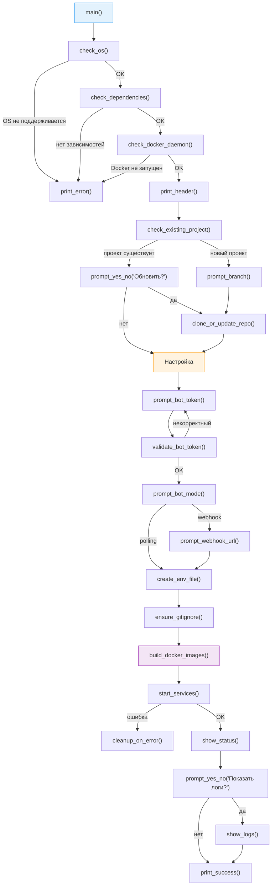
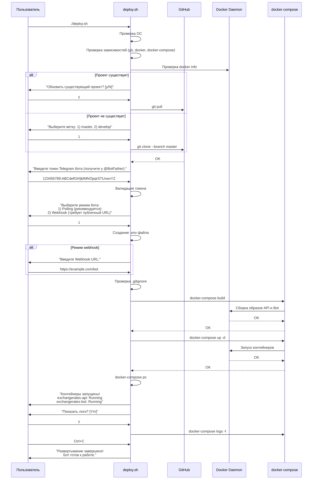
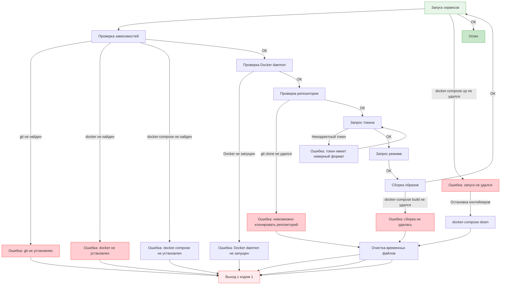

- [x] Реализовано

# Bash скрипт автоматизированного развёртывания ExchangeRates.Api

**Дата создания**: 2026-03-13
**Автор**: Software Architect Agent
**Версия плана**: 1.0
**Статус**: Проектирование

---

## Содержание

1. [Введение и цели](#1-введение-и-цели)
2. [Архитектура скрипта](#2-архитектура-скрипта)
3. [Модульная структура](#3-модульная-структура)
4. [Диаграмма потока выполнения](#4-диаграмма-потока-выполнения)
5. [UX/Взаимодействие с пользователем](#5-uxвзаимодействие-с-пользователем)
6. [Обработка ошибок и edge cases](#6-обработка-ошибок-и-edge-cases)
7. [План реализации](#7-план-реализации)
8. [Чеклист проверки](#8-чеклист-проверки)

---

## 1. Введение и цели

### 1.1 Цели фичи

| Цель | Описание |
|---|---|
| **Автоматизация развёртывания** | Единая команда для клонирования, сборки и запуска проекта |
| **Упрощение для новых пользователей** | Минимум шагов для запуска системы из коробки |
| **Интерактивная настройка** | Дружественные подсказки для ввода параметров конфигурации |
| **Проверка зависимостей** | Предварительная проверка необходимых инструментов |
| **Обработка ошибок** | Информативные сообщения при сбоях |

### 1.2 Проблема, которую решает скрипт

**Текущий процесс развёртывания:**
1. Клонировать репозиторий с GitHub
2. Установить Docker (если не установлен)
3. Создать файл `.env` вручную
4. Узнать токен бота у @BotFather
5. Настроить переменные окружения (polling/webhook)
6. Запустить `docker-compose build`
7. Запустить `docker-compose up -d`
8. Проверить логи

**С использованием скрипта:**
```bash
curl -fsSL https://raw.githubusercontent.com/Jenausmax/ExchangeRates.Api/main/deploy.sh | bash
```

### 1.3 Ограничения и допущения

| Ограничение | Обоснование |
|---|---|
| Bash-only | Bash встроен в Linux/macOS, доступен через Git Bash/WSL в Windows |
| Docker должен быть установлен | Автоматическая установка Docker выходит за рамки |
| Минимальная версия Bash 4.0 | Использование ассоциативных массивов и других возможностей |

---

## 2. Архитектура скрипта

### 2.1 Общая архитектура

```mermaid
graph TB
    subgraph Script["deploy.sh"]
        subgraph Init["Инициализация"]
            CheckOS["Проверка ОС"]
            CheckDeps["Проверка зависимостей<br/>(git, docker, docker-compose)"]
            SetVars["Настройка переменных окружения"]
        end

        subgraph Repo["Работа с репозиторием"]
            CheckExisting["Проверка существования проекта"]
            ClonePull["Клонирование или git pull"]
            GetBranch["Опрос ветки (master/develop)"]
        end

        subgraph Config["Интерактивная настройка"]
            PromptToken["Ввод токена бота"]
            ValidateToken["Валидация токена"]
            PromptMode["Выбор режима<br/>(polling/webhook)"]
            PromptWebhook["Ввод Webhook URL<br/>(если выбран webhook)"]
            PromptTimes["Ввод времени рассылки<br/>(опционально)"]
        end

        subgraph EnvFile["Создание .env"]
            CreateEnv["Создание файла .env"]
            WriteVars["Запись переменных"]
            ProtectEnv["Проверка .gitignore"]
        end

        subgraph Build["Сборка и запуск"]
            BuildImages["docker-compose build"]
            StartServices["docker-compose up -d"]
            ShowStatus["Показ статуса контейнеров"]
            ShowLogs["Показ логов"]
        end

        subgraph Cleanup["Завершение"]
            SuccessMsg["Сообщение об успехе"]
            NextSteps["Дальнейшие действия"]
        end
    end

    Init --> Repo
    Repo --> Config
    Config --> EnvFile
    EnvFile --> Build
    Build --> Cleanup

    style Script fill:#e8f5e9,stroke:#4caf50
    style Init fill:#e3f2fd,stroke:#2196f3
    style Config fill:#fff3e0,stroke:#ff9800
    style Build fill:#f3e5f5,stroke:#9c27b0
```



### 2.2 Константы и конфигурация скрипта

```bash
# Константы проекта
readonly PROJECT_NAME="ExchangeRates.Api"
readonly GITHUB_REPO="git@github.com:Jenausmax/ExchangeRates.Api.git"
readonly HTTPS_REPO="https://github.com/Jenausmax/ExchangeRates.Api.git"
readonly DEFAULT_BRANCH="master"
readonly ENV_FILE=".env"
readonly COMPOSE_FILE="docker-compose.yml"

# Цвета для вывода (ANSI escape codes)
readonly COLOR_RED='\033[0;31m'
readonly COLOR_GREEN='\033[0;32m'
readonly COLOR_YELLOW='\033[1;33m'
readonly COLOR_BLUE='\033[0;34m'
readonly COLOR_CYAN='\033[0;36m'
readonly COLOR_RESET='\033[0m'

# Иконки для визуализации
readonly ICON_SUCCESS="✓"
readonly ICON_ERROR="✗"
readonly ICON_WARNING="!"
readonly ICON_INFO="i"
readonly ICON_ARROW="→"

# Дефолтные значения
readonly DEFAULT_TIME_ONE="14:05"
readonly DEFAULT_TIME_TWO="15:32"
```

### 2.3 Паттерн "Single Source of Truth"

Все параметры по умолчанию должны браться из `docker-compose.yml` (за исключением токена, который пользователь вводит вручную):

```bash
# Функция для извлечения дефолтных значений из docker-compose.yml
get_docker_compose_default() {
    local var_name="$1"
    grep -oE "${var_name}[^}]*" docker-compose.yml | grep -oE '\${[^:]*:-([^}]*)' | cut -d: -f2 | tr -d '} '
}
```

---

## 3. Модульная структура

### 3.1 Список функций скрипта

| Функция | Описание | Выходной код |
|---|---|---|
| `print_header()` | Заголовок скрипта | - |
| `print_success()` | Вывод сообщения об успехе | - |
| `print_error()` | Вывод сообщения об ошибке | 1 |
| `print_info()` | Вывод информационного сообщения | - |
| `print_warning()` | Вывод предупреждения | - |
| `check_os()` | Проверка ОС | 0/1 |
| `check_dependencies()` | Проверка git, docker, docker-compose | 0/1 |
| `check_docker_daemon()` | Проверка запущенного Docker daemon | 0/1 |
| `prompt_yes_no()` | Универсальный вопрос да/нет | 0/1 |
| `validate_bot_token()` | Валидация формата токена | 0/1 |
| `prompt_bot_token()` | Интерактивный ввод токена | token |
| `prompt_bot_mode()` | Выбор режима (polling/webhook) | mode |
| `prompt_webhook_url()` | Ввод webhook URL | url |
| `prompt_branch()` | Выбор ветки репозитория | branch |
| `prompt_time()` | Ввод времени рассылки | time |
| `check_existing_project()` | Проверка существования проекта | exists |
| `clone_or_update_repo()` | Клонирование или git pull | 0/1 |
| `create_env_file()` | Создание/обновление .env файла | 0/1 |
| `ensure_gitignore()` | Проверка наличия .gitignore | - |
| `build_docker_images()` | Сборка Docker образов | 0/1 |
| `start_services()` | Запуск docker-compose | 0/1 |
| `show_status()` | Показ статуса контейнеров | - |
| `show_logs()` | Показ логов (опционально) | - |
| `cleanup_on_error()` | Очистка при ошибке | - |
| `main()` | Основная точка входа | 0/1 |

### 3.2 Диаграмма вызовов функций



---

## 4. Диаграмма потока выполнения

### 4.1 Основной поток (Happy Path)



### 4.2 Поток с ошибками



---

## 5. UX/Взаимодействие с пользователем

### 5.1 Пример диалога с пользователем

```bash
$ bash deploy.sh

========================================================================
                    ExchangeRates.Api - Развертывание
========================================================================

[1/8] Проверка зависимостей...
  ✓ Git найден: 2.45.2
  ✓ Docker найден: 24.0.7
  ✓ Docker Compose найден: 2.20.2
  ✓ Docker daemon запущен

[2/8] Работа с репозиторием...
  Обнаружен существующий проект: ExchangeRates.Api
  Обновить существующий проект? [y/N]: y
  Обновление ветки 'master'...
  ✓ Обновление завершено

[3/8] Настройка конфигурации...

  Для работы бота необходим токен Telegram.
  Получите токен у @BotFather в Telegram.

  Введите токен бота: [скрытый ввод]
  ✓ Токен принят

  Выберите режим работы бота:
    1) Polling (рекомендуется для Docker)
    2) Webhook (требует публичный HTTPS URL)

  Ваш выбор [1]: 1
  ✓ Выбран режим: Polling

  Настройка времени рассылки (или нажмите Enter для дефолтных значений):
  Время первой рассылки [14:05]: 10:00
  Время второй рассылки [15:32]: 18:00

[4/8] Создание файла конфигурации...
  ✓ Файл .env создан
  ✓ .gitignore проверен

[5/8] Сборка Docker образов...
  Сборка exchangerates-api...
  ✓ Сборка завершена

[6/8] Запуск сервисов...
  Создание сети exchangerates-network...
  ✓ Сервер API запущен
  ✓ Telegram бот запущен

[7/8] Проверка статуса...
  NAME                STATUS              PORTS
  exchangerates-api    Up 10 seconds      0.0.0.0:5000->80/tcp
  exchangerates-bot    Up 8 seconds       -

[8/8] Логи...
  Показать логи в реальном времени? [Y/n]: n

========================================================================
                    Развертывание завершено!
========================================================================

  ✓ Сервисы успешно запущены

  Следующие шаги:
  1. Найдите бота в Telegram
  2. Отправьте команду /start
  3. Проверьте работоспособность: /valuteoneday

  Управление:
    docker-compose logs -f          - просмотр логов
    docker-compose ps               - статус контейнеров
    docker-compose down             - остановка сервисов
    docker-compose up -d --build    - пересборка и запуск

  API доступен по адресу: http://localhost:5000

========================================================================
```

### 5.2 Цветовая схема и визуализация

| Тип сообщения | Цвет | Иконка | Пример |
|---|---|---|---|
| Заголовок | Голубой | - | `==================== Развертывание ====================` |
| Информация | Белый | `→` | `→ Клонирование репозитория...` |
| Успех | Зеленый | `✓` | `✓ Сборка завершена` |
| Ошибка | Красный | `✗` | `✗ Docker не найден` |
| Предупреждение | Желтый | `!` | `! Токен имеет неверный формат` |
| Вопрос | Циан | `?` | `? Введите токен бота:` |

### 5.3 Прогресс-бар

Для долгих операций (сборка Docker образов) показывать прогресс:

```bash
build_docker_images() {
    print_info "Сборка Docker образов..."

    # docker-compose build с перенаправлением вывода
    docker-compose build --progress=plain 2>&1 | while IFS= read -r line; do
        if [[ "$line" =~ ^#\d+ ]]; then
            # Извлечь номер шага и показать прогресс
            local step=$(echo "$line" | grep -oE '#\d+' | tr -d '#')
            print_info "Шаг $step/$(docker-compose config --services | wc -l)"
        fi
    done
}
```

### 5.4 Скрытый ввод для токена

Для безопасности токен должен вводиться скрыто (без отображения на экране):

```bash
prompt_bot_token() {
    while true; do
        print_info "Введите токен бота:"
        read -s -p "  " bot_token
        echo ""

        if validate_bot_token "$bot_token"; then
            echo "$bot_token" | sed 's/./x/g'  # Показать маску: xxxxxxxx
            echo "$bot_token"  # Вернуть реальное значение
            return 0
        else
            print_warning "Некорректный формат токена. Попробуйте еще раз."
        fi
    done
}
```

---

## 6. Обработка ошибок и edge cases

### 6.1 Классификация ошибок

| Тип ошибки | Пример | Действие |
|---|---|---|
| **Критические (exit code 1)** | git/docker не установлен | Прекратить выполнение |
| **Восстанавливаемые** | git clone не удался (нет интернета) | Предложить повтор или выход |
| **Предупреждающие** | Существующий .env файл | Предложить перезаписать |
| **Информационные** | Ветка develop выбрана | Продолжить выполнение |

### 6.2 Валидация токена бота

Формат токена Telegram: `数字数字:БуквыЦифры_буквы-цифры`

```regex
^[0-9]{9,10}:[A-Za-z0-9_-]{35}$
```

Функция валидации:

```bash
validate_bot_token() {
    local token="$1"

    # Проверка формата с regex
    if [[ ! "$token" =~ ^[0-9]{9,10}:[A-Za-z0-9_-]{35}$ ]]; then
        return 1
    fi

    return 0
}
```

### 6.3 Обработка существующего проекта

```mermaid
graph TD
    A["Скрипт запущен"] --> B{Папка проекта<br/>существует?}
    B -->|Нет| C["Создать папку и клонировать"]
    B -->|Да| D{Содержит .git?}
    D -->|Нет| E["Предупреждение:<br/>не git репозиторий<br/>Продолжить? [y/N]"]
    D -->|Да| F{Нестандартные файлы<br/>(.env, data/)?}
    E -->|Нет| G["Выход с кодом 1"]
    E -->|Да| H["Инициализация git<br/>и добавление .gitignore"]

    F -->|Да| I["Запрос: сохранить<br/>существующие данные? [y/N]"]
    F -->|Нет| J["Просто обновить код<br/>git pull"]

    I -->|Да| K["Переименовать<br/>.env -> .env.backup"]
    I -->|Нет| L["Предупреждение:<br/>.env будет перезаписан"]

    K --> J
    L --> J

    J --> M{"git pull успешен?"}
    M -->|Да| N["Продолжить настройку"]
    M -->|Нет| O["Ошибка: невозможно обновить<br/>Проверьте локальные изменения"]

    style A fill:#e8f5e9,stroke:#4caf50
    style N fill:#c8e6c9,stroke:#4caf50
    style G fill:#ffcdd2,stroke:#f44336
    style O fill:#ffcdd2,stroke:#f44336
```

### 6.4 Обработка ошибок Docker

```bash
# Проверка, запущен ли Docker daemon
check_docker_daemon() {
    if ! docker info >/dev/null 2>&1; then
        print_error "Docker daemon не запущен или нет прав доступа."
        print_info "Запустите Docker Desktop или выполните:"
        print_info "  sudo systemctl start docker  (Linux)"
        print_info "  sudo usermod -aG docker \$USER  (Linux, добавить пользователя в группу)"
        return 1
    fi
    return 0
}

# Обработка ошибок сборки
build_docker_images() {
    print_info "Сборка Docker образов..."

    if ! docker-compose build --no-cache 2>&1 | tee /tmp/docker-build.log; then
        print_error "Сборка Docker образов не удалась."
        print_info "Лог сохранен: /tmp/docker-build.log"
        print_info "Попробуйте:"
        print_info "  1) Проверить подключение к интернету"
        print_info "  2) Проверить права доступа к Docker"
        print_info "  3) Увеличить ресурсы Docker (RAM, Disk)"
        return 1
    fi

    return 0
}
```

### 6.5 Обработка прерывания (Ctrl+C)

```bash
# Trap для обработки прерываний
trap cleanup_on_error SIGINT SIGTERM

cleanup_on_error() {
    print_warning "Прерывание выполнения..."
    print_info "Остановка контейнеров (если запущены)..."
    docker-compose down 2>/dev/null || true
    print_info "Удаление .env.tmp (если существует)..."
    rm -f .env.tmp 2>/dev/null || true
    print_error "Развертывание прервано пользователем"
    exit 130  # Код выхода для SIGINT
}
```

### 6.6 Edge Cases

| Edge Case | Обработка |
|---|---|
| **Нет прав на запись** | Проверка `touch .env.test && rm .env.test`, иначе выход с ошибкой |
| **Нет места на диске** | Проверка `df` перед сборкой образов |
| **Интернет недоступен** | Проверка `ping -c 1 github.com` перед git clone |
| **Конфликт портов** | Проверка занятости портов 5000, 5001 перед запуском |
| **Docker недоступен** | Проверка `docker ps` перед началом работы |
| **Неверная ветка** | Предварительный список доступных веток через `git ls-remote` |
| **Токен уже существует в .env** | Предложить использовать существующий или перезаписать |

---

## 7. План реализации

### 7.1 Этапы разработки

| Этап | Описание | Время |
|---|---|---|
| **Этап 1: Каркас** | Основная структура, цвета, заголовки | 30 мин |
| **Этап 2: Проверки** | Проверка зависимостей, OS, Docker daemon | 45 мин |
| **Этап 3: Репозиторий** | Клонирование, git pull, выбор ветки | 60 мин |
| **Этап 4: Конфигурация** | Интерактивный ввод, валидация | 90 мин |
| **Этап 5: .env файл** | Создание, обновление, проверка .gitignore | 45 мин |
| **Этап 6: Сборка** | docker-compose build, обработка ошибок | 60 мин |
| **Этап 7: Запуск** | docker-compose up, проверка статуса | 45 мин |
| **Этап 8: Тестирование** | Тестирование на Linux/macOS/WSL | 120 мин |

**Общее время: ~8 часов**

### 7.2 Структура файла скрипта

```bash
#!/bin/bash

#==================================================================================
#  ExchangeRates.Api - Скрипт автоматизированного развертывания
#==================================================================================

#----------------------------------------------------------------------------------
#  Константы
#----------------------------------------------------------------------------------
readonly PROJECT_NAME="ExchangeRates.Api"
readonly GITHUB_REPO="https://github.com/Jenausmax/ExchangeRates.Api.git"
readonly DEFAULT_BRANCH="master"
readonly ENV_FILE=".env"
# ... остальные константы ...

#----------------------------------------------------------------------------------
#  Вспомогательные функции (logging)
#----------------------------------------------------------------------------------
print_header() { ... }
print_success() { ... }
print_error() { ... }
print_info() { ... }
print_warning() { ... }

#----------------------------------------------------------------------------------
#  Функции проверки зависимостей
#----------------------------------------------------------------------------------
check_os() { ... }
check_dependencies() { ... }
check_docker_daemon() { ... }

#----------------------------------------------------------------------------------
#  Функции работы с репозиторием
#----------------------------------------------------------------------------------
check_existing_project() { ... }
clone_or_update_repo() { ... }
prompt_branch() { ... }

#----------------------------------------------------------------------------------
#  Функции интерактивного ввода
#----------------------------------------------------------------------------------
prompt_yes_no() { ... }
validate_bot_token() { ... }
prompt_bot_token() { ... }
prompt_bot_mode() { ... }
prompt_webhook_url() { ... }
prompt_time() { ... }

#----------------------------------------------------------------------------------
#  Функции работы с конфигурацией
#----------------------------------------------------------------------------------
create_env_file() { ... }
ensure_gitignore() { ... }
backup_existing_env() { ... }

#----------------------------------------------------------------------------------
#  Функции Docker
#----------------------------------------------------------------------------------
build_docker_images() { ... }
start_services() { ... }
show_status() { ... }
show_logs() { ... }
check_port_availability() { ... }

#----------------------------------------------------------------------------------
#  Обработка ошибок
#----------------------------------------------------------------------------------
cleanup_on_error() { ... }
show_error_details() { ... }

#----------------------------------------------------------------------------------
#  Основная точка входа
#----------------------------------------------------------------------------------
main() {
    # 1. Проверка зависимостей
    # 2. Работа с репозиторием
    # 3. Интерактивная настройка
    # 4. Создание .env
    # 5. Сборка образов
    # 6. Запуск сервисов
    # 7. Показ статуса
    # 8. Завершение
}

# Запуск
main "$@"
```

### 7.3 Функции по приоритетам

**P0 (Критические для минимальной версии):**
1. `main()` - координация всех шагов
2. `print_success()`, `print_error()` - базовый вывод
3. `check_dependencies()` - проверка git/docker
4. `clone_or_update_repo()` - клонирование
5. `prompt_bot_token()` - ввод токена
6. `create_env_file()` - создание .env
7. `build_docker_images()` - сборка
8. `start_services()` - запуск

**P1 (Важные для UX):**
1. `validate_bot_token()` - валидация токена
2. `prompt_bot_mode()` - выбор режима
3. `prompt_yes_no()` - универсальные вопросы
4. `show_status()` - статус контейнеров
5. `cleanup_on_error()` - обработка ошибок

**P2 (Улучшения):**
1. Цветной вывод
2. Прогресс-бар
3. Проверка портов
4. Выбор ветки
5. Backup существующего .env
6. Показ логов

### 7.4 Критические файлы проекта

| Файл | Путь | Назначение |
|---|---|---|
| `deploy.sh` | Корень проекта | Главный скрипт |
| `.env.template` | Корень проекта | Шаблон .env с комментариями |
| `.gitignore` | Корень проекта | Защита .env (проверяется скриптом) |
| `docker-compose.yml` | Корень проекта | Конфигурация контейнеров |

### 7.5 Изменения в `.gitignore`

Убедиться, что следующие строки присутствуют:

```gitignore
# Environment variables
.env
.env.local
.env.*.local

# Deployment
deploy.log
```

---

## 8. Чеклист проверки

### 8.1 Функциональные требования

- [ ] Скрипт проверяет наличие git, docker, docker-compose
- [ ] Скрипт проверяет, что Docker daemon запущен
- [ ] Скрипт определяет ОС и работает на Linux/macOS/WSL
- [ ] Скрипт клонирует репозиторий или делает git pull
- [ ] Пользователь может выбрать ветку (master/develop)
- [ ] Скрипт запрашивает токен бота с валидацией
- [ ] Скрипт запрашивает режим (polling/webhook)
- [ ] При выборе webhook запрашивается URL
- [ ] Скрипт создает/обновляет .env файл
- [ ] Скрипт проверяет наличие .gitignore
- [ ] Скрипт собирает Docker образы
- [ ] Скрипт запускает docker-compose up -d
- [ ] Скрипт показывает статус контейнеров
- [ ] Скрипт предлагает показать логи
- [ ] Скрипт выводит дальнейшие действия

### 8.2 Обработка ошибок

- [ ] При отсутствии git/docker скрипт выходит с кодом 1
- [ ] При неправильном токене скрипт предлагает повторить ввод
- [ ] При ошибке сборки скрипт показывает лог ошибки
- [ ] При ошибке запуска скрипт останавливает контейнеры
- [ ] При Ctrl+C скрипт корректно завершает работу
- [ ] При ошибке клонирования скрипт проверяет интернет
- [ ] При занятых портах скрипт предупреждает пользователя

### 8.3 UX требования

- [ ] Цветной вывод для разных типов сообщений
- [ ] Понятные подсказки на каждом шаге
- [ ] Дефолтные значения в квадратных скобках
- [ ] Скрытый ввод для токена
- [ ] Прогресс выполнения (шаги 1/8)
- [ ] Иконки для визуализации (✓, ✗, !)
- [ ] Инструкции после развертывания
- [ ] Примеры команд для управления

### 8.4 Совместимость

- [ ] Работает на Linux (Ubuntu 20.04+)
- [ ] Работает на macOS (10.15+)
- [ ] Работает на Windows через Git Bash
- [ ] Работает на Windows через WSL (Ubuntu)
- [ ] Работает с Docker Compose v1 и v2
- [ ] Работает с Bash 4.0+
- [ ] Не использует специфичные расширения (zsh, fish)

### 8.5 Безопасность

- [ ] Токен не выводится в лог
- [ ] .env файл добавляется в .gitignore
- [ ] Нет жестко закодированных секретов
- [ ] Скрипт не запрашивает пароли
- [ ] Существующий .env не перезаписывается без подтверждения

### 8.6 Тестовые сценарии

| Сценарий | Ожидаемый результат |
|---|---|
| **Первый запуск на чистой машине** | Скрипт клонирует репозиторий, соберет образы, запустит контейнеры |
| **Повторный запуск с существующим проектом** | Скрипт предложит обновить, создаст .env, перезапустит |
| **Запуск с существующим .env** | Скрипт предложит использовать существующий или перезаписать |
| **Неверный токен (3 попытки)** | Скрипт повторяет запрос, после 3 попыток выходит |
| **Отсутствует Docker** | Скрипт выходит с инструкцией по установке Docker |
| **Прерывание Ctrl+C при сборке** | Скрипт останавливает сборку, очищает временные файлы, выходит |
| **Выбор webhook без URL** | Скрипт запрашивает URL |
| **Выбор polling** | Скрипт использует дефолтные настройки для polling |
| **Занят порт 5000** | Скрипт предупреждает и предлагает остановить процесс |
| **Нет интернета при клонировании** | Скрипт проверяет соединение, предлагает повторить или выйти |

---

## 9. Дополнительные возможности (Future Enhancements)

### 9.1 Опциональные функции

| Функция | Описание | Приоритет |
|---|---|---|
| **Автоматическая установка зависимостей** | Установка Docker через скрипт | P3 |
| **Интеграция с @BotFather API** | Автоматическое создание бота | P3 |
| **Многопользовательский режим** | Несколько ботов на одной машине | P4 |
| **Uninstall режим** | Очистка контейнеров, образов, данных | P2 |
| **Healthcheck после запуска** | Проверка работоспособности сервисов | P2 |
| **Telegram уведомление** | Отправка сообщения при успешном развертывании | P4 |
| **Backup/Restore** | Создание бэкапа перед обновлением | P3 |
| **Мониторинг ресурсов** | Показ использования CPU/RAM | P4 |

### 9.2 Оптимизации

1. **Кэширование Docker слоев** - Использовать `--cache-from` для ускорения сборки
2. **Параллельная сборка** - `docker-compose build --parallel`
3. **Компрессия логов** - Сжатие старых логов после N дней
4. **Очистка dangling images** - Автоматическая очистка после успешного запуска

---

## 10. Документация

### 10.1 README для скрипта

Создать `README-deploy.md` с инструкциями:

```markdown
# Скрипт автоматизированного развертывания

## Быстрый старт

```bash
curl -fsSL https://raw.githubusercontent.com/Jenausmax/ExchangeRates.Api/main/deploy.sh | bash
```

## Локальный запуск

```bash
chmod +x deploy.sh
./deploy.sh
```

## Требования

- Bash 4.0+
- Git
- Docker 20.10+
- Docker Compose 1.29+

## Параметры

```bash
./deploy.sh [OPTIONS]

Options:
  -h, --help          Показать справку
  -b, --branch BRANCH Выбрать ветку (master/develop)
  -p, --polling       Принудительный polling режим
  -w, --webhook       Принудительный webhook режим
  -n, --no-logs       Не показывать логи после запуска
  -v, --verbose       Подробный вывод
```
```

### 10.2 Примеры использования

```bash
# Быстрое развертывание с polling режимом
./deploy.sh --polling

# Развертывание ветки develop
./deploy.sh --branch develop

# Развертывание без показа логов
./deploy.sh --no-logs
```

---

## 11. Архитектурные решения (ADR)

### ADR-001: Использование Bash вместо Python/Node.js

**Решение**: Скрипт написан на Bash.

**Обоснование**:
- Bash встроен в все Linux/macOS системы
- Не требует установки интерпретатора
- Минимальный размер скрипта
- Пользователи, использующие Docker, привыкли к bash скриптам

**Риски**:
- Bash менее выразителен чем Python
- Сложнее обрабатывать сложные структуры данных

**Альтернатива**: Python скрипт с проверкой наличия интерпретатора.

### ADR-002: Проверка зависимостей до начала работы

**Решение**: Все проверки (git, docker, docker-compose, Docker daemon) выполняются в начале скрипта.

**Обоснование**:
- Быстрое обнаружение проблем
- Четкие инструкции для пользователя
- Избежание частичной установки при ошибке

### ADR-003: Использование SSH и HTTPS репозитория

**Решение**: Скрипт использует HTTPS URL для клонирования по умолчанию.

**Обоснование**:
- Не требует настройки SSH ключей
- Работает на любой машине
- HTTPS URL публичный

### ADR-004: Валидация токена без вызова Telegram API

**Решение**: Валидация формата токена через regex без вызова Telegram API.

**Обоснование**:
- Не требует сетевого запроса
- Защищает от простых ошибок ввода
- Вызов API может быть заблокирован или ограничен

### ADR-005: Single-pass vs Multi-pass

**Решение**: Однопроходный скрипт (один запуск завершает все этапы).

**Обоснование**:
- Простота использования
- Атомарность (все или ничего)
- Минимум действий от пользователя

---

## 12. Приложение: Шаблон .env файла

```bash
# Токен Telegram бота (получить от @BotFather)
# ВАЖНО: Заменить на реальный токен перед запуском!
BOT_TOKEN=YOUR_BOT_TOKEN_HERE

# Режим работы бота
# true = Polling (рекомендуется для локальной разработки и Docker)
# false = Webhook (требует публичный HTTPS URL)
BOT_USE_POLLING=true

# Webhook URL (используется только если BOT_USE_POLLING=false)
# Оставить пустым в polling режиме
BOT_WEBHOOK=

# Время рассылки сообщений подписчикам
BOT_TIME_ONE=14:05
BOT_TIME_TWO=15:32
```

---

## Итоговая структура файлов

```
ExchangeRates.Api/
├── deploy.sh                 # Главный скрипт развертывания (новый)
├── README-deploy.md          # Документация скрипта (новый)
├── .env.template            # Шаблон .env (новый, опционально)
├── .env                     # Создается скриптом
├── .gitignore               # Проверяется скриптом
├── docker-compose.yml        # Используется скриптом
├── src/                     # Исходный код
│   ├── ExchangeRates.Api/
│   │   └── Dockerfile
│   └── bot/
│       └── ExchangeRatesBot/
│           └── Dockerfile
└── doc/                     # Документация
    └── feature/
        └── 20260313-bash-скрипт-авторазвертывания.md
```

---

## 13. Расширения на будущее (Future Enhancements)

В рамках данной фичи не планируется, но может быть реализовано в будущем:

| Расширение | Описание | Приоритет | Оценка времени |
|-------------|-----------|-----------|---------------|
| **Опциональные аргументы командной строки** | Поддержка флагов: `--branch`, `--polling`, `--webhook`, `--no-logs`, `--verbose` | P2 | 2 часа |
| **Автоматическая установка зависимостей** | Скрипт предлагает установить Docker/Docker Compose если не найдены | P3 | 3 часа |
| **Интеграция с @BotFather API** | Автоматическое создание бота через Telegram API | P4 | 4 часа |
| **Многопользовательский режим** | Поддержка нескольких ботов на одной машине | P4 | 3 часа |
| **Uninstall режим** | Команда для полной очистки (контейнеры, образы, данные) | P2 | 1 час |
| **Healthcheck после запуска** | Автоматическая проверка работоспособности сервисов | P2 | 2 часа |
| **Telegram уведомление** | Отправка сообщения при успешном развертывании | P4 | 2 часа |
| **Backup/Restore** | Создание бэкапа перед обновлением | P3 | 2 часа |
| **Мониторинг ресурсов** | Показ использования CPU/RAM контейнерами | P4 | 2 часа |

### Детализация приоритетов

**P1 (Критично для MVP)**:
- Не применимо (все P0 задачи уже в базовом скрипте)

**P2 (Важно для UX)**:
- Опциональные аргументы командной строки
- Uninstall режим
- Healthcheck после запуска

**P3 (Улучшения)**:
- Автоматическая установка зависимостей
- Backup/Restore

**P4 (Расширения)**:
- Интеграция с @BotFather API
- Многопользовательский режим
- Telegram уведомление
- Мониторинг ресурсов

### Пример использования опциональных аргументов

```bash
# Быстрое развертывание с polling режимом
./deploy.sh --polling

# Развертывание ветки develop
./deploy.sh --branch develop

# Развертывание без показа логов
./deploy.sh --no-logs

# Подробный вывод
./deploy.sh --verbose

# Комбинация аргументов
./deploy.sh --branch develop --polling --no-logs
```

---

**Конец документа плана реализации**
