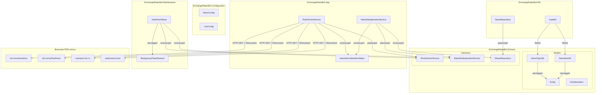
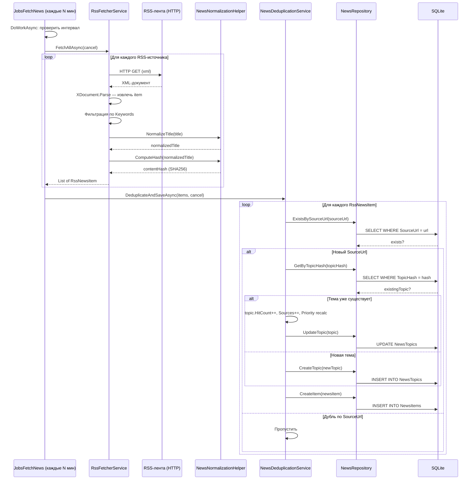
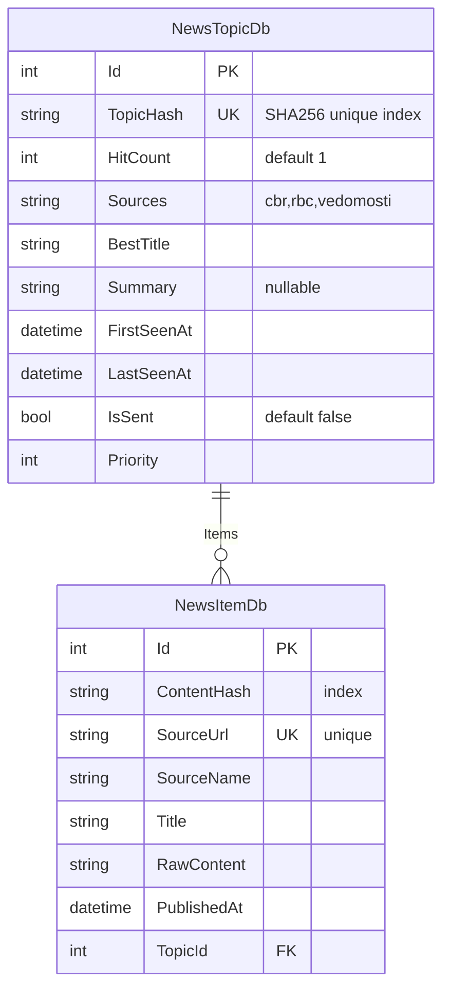

# Архитектурный план: Часть 1 — Инфраструктура данных и RSS-парсер

## 1. Обзор

Часть 1 закладывает фундамент для новостного дайджеста: модели данных, парсинг RSS-лент, нормализацию заголовков, дедупликацию с механизмом "горячести" и фоновую задачу периодического сбора новостей.

**Границы Части 1** — после реализации система будет автоматически собирать новости из 4 RSS-источников, фильтровать по ключевым словам, дедуплицировать и сохранять в SQLite с приоритизацией. Отправка дайджеста пользователям — Часть 2.

---

## 2. Диаграмма компонентов



---

## 3. Диаграмма потока данных



---

## 4. Модели данных

### 4.1. NewsTopicDb

**Файл**: `src/bot/ExchangeRatesBot.Domain/Models/NewsTopicDb.cs`

```csharp
public class NewsTopicDb : Entity
{
    public string TopicHash { get; set; }       // SHA256 нормализованного заголовка, unique index
    public int HitCount { get; set; } = 1;      // сколько источников упомянули
    public string Sources { get; set; }          // "cbr,rbc,vedomosti"
    public string BestTitle { get; set; }        // самый информативный заголовок
    public string Summary { get; set; }          // nullable, LLM (Часть 3)
    public DateTime FirstSeenAt { get; set; }
    public DateTime LastSeenAt { get; set; }
    public bool IsSent { get; set; } = false;
    public int Priority { get; set; }            // HitCount * 10 + RecencyBonus

    public List<NewsItemDb> Items { get; set; } = new();
}
```

### 4.2. NewsItemDb

**Файл**: `src/bot/ExchangeRatesBot.Domain/Models/NewsItemDb.cs`

```csharp
public class NewsItemDb : Entity
{
    public string ContentHash { get; set; }      // SHA256, index
    public string SourceUrl { get; set; }        // unique
    public string SourceName { get; set; }       // "cbr" / "rbc" / "vedomosti"
    public string Title { get; set; }
    public string RawContent { get; set; }
    public DateTime PublishedAt { get; set; }

    public int TopicId { get; set; }             // FK
    public NewsTopicDb Topic { get; set; }
}
```

### 4.3. RssNewsItem (DTO, не БД)

**Файл**: `src/bot/ExchangeRatesBot.Domain/Models/RssNewsItem.cs`

```csharp
public class RssNewsItem
{
    public string Title { get; set; }
    public string Description { get; set; }
    public string Link { get; set; }
    public DateTime PublishedAt { get; set; }
    public string SourceName { get; set; }
    public string ContentHash { get; set; }
    public string NormalizedTitle { get; set; }
}
```

### 4.4. ER-диаграмма



### 4.5. Конфигурация EF Core (DataDb)

Дополнить `src/bot/ExchangeRatesBot.DB/DataDb.cs`:

```csharp
public DbSet<NewsTopicDb> NewsTopics { get; set; }
public DbSet<NewsItemDb> NewsItems { get; set; }

protected override void OnModelCreating(ModelBuilder modelBuilder)
{
    base.OnModelCreating(modelBuilder);

    modelBuilder.Entity<NewsTopicDb>(entity =>
    {
        entity.HasIndex(e => e.TopicHash).IsUnique();
        entity.Property(e => e.HitCount).HasDefaultValue(1);
        entity.Property(e => e.IsSent).HasDefaultValue(false);
    });

    modelBuilder.Entity<NewsItemDb>(entity =>
    {
        entity.HasIndex(e => e.ContentHash);
        entity.HasIndex(e => e.SourceUrl).IsUnique();
        entity.HasOne(e => e.Topic)
              .WithMany(t => t.Items)
              .HasForeignKey(e => e.TopicId)
              .OnDelete(DeleteBehavior.Cascade);
    });
}
```

---

## 5. Конфигурация

### 5.1. NewsConfig

**Файл**: `src/bot/ExchangeRatesBot.Configuration/ModelConfig/NewsConfig.cs`

```csharp
public class NewsConfig
{
    public bool Enabled { get; set; } = false;
    public int FetchIntervalMinutes { get; set; } = 60;
    public string SendTime { get; set; } = "09:00";
    public string[] Keywords { get; set; } = new[]
    {
        "курс", "валют", "доллар", "евро", "юань", "рубл",
        "ключевая ставка", "инфляц", "девальвац", "ЦБ", "центробанк",
        "forex", "exchange rate", "currency"
    };
    public int MaxNewsPerDigest { get; set; } = 5;
    public string[] RssSources { get; set; } = new[]
    {
        "http://www.cbr.ru/rss/eventrss",
        "http://www.cbr.ru/rss/RssPress",
        "https://rssexport.rbc.ru/rbcnews/news/30/full.rss",
        "https://www.vedomosti.ru/rss/rubric/finance/markets"
    };
}
```

### 5.2. LlmConfig

**Файл**: `src/bot/ExchangeRatesBot.Configuration/ModelConfig/LlmConfig.cs`

```csharp
public class LlmConfig
{
    public string Provider { get; set; } = "polza";
    public string PolzaApiKey { get; set; }
    public string PolzaBaseUrl { get; set; } = "https://polza.ai/api/v1";
    public string PolzaModel { get; set; } = "deepseek/deepseek-chat";
    public string OllamaUrl { get; set; } = "http://localhost:11434";
    public string OllamaModel { get; set; } = "llama3.1:8b";
    public int MaxTokens { get; set; } = 200;
    public double Temperature { get; set; } = 0.3;
}
```

### 5.3. appsettings.json — новые секции

```json
{
  "NewsConfig": {
    "Enabled": true,
    "FetchIntervalMinutes": 60,
    "SendTime": "09:00",
    "Keywords": [
      "курс", "валют", "доллар", "евро", "юань", "рубл",
      "ключевая ставка", "инфляц", "девальвац", "ЦБ", "центробанк",
      "forex", "exchange rate", "currency"
    ],
    "MaxNewsPerDigest": 5,
    "RssSources": [
      "http://www.cbr.ru/rss/eventrss",
      "http://www.cbr.ru/rss/RssPress",
      "https://rssexport.rbc.ru/rbcnews/news/30/full.rss",
      "https://www.vedomosti.ru/rss/rubric/finance/markets"
    ]
  },
  "LlmConfig": {
    "Provider": "polza",
    "PolzaApiKey": "",
    "PolzaBaseUrl": "https://polza.ai/api/v1",
    "PolzaModel": "deepseek/deepseek-chat",
    "OllamaUrl": "http://localhost:11434",
    "OllamaModel": "llama3.1:8b",
    "MaxTokens": 200,
    "Temperature": 0.3
  }
}
```

---

## 6. Интерфейсы

### 6.1. IRssFetcherService

**Файл**: `src/bot/ExchangeRatesBot.Domain/Interfaces/IRssFetcherService.cs`

```csharp
public interface IRssFetcherService
{
    Task<List<RssNewsItem>> FetchAllAsync(CancellationToken cancel = default);
    Task<List<RssNewsItem>> FetchFromSourceAsync(string url, CancellationToken cancel = default);
}
```

### 6.2. INewsDeduplicationService

**Файл**: `src/bot/ExchangeRatesBot.Domain/Interfaces/INewsDeduplicationService.cs`

```csharp
public interface INewsDeduplicationService
{
    Task<(int newTopics, int updatedTopics)> DeduplicateAndSaveAsync(
        List<RssNewsItem> items,
        CancellationToken cancel = default);
}
```

### 6.3. INewsRepository

**Файл**: `src/bot/ExchangeRatesBot.Domain/Interfaces/INewsRepository.cs`

```csharp
public interface INewsRepository
{
    Task<NewsTopicDb> GetByTopicHash(string topicHash, CancellationToken cancel = default);
    Task<NewsTopicDb> CreateTopic(NewsTopicDb topic, CancellationToken cancel = default);
    Task<NewsTopicDb> UpdateTopic(NewsTopicDb topic, CancellationToken cancel = default);
    Task<List<NewsTopicDb>> GetUnsentTopics(int limit, CancellationToken cancel = default);
    Task UpdateTopicsAsSent(List<int> topicIds, CancellationToken cancel = default);

    Task<bool> ExistsBySourceUrl(string sourceUrl, CancellationToken cancel = default);
    Task<NewsItemDb> CreateItem(NewsItemDb item, CancellationToken cancel = default);
    Task<List<NewsItemDb>> GetItemsByTopicId(int topicId, CancellationToken cancel = default);
}
```

---

## 7. Реализации сервисов

### 7.1. NewsNormalizationHelper

**Файл**: `src/bot/ExchangeRatesBot.App/Helpers/NewsNormalizationHelper.cs`

Статический класс, без DI-зависимостей.

```csharp
public static class NewsNormalizationHelper
{
    private static readonly HashSet<string> StopWords = new(StringComparer.OrdinalIgnoreCase)
    {
        "и", "в", "на", "с", "по", "за", "к", "от", "из", "о", "у",
        "не", "что", "как", "для", "при", "до", "это", "но", "а",
        "же", "ли", "бы", "то", "все", "его", "так", "уже", "она",
        "он", "или", "ее", "мы", "вы", "их", "ни", "нет", "да",
        "был", "была", "были", "будет", "может", "также", "более"
    };

    public static string NormalizeTitle(string title);
    public static string ComputeHash(string normalizedText);
}
```

**Алгоритм NormalizeTitle**:

1. `title.ToLowerInvariant()`
2. Заменить все символы, не являющиеся буквами/цифрами, на пробел
3. Разбить по пробелам: `Split(' ', RemoveEmptyEntries)`
4. Отфильтровать стоп-слова
5. **Защита**: если после фильтрации < 3 слов — использовать все слова без фильтрации
6. Отсортировать: `OrderBy(w => w, StringComparer.Ordinal)`
7. Склеить: `string.Join(" ", words)`

**Алгоритм ComputeHash**:

1. `Encoding.UTF8.GetBytes(normalizedText)`
2. `SHA256.HashData(bytes)` (.NET 5+)
3. `Convert.ToHexString(hash).ToLowerInvariant()`

### 7.2. RssFetcherService

**Файл**: `src/bot/ExchangeRatesBot.App/Services/RssFetcherService.cs`
**DI Lifetime**: Scoped
**Зависимости**: `IOptions<NewsConfig>`, `ILogger`

```csharp
public class RssFetcherService : IRssFetcherService
{
    private readonly NewsConfig _config;
    private readonly ILogger _logger;
    private static readonly HttpClient _httpClient = new() { Timeout = TimeSpan.FromSeconds(30) };

    public async Task<List<RssNewsItem>> FetchAllAsync(CancellationToken cancel = default);
    public async Task<List<RssNewsItem>> FetchFromSourceAsync(string url, CancellationToken cancel = default);

    private static string ResolveSourceName(string url);
    private bool MatchesKeywords(string text);
}
```

**Алгоритм FetchAllAsync**: Для каждого url в RssSources — try/catch, ошибка одного не роняет остальные.

**Алгоритм FetchFromSourceAsync**:
1. HTTP GET → XML string
2. `XDocument.Parse(xml)`
3. Итерация по `doc.Descendants("item")` (RSS 2.0) или `doc.Descendants("entry")` (Atom)
4. Фильтрация по Keywords
5. Нормализация + хеширование заголовка
6. Возврат `List<RssNewsItem>`

**ResolveSourceName**: `cbr.ru` → "cbr", `rbc.ru` → "rbc", `vedomosti.ru` → "vedomosti"

**MatchesKeywords**: `keywords.Any(kw => lowerText.Contains(kw))`

**Кодировка**: RSS от ЦБ РФ может возвращать windows-1251. Использовать `GetByteArrayAsync` + детектировать encoding. `Encoding.RegisterProvider(CodePagesEncodingProvider.Instance)`.

### 7.3. NewsRepository

**Файл**: `src/bot/ExchangeRatesBot.DB/Repositories/NewsRepository.cs`
**DI Lifetime**: Scoped
**Зависимости**: `ILogger`, `DataDb`

**Не наследует RepositoryDb<T>** — работает с двумя сущностями (NewsTopicDb + NewsItemDb) через прямой DataDb.

```csharp
public class NewsRepository : INewsRepository
{
    private readonly ILogger _logger;
    private readonly DataDb _db;

    public async Task<NewsTopicDb> GetByTopicHash(string topicHash, CancellationToken cancel)
        => await _db.NewsTopics.FirstOrDefaultAsync(t => t.TopicHash == topicHash, cancel);

    public async Task<List<NewsTopicDb>> GetUnsentTopics(int limit, CancellationToken cancel)
        => await _db.NewsTopics
            .Where(t => !t.IsSent)
            .OrderByDescending(t => t.Priority)
            .Take(limit)
            .Include(t => t.Items)
            .ToListAsync(cancel);

    public async Task<bool> ExistsBySourceUrl(string sourceUrl, CancellationToken cancel)
        => await _db.NewsItems.AnyAsync(i => i.SourceUrl == sourceUrl, cancel);

    // ... CreateTopic, UpdateTopic, CreateItem, UpdateTopicsAsSent, GetItemsByTopicId
}
```

### 7.4. NewsDeduplicationService

**Файл**: `src/bot/ExchangeRatesBot.App/Services/NewsDeduplicationService.cs`
**DI Lifetime**: Scoped
**Зависимости**: `INewsRepository`, `ILogger`

```csharp
public class NewsDeduplicationService : INewsDeduplicationService
{
    public async Task<(int newTopics, int updatedTopics)> DeduplicateAndSaveAsync(
        List<RssNewsItem> items, CancellationToken cancel = default);

    private static int CalculatePriority(NewsTopicDb topic);
    private static string ChooseBestTitle(string existing, string candidate);
}
```

**Алгоритм DeduplicateAndSaveAsync**:

Для каждого item:
1. **Точная дедупликация**: `ExistsBySourceUrl(item.Link)` — если true, пропустить
2. **Тематическая дедупликация**: `GetByTopicHash(item.ContentHash)`
3. Если тема существует → `HitCount++`, обновить Sources, BestTitle, Priority
4. Если новая → создать NewsTopic
5. Создать NewsItemDb с привязкой к TopicId

**Формула Priority**: `HitCount * 10 + max(0, 24 - floor((UtcNow - LastSeenAt).TotalHours))`

**ChooseBestTitle**: возвращает более длинный заголовок.

### 7.5. JobsFetchNews

**Файл**: `src/bot/ExchangeRatesBot.Maintenance/Jobs/JobsFetchNews.cs`

```csharp
public class JobsFetchNews : BackgroundTaskAbstract<JobsFetchNews>
{
    private DateTime _lastFetchTime = DateTime.MinValue;

    protected override async Task DoWorkAsync(CancellationToken cancel, IServiceProvider scope)
    {
        // 1. Проверить Enabled
        // 2. Проверить интервал _lastFetchTime
        // 3. FetchAllAsync → DeduplicateAndSaveAsync
        // 4. Логирование результатов
    }
}
```

---

## 8. Регистрация в DI (Startup.cs)

```csharp
// --- News digest (Part 1) ---
services.Configure<NewsConfig>(Config.GetSection("NewsConfig"));
services.Configure<LlmConfig>(Config.GetSection("LlmConfig"));

services.AddScoped<IRssFetcherService, RssFetcherService>();
services.AddScoped<INewsDeduplicationService, NewsDeduplicationService>();
services.AddScoped<INewsRepository, NewsRepository>();

var newsConfig = Config.GetSection("NewsConfig").Get<NewsConfig>();
if (newsConfig != null && newsConfig.Enabled)
{
    services.AddHostedService<JobsFetchNews>();
}
```

---

## 9. Миграция EF Core

```bash
dotnet ef migrations add AddNewsTables \
  --project src/bot/ExchangeRatesBot.Migrations \
  --startup-project src/bot/ExchangeRatesBot
```

Автоприменение через `dataDb.Database.Migrate()` в `Configure()`.

| Таблица | Столбец | Тип SQLite | Ограничения |
|---|---|---|---|
| NewsTopics | Id | INTEGER | PK AUTOINCREMENT |
| NewsTopics | TopicHash | TEXT | NOT NULL, UNIQUE INDEX |
| NewsTopics | HitCount | INTEGER | DEFAULT 1 |
| NewsTopics | Sources | TEXT | |
| NewsTopics | BestTitle | TEXT | |
| NewsTopics | Summary | TEXT | nullable |
| NewsTopics | FirstSeenAt | TEXT | ISO 8601 |
| NewsTopics | LastSeenAt | TEXT | ISO 8601 |
| NewsTopics | IsSent | INTEGER | DEFAULT 0 |
| NewsTopics | Priority | INTEGER | |
| NewsItems | Id | INTEGER | PK AUTOINCREMENT |
| NewsItems | ContentHash | TEXT | INDEX |
| NewsItems | SourceUrl | TEXT | UNIQUE INDEX |
| NewsItems | SourceName | TEXT | |
| NewsItems | Title | TEXT | |
| NewsItems | RawContent | TEXT | |
| NewsItems | PublishedAt | TEXT | ISO 8601 |
| NewsItems | TopicId | INTEGER | FK → NewsTopics(Id) CASCADE |

---

## 10. Порядок реализации файлов

| Шаг | Файл | Проект | Зависит от |
|-----|------|--------|------------|
| 1 | `NewsConfig.cs` | Configuration | — |
| 2 | `LlmConfig.cs` | Configuration | — |
| 3 | `RssNewsItem.cs` | Domain/Models | — |
| 4 | `NewsTopicDb.cs` | Domain/Models | — |
| 5 | `NewsItemDb.cs` | Domain/Models | шаг 4 |
| 6 | `IRssFetcherService.cs` | Domain/Interfaces | шаг 3 |
| 7 | `INewsDeduplicationService.cs` | Domain/Interfaces | шаг 3 |
| 8 | `INewsRepository.cs` | Domain/Interfaces | шаги 4-5 |
| 9 | `DataDb.cs` (правка) | DB | шаги 4-5 |
| 10 | `NewsRepository.cs` | DB/Repositories | шаги 8-9 |
| 11 | `NewsNormalizationHelper.cs` | App/Helpers | — |
| 12 | `RssFetcherService.cs` | App/Services | шаги 1, 6, 11 |
| 13 | `NewsDeduplicationService.cs` | App/Services | шаги 7, 8 |
| 14 | `JobsFetchNews.cs` | Maintenance/Jobs | шаги 6, 7 |
| 15 | `Startup.cs` (правка) | Host | шаги 10, 12-14 |
| 16 | `appsettings.json` (правка) | Host | шаги 1-2 |
| 17 | Миграция EF Core | Migrations | шаг 9 |

---

## 11. Потенциальные риски и решения

| Риск | Вероятность | Решение |
|------|-------------|---------|
| RSS-источники недоступны | Высокая | try/catch на каждый источник, таймаут 30 сек, User-Agent |
| Различия формата RSS (RSS 2.0 vs Atom) | Средняя | Поддержка обоих: `<item>` и `<entry>` |
| Кодировка windows-1251 от ЦБ | Средняя | `GetByteArrayAsync` + детект encoding + CodePagesEncodingProvider |
| Ложные совпадения коротких заголовков | Низкая | Если < 3 слов после стоп-слов — использовать все |
| Рост объёма таблиц | Низкая | Индексы, будущая задача очистки старых записей |
| Конкурентный доступ SQLite | Низкая | Scoped DbContext, WAL mode |

---

## 12. Архитектурные решения

| Решение | Обоснование | Отвергнутая альтернатива |
|---|---|---|
| Модели в Domain | Консистентно с UserDb, Entity | Модели в DB (нарушает паттерн) |
| NewsRepository не наследует RepositoryDb | Работает с двумя сущностями | Два generic-репозитория (избыточно) |
| Static NewsNormalizationHelper | Чистые функции без состояния | DI-сервис (overfit для stateless) |
| Отдельный NewsConfig | SRP, не раздувать BotConfig | Поля в BotConfig (SRP violation) |
| Static HttpClient | Избежать socket exhaustion | IHttpClientFactory (overfit для 4 URL) |
| Условная регистрация Job | Консистентно с UsePolling | Проверка в DoWorkAsync (overhead) |

---

## 13. Чек-лист готовности Части 1

- [ ] Проект собирается: `dotnet build src/ExchangeRates.Api.sln`
- [ ] Миграция применяется
- [ ] При `Enabled=true` — JobsFetchNews тикает, логирует
- [ ] При `Enabled=false` — задача не регистрируется
- [ ] RSS-ленты загружаются, парсятся, фильтруются по Keywords
- [ ] Дубли по SourceUrl пропускаются
- [ ] Дубли по TopicHash увеличивают HitCount + Priority
- [ ] BestTitle обновляется на более длинный
- [ ] Sources аккумулируются без дублей
- [ ] Ошибки одного RSS не роняют остальные
- [ ] Таблицы заполняются данными
