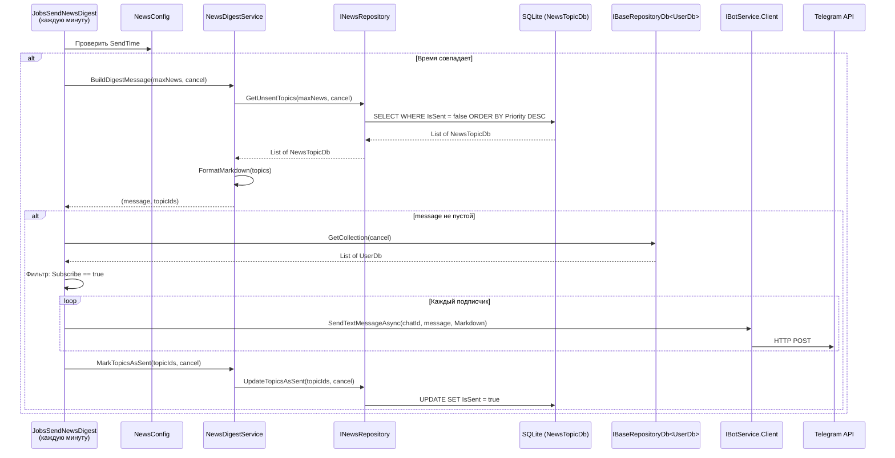
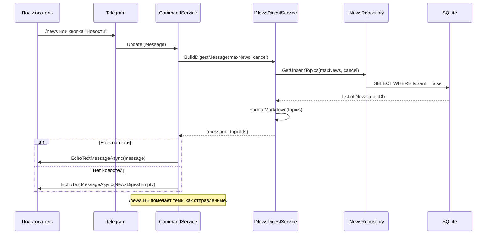
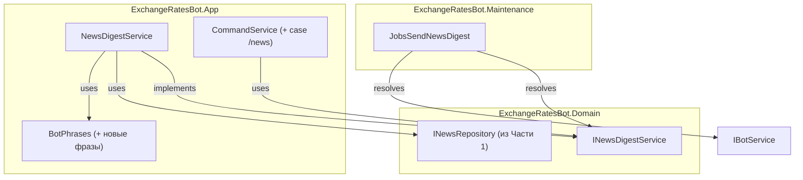
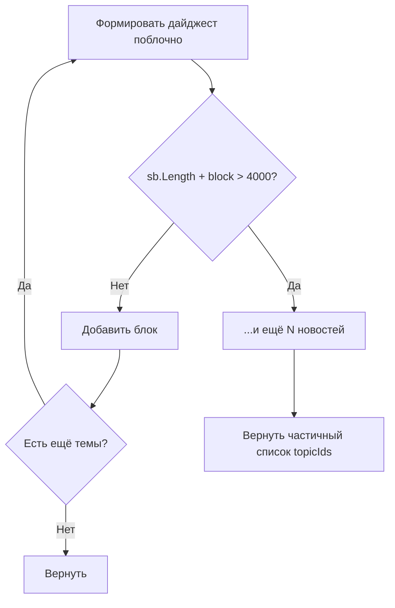

# Архитектурный план: Часть 2 — Формирование и отправка дайджеста (без LLM)

## 1. Обзор

Часть 2 добавляет три компонента:

1. **NewsDigestService** — формирует Markdown-дайджест из неотправленных тем
2. **JobsSendNewsDigest** — фоновая задача рассылки дайджеста по расписанию
3. **Команда /news** — ручной запрос дайджеста + кнопка "Новости" в reply keyboard

**Зависимость**: Часть 1 (RSS-парсер, модели NewsTopicDb/NewsItemDb, INewsRepository)

---

## 2. Диаграммы потоков данных

### 2.1 Автоматическая рассылка



### 2.2 Ручной запрос (/news)



### 2.3 Компонентная диаграмма



---

## 3. Интерфейсы и сигнатуры

### 3.1 INewsDigestService

**Файл**: `src/bot/ExchangeRatesBot.Domain/Interfaces/INewsDigestService.cs`

```csharp
public interface INewsDigestService
{
    /// <summary>
    /// Собирает неотправленные темы, формирует Markdown-дайджест.
    /// Возвращает кортеж: (текст, список ID для пометки).
    /// Если тем нет — message будет null.
    /// </summary>
    Task<(string message, List<int> topicIds)> BuildDigestMessage(
        int maxNews, CancellationToken cancel);

    /// <summary>
    /// Помечает темы как отправленные (IsSent = true).
    /// </summary>
    Task MarkTopicsAsSent(List<int> topicIds, CancellationToken cancel);
}
```

**Обоснование кортежа**: Разделение "формирование" и "пометка" позволяет:
- `/news` показывать дайджест БЕЗ пометки
- `JobsSendNewsDigest` помечать ПОСЛЕ успешной рассылки
- При падении рассылки — темы не потеряются

---

## 4. Алгоритм BuildDigestMessage

```
ВХОД: maxNews (int), cancel (CancellationToken)
ВЫХОД: (string message, List<int> topicIds)

1. topics = await GetUnsentTopics(maxNews, cancel)
2. Если topics пуст → return (null, empty list)
3. StringBuilder sb
4. sb.Append("*" + NewsDigestHeader + "*\n\n")
5. includedTopicIds = new List<int>()
6. Для каждого topic:
   a. emoji = HitCount >= 3 ? "🔥" : "📰"
   b. sourcesText = FormatSources(topic.Sources)
   c. hitCountText = Pluralize(HitCount)
   d. block = $"{emoji} *{EscapeMarkdown(BestTitle)}* ({HitCount} {hitCountText})\n"
   e. block += $"   Источники: {sourcesText}\n\n"
   f. Если sb.Length + block.Length > 4000:
      sb.Append($"...и ещё {остаток} новостей\n")
      break
   g. sb.Append(block), includedTopicIds.Add(topic.Id)
7. return (sb.ToString(), includedTopicIds)
```

### Вспомогательные методы

```csharp
private static readonly Dictionary<string, string> SourceNames = new()
{
    ["cbr"] = "ЦБ РФ",
    ["rbc"] = "РБК",
    ["vedomosti"] = "Ведомости"
};

private static string FormatSources(string sources);    // "cbr,rbc" → "ЦБ РФ, РБК"
private static string Pluralize(int count);              // 1→"источник", 2→"источника", 5→"источников"
private static string EscapeMarkdown(string text);      // Экранирование _ * ` [ для Markdown v1
```

---

## 5. Обработка лимита Telegram 4096 символов



Лимит 4000 (не 4096) — запас для юникода. При maxNews=10 переполнение маловероятно (~1300 символов).

---

## 6. JobsSendNewsDigest

**Файл**: `src/bot/ExchangeRatesBot.Maintenance/Jobs/JobsSendNewsDigest.cs`

```csharp
public class JobsSendNewsDigest : BackgroundTaskAbstract<JobsSendNewsDigest>
{
    private readonly IOptions<NewsConfig> _newsConfig;
    private readonly ILogger _logger;

    public JobsSendNewsDigest(
        IServiceProvider services,
        IOptions<BotConfig> botConfig,
        IOptions<NewsConfig> newsConfig,
        ILogger logger)
        : base(services, botConfig, logger) { ... }
}
```

### Алгоритм DoWorkAsync

1. Если `Enabled == false` → return
2. Проверка времени (паттерн JobsSendMessageUsers): timeNow vs SendTime
3. `BuildDigestMessage(MaxNewsPerDigest, cancel)` → (message, topicIds)
4. Если message == null → return
5. Получить подписчиков: `Subscribe == true`
6. Рассылка с try/catch на каждого (Warning при ошибке)
7. `MarkTopicsAsSent(topicIds, cancel)`
8. Лог результата

**Темы помечаются даже при пустом списке подписчиков** — чтобы не накапливались.

---

## 7. Интеграция в CommandService

### Новый case в MessageCommand

```csharp
case "/news":
case var txt when txt == BotPhrases.BtnNews:
    var (newsMessage, _) = await _newsDigestService.BuildDigestMessage(
        10, CancellationToken.None);
    await _updateService.EchoTextMessageAsync(
        update,
        newsMessage ?? BotPhrases.NewsDigestEmpty,
        default);
    break;
```

topicIds игнорируются — `/news` НЕ помечает темы как отправленные.

### Reply Keyboard — 3 ряда

```
+----------------+----------------+----------------+
| Курс сегодня   |  За 7 дней     |  Статистика    |
+----------------+----------------+----------------+
|   Новости      |   Валюты       |   Подписка     |
+----------------+----------------+----------------+
|                    Помощь                         |
+--------------------------------------------------+
```

### Конструктор — добавить INewsDigestService

7-я зависимость. Допустимо — на границе, но не требует рефакторинга.

---

## 8. Новые фразы в BotPhrases

```csharp
public static string BtnNews { get; } = "Новости";
public static string NewsDigestHeader { get; } = "Новостной дайджест по валютам";
public static string NewsDigestEmpty { get; } = "Новых новостей по валютам пока нет.";
```

Обновить HelpMessage: добавить `/news — новостной дайджест`.

---

## 9. Формат дайджеста — примеры

### Стандартный

```
*Новостной дайджест по валютам*

🔥 *ЦБ повысил ключевую ставку до 22%* (3 источника)
   Источники: ЦБ РФ, РБК, Ведомости

📰 *Курс доллара обновил максимум* (2 источника)
   Источники: РБК, Ведомости

📰 *Минфин разместил ОФЗ* (1 источник)
   Источник: ЦБ РФ
```

### Нет новостей

```
Новых новостей по валютам пока нет.
```

### Обрезка по лимиту

```
*Новостной дайджест по валютам*

🔥 *Первая новость...* (3 источника)
   Источники: ЦБ РФ, РБК, Ведомости

...и ещё 5 новостей
```

---

## 10. Регистрация в DI (Startup.cs)

```csharp
services.AddScoped<INewsDigestService, NewsDigestService>();

var newsConfig = Config.GetSection("NewsConfig").Get<NewsConfig>();
if (newsConfig?.Enabled == true)
{
    services.AddHostedService<JobsSendNewsDigest>();
}
```

---

## 11. Edge cases

| Сценарий | Поведение |
|----------|-----------|
| Нет неотправленных тем | (null, []), /news → NewsDigestEmpty |
| Пустой BestTitle | Пропустить тему, Warning |
| Пустой Sources | Показать без строки "Источники:" |
| Сообщение > 4000 | Обрезать с футером |
| Ошибка отправки пользователю | Warning, продолжить |
| Пользователь заблокировал бота | ApiRequestException 403, Warning |
| Enabled=false | Job не регистрируется, /news всё равно работает |
| Спецсимволы в заголовке | EscapeMarkdown |

---

## 12. Порядок реализации

| Шаг | Файл | Действие |
|-----|------|----------|
| 1 | `Domain/Interfaces/INewsDigestService.cs` | Создать интерфейс |
| 1b | `Domain/Interfaces/INewsRepository.cs` | Проверить UpdateTopicsAsSent |
| 2 | `App/Phrases/BotPhrases.cs` | Добавить фразы, обновить Help |
| 3 | `App/Services/NewsDigestService.cs` | Реализация |
| 4 | `Maintenance/Jobs/JobsSendNewsDigest.cs` | Фоновая задача |
| 5 | `App/Services/CommandService.cs` | /news + reply keyboard |
| 6 | `Startup.cs` + `appsettings.json` | DI, конфигурация |

---

## 13. Чек-лист готовности Части 2

- [ ] Команда `/news` возвращает дайджест
- [ ] Кнопка "Новости" работает аналогично
- [ ] Reply keyboard — 3 ряда, 7 кнопок
- [ ] Дайджест отсортирован по Priority DESC
- [ ] Emoji: 🔥 при HitCount >= 3, 📰 при < 3
- [ ] Сообщение не превышает 4096 символов
- [ ] /news НЕ помечает темы как отправленные
- [ ] Рассылка помечает IsSent = true
- [ ] Повторная рассылка не включает уже отправленные
- [ ] Ошибка одного пользователя не роняет рассылку
- [ ] HelpMessage содержит /news
