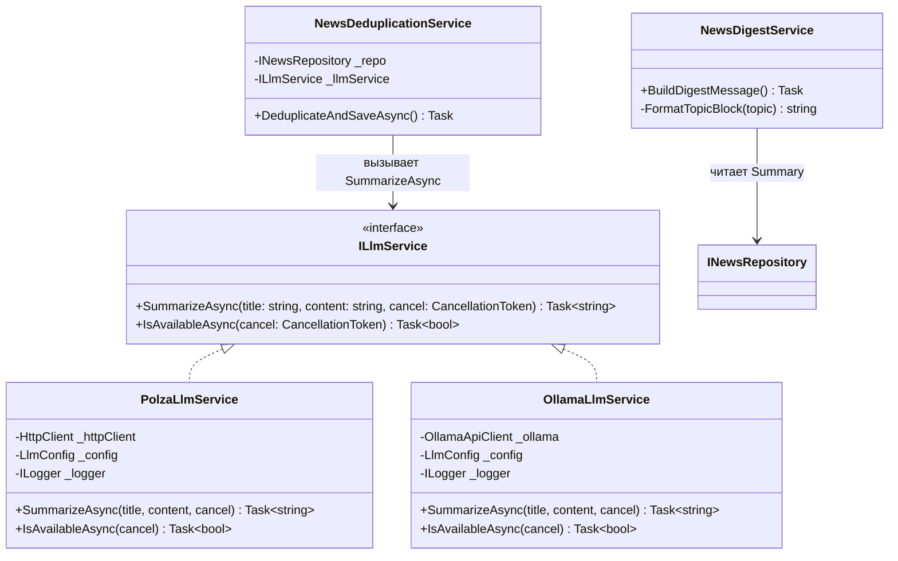
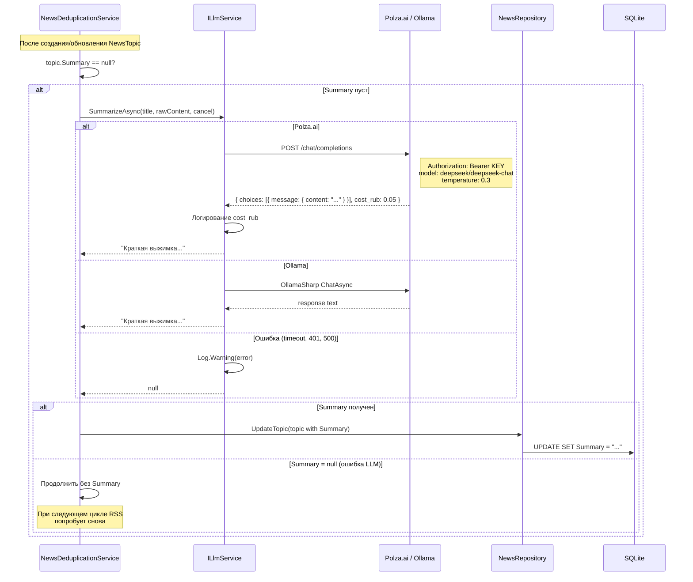
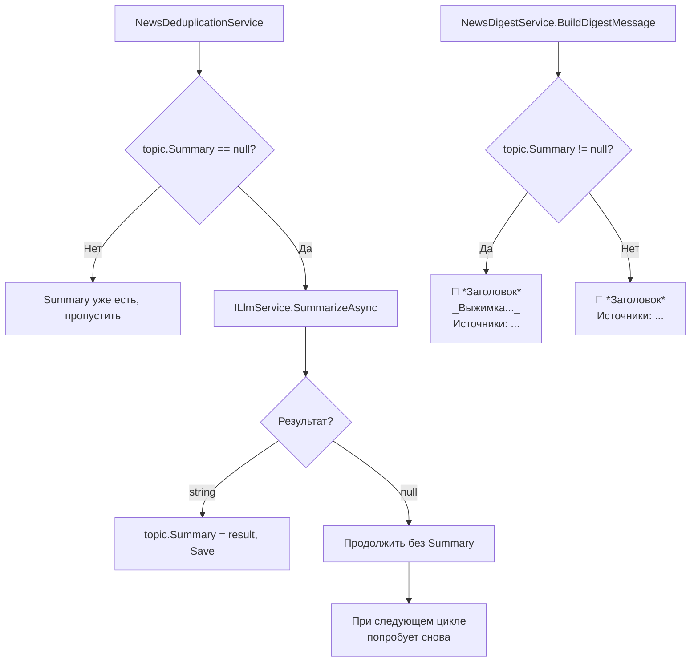

# Архитектурный план: Часть 3 — Интеграция LLM для суммаризации

## 1. Обзор

Часть 3 добавляет AI-суммаризацию новостей через LLM. Каждая тема (NewsTopic) получает поле Summary — краткую выжимку на 1-2 предложения. Два провайдера через абстракцию `ILlmService`: Polza.ai (облачный, OpenAI-совместимый) и Ollama (локальный).

**Graceful degradation**: если LLM недоступен — дайджест работает как в Части 2 (только заголовки).

**Зависимости**: Части 1-2

---

## 2. Диаграмма классов



---

## 3. Sequence diagram вызова LLM



---

## 4. Интерфейс ILlmService

**Файл**: `src/bot/ExchangeRatesBot.Domain/Interfaces/ILlmService.cs`

```csharp
namespace ExchangeRatesBot.Domain.Interfaces
{
    public interface ILlmService
    {
        /// <summary>
        /// Суммаризировать новость в 1-2 предложения на русском.
        /// Возвращает null при ошибке (graceful degradation).
        /// </summary>
        Task<string> SummarizeAsync(string title, string content, CancellationToken cancel);

        /// <summary>
        /// Проверка доступности провайдера LLM.
        /// </summary>
        Task<bool> IsAvailableAsync(CancellationToken cancel);
    }
}
```

---

## 5. Polza.ai — детали интеграции

### 5.1. HTTP-запрос

```
POST https://polza.ai/api/v1/chat/completions
Authorization: Bearer <POLZA_AI_API_KEY>
Content-Type: application/json

{
    "model": "deepseek/deepseek-chat",
    "messages": [
        {
            "role": "system",
            "content": "Ты финансовый аналитик. Сделай краткую выжимку новости о валютном рынке в 1-2 предложениях на русском языке. Только факты, без вводных слов."
        },
        {
            "role": "user",
            "content": "Заголовок: ЦБ повысил ключевую ставку до 22%\n\nТекст: Совет директоров Банка России принял решение повысить ключевую ставку на 200 базисных пунктов..."
        }
    ],
    "temperature": 0.3,
    "max_tokens": 200
}
```

### 5.2. HTTP-ответ (OpenAI-совместимый)

```json
{
    "id": "chatcmpl-xxx",
    "object": "chat.completion",
    "model": "deepseek/deepseek-chat",
    "choices": [
        {
            "index": 0,
            "message": {
                "role": "assistant",
                "content": "ЦБ РФ повысил ключевую ставку с 20% до 22%, что является максимальным уровнем с 2022 года. Решение направлено на сдерживание инфляции."
            },
            "finish_reason": "stop"
        }
    ],
    "usage": {
        "prompt_tokens": 150,
        "completion_tokens": 45,
        "total_tokens": 195
    },
    "cost_rub": 0.05
}
```

### 5.3. C# модели для десериализации

```csharp
// Запрос
public class ChatCompletionRequest
{
    [JsonPropertyName("model")]
    public string Model { get; set; }

    [JsonPropertyName("messages")]
    public List<ChatMessage> Messages { get; set; }

    [JsonPropertyName("temperature")]
    public double Temperature { get; set; }

    [JsonPropertyName("max_tokens")]
    public int MaxTokens { get; set; }
}

public class ChatMessage
{
    [JsonPropertyName("role")]
    public string Role { get; set; }

    [JsonPropertyName("content")]
    public string Content { get; set; }
}

// Ответ
public class ChatCompletionResponse
{
    [JsonPropertyName("choices")]
    public List<ChatChoice> Choices { get; set; }

    [JsonPropertyName("usage")]
    public ChatUsage Usage { get; set; }

    [JsonPropertyName("cost_rub")]
    public double? CostRub { get; set; }
}

public class ChatChoice
{
    [JsonPropertyName("message")]
    public ChatMessage Message { get; set; }

    [JsonPropertyName("finish_reason")]
    public string FinishReason { get; set; }
}

public class ChatUsage
{
    [JsonPropertyName("prompt_tokens")]
    public int PromptTokens { get; set; }

    [JsonPropertyName("completion_tokens")]
    public int CompletionTokens { get; set; }

    [JsonPropertyName("total_tokens")]
    public int TotalTokens { get; set; }
}
```

### 5.4. PolzaLlmService

**Файл**: `src/bot/ExchangeRatesBot.App/Services/PolzaLlmService.cs`

```csharp
public class PolzaLlmService : ILlmService
{
    private static readonly HttpClient _httpClient = new()
    {
        Timeout = TimeSpan.FromSeconds(30)
    };
    private readonly LlmConfig _config;
    private readonly ILogger _logger;

    public PolzaLlmService(IOptions<LlmConfig> config, ILogger logger);

    public async Task<string> SummarizeAsync(string title, string content, CancellationToken cancel);
    public async Task<bool> IsAvailableAsync(CancellationToken cancel);
}
```

**Алгоритм SummarizeAsync**:

1. Сформировать `ChatCompletionRequest` с system + user промптами
2. `JsonSerializer.Serialize(request)`
3. Создать `HttpRequestMessage(POST, $"{BaseUrl}/chat/completions")`
4. Установить `Authorization: Bearer {ApiKey}`
5. `await _httpClient.SendAsync(requestMessage, cancel)`
6. Проверить `response.IsSuccessStatusCode`
7. Десериализовать `ChatCompletionResponse`
8. Логировать `cost_rub` если есть: `_logger.Information("LLM cost: {CostRub} RUB", resp.CostRub)`
9. Вернуть `response.Choices[0].Message.Content?.Trim()`
10. При любой ошибке — `_logger.Warning(ex, ...)`, вернуть `null`

**IsAvailableAsync**: GET `{BaseUrl}/models` с timeout 5 сек. Если 200 — true, иначе false.

---

## 6. Ollama — детали интеграции

### 6.1. NuGet пакет

`OllamaSharp` v5.4.16 — рекомендован Microsoft, поддерживает `Microsoft.Extensions.AI` абстракции.

### 6.2. OllamaLlmService

**Файл**: `src/bot/ExchangeRatesBot.App/Services/OllamaLlmService.cs`

```csharp
public class OllamaLlmService : ILlmService
{
    private readonly OllamaApiClient _ollama;
    private readonly LlmConfig _config;
    private readonly ILogger _logger;

    public OllamaLlmService(IOptions<LlmConfig> config, ILogger logger)
    {
        _config = config.Value;
        _logger = logger;
        _ollama = new OllamaApiClient(_config.OllamaUrl);
        _ollama.SelectedModel = _config.OllamaModel;
    }

    public async Task<string> SummarizeAsync(string title, string content, CancellationToken cancel);
    public async Task<bool> IsAvailableAsync(CancellationToken cancel);
}
```

**Алгоритм SummarizeAsync**:

1. Создать `ChatRequest` с system + user сообщениями
2. `await _ollama.ChatAsync(request, cancel)`
3. Собрать ответ из stream или использовать `Chat()` для полного ответа
4. Вернуть `response?.Trim()` или null при ошибке

**IsAvailableAsync**: `await _ollama.ListLocalModelsAsync()` — если не бросает исключение, значит Ollama доступна.

---

## 7. Системный промпт

```
Ты финансовый аналитик. Сделай краткую выжимку новости о валютном рынке в 1-2 предложениях на русском языке. Только факты, без вводных слов.
```

**Обоснование выбора**:
- "Финансовый аналитик" — задаёт контекст для терминологии
- "1-2 предложения" — ограничивает длину, экономит токены
- "Только факты" — убирает фразы типа "В данной статье рассматривается..."
- "Без вводных слов" — убирает "Согласно источнику...", "Как сообщается..."
- Русский язык — явное указание, т.к. модель может ответить на английском

### Формат user-промпта

```
Заголовок: {title}

Текст: {content}
```

Если `content` пуст (RSS иногда не содержит description) — отправлять только заголовок.

---

## 8. Стратегия обработки ошибок

| Ошибка | HTTP код | Действие |
|--------|----------|----------|
| Timeout | — | Warning, return null |
| Unauthorized | 401 | Error (неверный API ключ), return null |
| Rate limited | 429 | Warning, return null, попробует при следующем цикле |
| Server error | 500-503 | Warning, return null |
| Невалидный JSON | — | Warning, return null |
| Пустой ответ (choices пуст) | 200 | Warning, return null |
| Ollama не запущена | ConnectException | Warning, return null |
| Модель не скачана | 404 | Error (нужно `ollama pull`), return null |

**Принцип**: НИКОГДА не бросать исключение из ILlmService. Всегда return null + логирование.

**Retry**: НЕ делать автоматический retry внутри SummarizeAsync. Причины:
- Не блокировать цикл обработки RSS
- При следующем вызове JobsFetchNews темы с Summary == null попробуют снова
- Rate limit сам разрешится через интервал

---

## 9. Graceful degradation



---

## 10. Условная регистрация в DI

**Файл**: `src/bot/ExchangeRatesBot/Startup.cs`

```csharp
// --- LLM Service (Part 3) ---
var llmConfig = Config.GetSection("LlmConfig").Get<LlmConfig>();
if (llmConfig != null && !string.IsNullOrEmpty(llmConfig.Provider))
{
    switch (llmConfig.Provider.ToLower())
    {
        case "polza":
            services.AddScoped<ILlmService, PolzaLlmService>();
            break;
        case "ollama":
            services.AddScoped<ILlmService, OllamaLlmService>();
            break;
        default:
            // Не регистрировать — NewsDeduplicationService проверит наличие через DI
            break;
    }
}
```

**Если ILlmService не зарегистрирован** — `NewsDeduplicationService` получает `ILlmService` как nullable через `IServiceProvider.GetService<ILlmService>()` (а не GetRequiredService), и пропускает суммаризацию.

---

## 11. Интеграция в существующие сервисы

### 11.1. NewsDeduplicationService — изменения

Добавить зависимость `IServiceProvider` (для опциональной резолюции ILlmService):

```csharp
public NewsDeduplicationService(
    INewsRepository newsRepository,
    IServiceProvider serviceProvider,
    ILogger logger)
```

После создания/обновления NewsTopic:

```csharp
if (topic.Summary == null)
{
    var llmService = scope.GetService<ILlmService>(); // nullable
    if (llmService != null)
    {
        try
        {
            topic.Summary = await llmService.SummarizeAsync(
                topic.BestTitle, bestRawContent, cancel);
            if (topic.Summary != null)
                await _newsRepository.UpdateTopic(topic, cancel);
        }
        catch (Exception ex)
        {
            _logger.Warning(ex, "LLM summarization failed for topic {TopicId}", topic.Id);
        }
    }
}
```

### 11.2. NewsDigestService — изменения

Обновить FormatTopicBlock:

```csharp
// Если Summary есть — показать под заголовком курсивом
if (!string.IsNullOrWhiteSpace(topic.Summary))
{
    block += $"   _{EscapeMarkdown(topic.Summary)}_\n";
}
```

Итоговый формат блока:
```
🔥 *ЦБ повысил ключевую ставку до 22%* (3 источника)
   _ЦБ РФ повысил ставку с 20% до 22% — максимум с 2022 года, для сдерживания инфляции._
   Источники: ЦБ РФ, РБК, Ведомости
```

---

## 12. Логирование стоимости (Polza.ai)

При каждом вызове Polza.ai логировать:

```csharp
_logger.Information(
    "LLM Summary: topic={TopicId}, model={Model}, tokens={Tokens}, cost={CostRub} RUB",
    topicId, _config.PolzaModel, response.Usage?.TotalTokens, response.CostRub);
```

Это позволит мониторить расходы через логи Serilog (SQLite sink).

---

## 13. Зависимости (.csproj)

**`src/bot/ExchangeRatesBot.App/ExchangeRatesBot.App.csproj`**:

```xml
<PackageReference Include="OllamaSharp" Version="5.4.16" />
```

Для Polza.ai дополнительных пакетов не нужно — используется `System.Net.Http.HttpClient` + `System.Text.Json`.

---

## 14. Потенциальные риски и решения

| Риск | Вероятность | Решение |
|------|-------------|---------|
| Polza.ai API ключ невалиден | Средняя | 401 → Error log, graceful degradation |
| Polza.ai rate limit | Низкая | 429 → Warning, попробует в следующем цикле |
| Ollama не запущена | Средняя | ConnectException → Warning, graceful degradation |
| Модель не скачана в Ollama | Средняя | 404 → Error log с подсказкой `ollama pull model` |
| Слишком длинный текст для LLM | Низкая | Обрезать content до 2000 символов перед отправкой |
| LLM галлюцинирует | Низкая | Temperature 0.3, системный промпт с ограничениями |
| Стоимость растёт | Низкая | deepseek-chat дешёвый (~0.5₽ за суммаризацию), логирование cost_rub |

---

## 15. Порядок реализации

| Шаг | Файл | Действие |
|-----|------|----------|
| 1 | `Domain/Interfaces/ILlmService.cs` | Создать интерфейс |
| 2 | `App/Models/ChatCompletionRequest.cs` | Модели запроса/ответа Polza.ai |
| 3 | `App/Services/PolzaLlmService.cs` | Реализация через HttpClient |
| 4 | `App/ExchangeRatesBot.App.csproj` | Добавить OllamaSharp |
| 5 | `App/Services/OllamaLlmService.cs` | Реализация через OllamaSharp |
| 6 | `App/Services/NewsDeduplicationService.cs` | Добавить вызов ILlmService |
| 7 | `App/Services/NewsDigestService.cs` | Показывать Summary |
| 8 | `Startup.cs` | Условная регистрация ILlmService |

---

## 16. Чек-лист готовности Части 3

- [ ] С Polza.ai: Summary заполняется в NewsTopicDb
- [ ] С Ollama: Summary заполняется
- [ ] cost_rub логируется при использовании Polza.ai
- [ ] Graceful degradation: невалидный API ключ → дайджест без Summary
- [ ] Graceful degradation: Ollama не запущена → дайджест без Summary
- [ ] Без конфигурации LLM → ILlmService не регистрируется, всё работает
- [ ] Команда /news показывает выжимки (курсив)
- [ ] При Summary == null — блок без выжимки (как в Части 2)
- [ ] Content обрезается до 2000 символов перед отправкой в LLM
- [ ] Нет retry внутри SummarizeAsync
- [ ] При следующем цикле RSS — попытка суммаризации для topic с Summary == null
