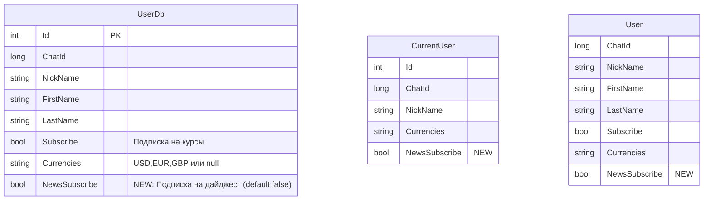
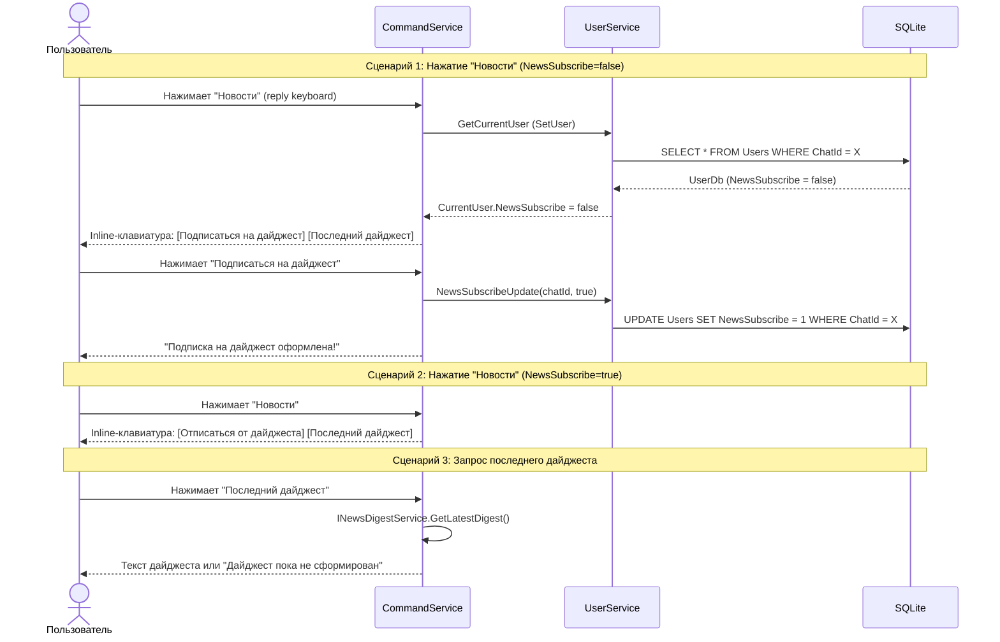
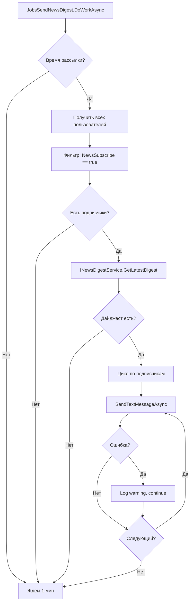

# Архитектурный план: Часть 4 — Подписка на новостной дайджест

## Обзор

Независимая подписка на новостной дайджест, работающая параллельно с существующей подпиской на курсы валют. Четыре комбинации состояний пользователя:

| Subscribe | NewsSubscribe | Поведение |
|-----------|---------------|-----------|
| false | false | Ничего не получает |
| true | false | Только курсы (TimeOne/TimeTwo) |
| false | true | Только новости (NewsDigestTime) |
| true | true | Курсы и новости |

## Диаграмма изменений модели данных



## UX Flow: взаимодействие пользователя



## Изменения в моделях

### 1. UserDb (`src/bot/ExchangeRatesBot.DB/Models/UserDb.cs`)

Добавить поле:
```csharp
public bool NewsSubscribe { get; set; }  // default false
```

### 2. User (`src/bot/ExchangeRatesBot.Domain/Models/User.cs`)

```csharp
public bool NewsSubscribe { get; set; }
```

### 3. CurrentUser (`src/bot/ExchangeRatesBot.Domain/Models/CurrentUser.cs`)

```csharp
public bool NewsSubscribe { get; set; }
```

## Интерфейс IUserService (`src/bot/ExchangeRatesBot.Domain/Interfaces/IUserService.cs`)

Добавить метод:
```csharp
Task<bool> NewsSubscribeUpdate(long chatId, bool subscribe, CancellationToken cancel);
```

## Реализация UserService (`src/bot/ExchangeRatesBot.App/Services/UserService.cs`)

### Новый метод (по паттерну SubscribeUpdate)

```csharp
public async Task<bool> NewsSubscribeUpdate(long chatId, bool subscribe, CancellationToken cancel)
{
    var usersDb = await _userDb.GetCollection(cancel);
    var userDb = usersDb.FirstOrDefault(u => u.ChatId == chatId);
    if (userDb == null) return false;

    userDb.NewsSubscribe = subscribe;
    await _userDb.Update(userDb, cancel);
    return true;
}
```

### Изменение SetUser — маппинг в CurrentUser

```csharp
CurrentUser.NewsSubscribe = userGetCollection.NewsSubscribe;
```

### Изменение Create — маппинг в UserDb

```csharp
userDb.NewsSubscribe = user.NewsSubscribe;
```

## Изменения в CommandService (`src/bot/ExchangeRatesBot.App/Services/CommandService.cs`)

### Callback-идентификаторы

| Callback Data | Действие |
|---------------|----------|
| `news_subscribe` | Подписаться на дайджест |
| `news_unsubscribe` | Отписаться от дайджеста |
| `news_latest` | Показать последний дайджест |

### Обработка кнопки "Новости" в MessageCommand

```csharp
case "/news":
case var txt when txt == BotPhrases.BtnNews:
    await _updateService.EchoTextMessageAsync(
        update,
        BotPhrases.NewsMenuHeader,
        new InlineKeyboardMarkup(NewsMenuKeyboard(_userControl.CurrentUser.NewsSubscribe)));
    break;
```

### Callback-обработчики в CallbackMessageCommand

```csharp
case "news_subscribe":
    await _userControl.NewsSubscribeUpdate(_userControl.CurrentUser.ChatId, true, CancellationToken.None);
    await _updateService.EchoTextMessageAsync(update, BotPhrases.NewsSubscribeTrue, default);
    break;

case "news_unsubscribe":
    await _userControl.NewsSubscribeUpdate(_userControl.CurrentUser.ChatId, false, CancellationToken.None);
    await _updateService.EchoTextMessageAsync(update, BotPhrases.NewsSubscribeFalse, default);
    break;

case "news_latest":
    var digest = await _newsDigestService.GetLatestDigest(CancellationToken.None);
    await _updateService.EchoTextMessageAsync(update,
        string.IsNullOrEmpty(digest) ? BotPhrases.NewsDigestEmpty : digest, default);
    break;
```

### Адаптивная inline-клавиатура

```csharp
private static List<List<InlineKeyboardButton>> NewsMenuKeyboard(bool isSubscribed)
{
    var rows = new List<List<InlineKeyboardButton>>();

    if (isSubscribed)
        rows.Add(new List<InlineKeyboardButton>
            { InlineKeyboardButton.WithCallbackData("Отписаться от дайджеста", "news_unsubscribe") });
    else
        rows.Add(new List<InlineKeyboardButton>
            { InlineKeyboardButton.WithCallbackData("Подписаться на дайджест", "news_subscribe") });

    rows.Add(new List<InlineKeyboardButton>
        { InlineKeyboardButton.WithCallbackData("Последний дайджест", "news_latest") });

    return rows;
}
```

Визуально:

**Не подписан:**
```
[ Подписаться на дайджест ]
[ Последний дайджест      ]
```

**Подписан:**
```
[ Отписаться от дайджеста ]
[ Последний дайджест      ]
```

### Инъекция INewsDigestService в конструктор

```csharp
private readonly INewsDigestService _newsDigestService;

public CommandService(..., INewsDigestService newsDigestService)
{
    _newsDigestService = newsDigestService;
}
```

## Reply Keyboard — итоговая раскладка

```
+------------------+------------------+------------------+
|  Курс сегодня    |   За 7 дней      |   Статистика     |
+------------------+------------------+------------------+
|   Валюты         |   Подписка       |   Новости        |
+------------------+------------------+------------------+
|                  Помощь                                 |
+------------------+------------------+------------------+
```

Кнопка "Новости" и `BtnNews` добавляются в Части 2. В Части 4 добавляется только обработчик.

## Новые фразы в BotPhrases

```csharp
public static string BtnNews { get; } = "Новости";
public static string NewsMenuHeader { get; } = "Новостной дайджест — финансовые новости из ЦБ РФ, РБК и Ведомостей.";
public static string NewsSubscribeTrue { get; } = "*Подписка на дайджест оформлена!* Вы будете получать новостные сводки.";
public static string NewsSubscribeFalse { get; } = "*Подписка на дайджест отменена.* Вы больше не будете получать новостные сводки.";
public static string NewsDigestEmpty { get; } = "Дайджест пока не сформирован. Попробуйте позже.";
```

## Миграция БД: AddUserNewsSubscription

```csharp
public partial class AddUserNewsSubscription : Migration
{
    protected override void Up(MigrationBuilder migrationBuilder)
    {
        migrationBuilder.AddColumn<bool>(
            name: "NewsSubscribe",
            table: "Users",
            type: "INTEGER",
            nullable: false,
            defaultValue: false);
    }

    protected override void Down(MigrationBuilder migrationBuilder)
    {
        migrationBuilder.DropColumn(name: "NewsSubscribe", table: "Users");
    }
}
```

- `defaultValue: false` — существующие пользователи не подписаны
- Автоприменение при старте через `dataDb.Database.Migrate()`
- SQLite `ALTER TABLE ADD COLUMN` безопасна, без простоя

## Интеграция с JobsSendNewsDigest



## Edge Cases

| Case | Ситуация | Решение |
|------|----------|---------|
| 1 | Подписан, но дайджест не сформирован | `GetLatestDigest()` вернет null/empty; JobsSendNewsDigest пропустит рассылку; по кнопке — `NewsDigestEmpty` |
| 2 | Отписался во время рассылки | Eventual consistency: получит текущую, не получит следующую |
| 3 | Заблокировал бота | try-catch с логированием, рассылка продолжается для остальных |
| 4 | Двойное нажатие подписки | Идемпотентно: повторная установка true/false безвредна |
| 5 | Callback от старой inline-клавиатуры | Идемпотентно |
| 6 | Параллельная разработка с Частью 3 | Конфликты в CommandService.cs, BotPhrases.cs, Startup.cs — разрешать при merge |

## Обратная совместимость

- Существующие пользователи: `NewsSubscribe = false` (миграция с `defaultValue`)
- `Subscribe` на курсы не затрагивается
- `JobsSendMessageUsers` фильтрует по `Subscribe` — без изменений
- API сервис не затрагивается

## Затрагиваемые файлы

| Файл | Действие |
|------|----------|
| `src/bot/ExchangeRatesBot.DB/Models/UserDb.cs` | Добавить поле `NewsSubscribe` |
| `src/bot/ExchangeRatesBot.Domain/Models/User.cs` | Добавить поле |
| `src/bot/ExchangeRatesBot.Domain/Models/CurrentUser.cs` | Добавить поле |
| `src/bot/ExchangeRatesBot.Domain/Interfaces/IUserService.cs` | Добавить метод |
| `src/bot/ExchangeRatesBot.App/Services/UserService.cs` | Реализация + маппинг |
| `src/bot/ExchangeRatesBot.App/Services/CommandService.cs` | Callback + клавиатура + DI |
| `src/bot/ExchangeRatesBot.App/Phrases/BotPhrases.cs` | Новые фразы |
| `src/bot/ExchangeRatesBot.Maintenance/Jobs/JobsSendNewsDigest.cs` | Фильтр `NewsSubscribe` |
| `src/bot/ExchangeRatesBot.Migrations/Migrations/` | Новая миграция |
